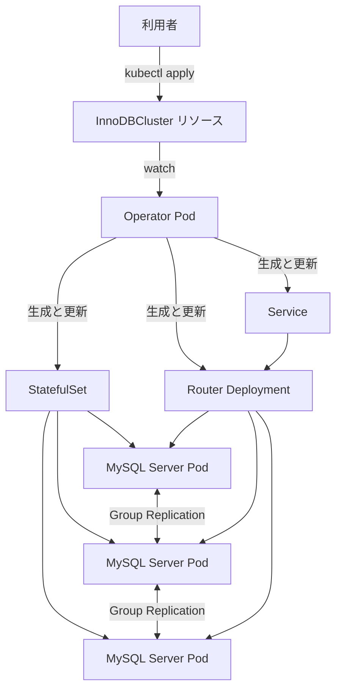

# 第1章 MySQL Operator の概要とアーキテクチャ

> 本章で参照する公式リソース
>
> - [mysqloperator/controller/config.py L22-L60](https://github.com/mysql/mysql-operator/blob/8.4.9-2.1.11/mysqloperator/controller/config.py#L22-L60)
> - [helm/mysql-operator/crds/crd.yaml L1-L10](https://github.com/mysql/mysql-operator/blob/8.4.9-2.1.11/helm/mysql-operator/crds/crd.yaml#L1-L10)
> - [helm/mysql-operator/crds/crd.yaml L889-L897](https://github.com/mysql/mysql-operator/blob/8.4.9-2.1.11/helm/mysql-operator/crds/crd.yaml#L889-L897)
> - [helm/mysql-operator/crds/crd.yaml L899-L912](https://github.com/mysql/mysql-operator/blob/8.4.9-2.1.11/helm/mysql-operator/crds/crd.yaml#L899-L912)
> - [samples/sample-cluster.yaml L1-L24](https://github.com/mysql/mysql-operator/blob/8.4.9-2.1.11/samples/sample-cluster.yaml#L1-L24)

## この章でできるようになること

MySQL Operator が管理する2つの Custom Resource の役割と、クラスタが起動するまでの内部の流れを説明できるようになる。

## 前提

Kubernetes の基本的なリソース（Deployment、StatefulSet、Service）を扱った経験があることを前提とする。

## MySQL Operator が管理するもの

**MySQL Operator**（`mysql/mysql-operator`）は、Kubernetes 上で MySQL の InnoDB Cluster を運用するための Operator である。
InnoDB Cluster は、MySQL の **Group Replication** を用いて複数の MySQL Server インスタンス間でデータを複製する仕組みであり、1台の**プライマリ**と複数の**セカンダリ**で構成される。

Operator は2種類の CRD を提供する。

- **InnoDBCluster**：InnoDB Cluster 1クラスタ分の構成を表す。
- **MySQLBackup**：InnoDBCluster に対する1回のバックアップジョブを表す。

CRD の group は `mysql.oracle.com`、バージョンは `v2` である。
次のリンク先で、2つの CRD の kind 定義を確認できる。

[helm/mysql-operator/crds/crd.yaml L1-L10](https://github.com/mysql/mysql-operator/blob/8.4.9-2.1.11/helm/mysql-operator/crds/crd.yaml#L1-L10)

```yaml
apiVersion: apiextensions.k8s.io/v1
kind: CustomResourceDefinition
metadata:
  name: innodbclusters.mysql.oracle.com
spec:
  group: mysql.oracle.com
  versions:
    - name: v2
      served: true
      storage: true
      schema:
```

[helm/mysql-operator/crds/crd.yaml L889-L897](https://github.com/mysql/mysql-operator/blob/8.4.9-2.1.11/helm/mysql-operator/crds/crd.yaml#L889-L897)

```yaml
  scope: Namespaced
  names:
    kind: InnoDBCluster
    listKind: InnoDBClusterList
    singular: innodbcluster
    plural: innodbclusters
    shortNames:
      - ic
      - ics
```

[helm/mysql-operator/crds/crd.yaml L899-L912](https://github.com/mysql/mysql-operator/blob/8.4.9-2.1.11/helm/mysql-operator/crds/crd.yaml#L899-L912)

```yaml
apiVersion: apiextensions.k8s.io/v1
kind: CustomResourceDefinition
metadata:
  name: mysqlbackups.mysql.oracle.com
spec:
  group: mysql.oracle.com
  scope: Namespaced
  names:
    kind: MySQLBackup
    listKind: MySQLBackupList
    singular: mysqlbackup
    plural: mysqlbackups
    shortNames:
      - mbk
```

InnoDBCluster の `shortNames` は `ic` と `ics`、MySQLBackup の `shortNames` は `mbk` である。
`kubectl get ic` や `kubectl get mbk` のように短縮形で参照できる。

## Operator 本体のバージョン構成

Operator は Python で書かれ、内部で Kubernetes オペレーターフレームワークの kopf を使う。
kopf は Custom Resource の作成、更新、削除イベントを監視し、対応するハンドラー関数を呼び出す仕組みを提供する。
Operator はこのイベントを受けて InnoDBCluster の状態を Kubernetes リソースへ反映する処理を**リコンサイル**と呼ぶ。

Operator が扱うバージョン定数は、次のファイルにまとまっている。

[mysqloperator/controller/config.py L22-L60](https://github.com/mysql/mysql-operator/blob/8.4.9-2.1.11/mysqloperator/controller/config.py#L22-L60)

```python
# Constants
OPERATOR_VERSION = "2.1.11"
OPERATOR_EDITION = Edition.community
OPERATOR_EDITION_NAME_TO_ENUM = { edition.value : edition.name for edition in Edition }

SHELL_VERSION = "8.4.9"

MIN_BASE_SERVER_ID = 1
MAX_BASE_SERVER_ID = 4000000000

DEFAULT_VERSION_TAG = "8.4.9"

DEFAULT_SERVER_VERSION_TAG = DEFAULT_VERSION_TAG
MIN_SUPPORTED_MYSQL_VERSION = "8.0.27"
MAX_SUPPORTED_MYSQL_VERSION = "8.4.99" # SHELL_VERSION

DISABLED_MYSQL_VERSION = {
    "8.0.29": "Support for MySQL 8.0.29 is disabled. Please see https://dev.mysql.com/doc/relnotes/mysql-operator/en/news-8-0-29.html"
}

DEFAULT_ROUTER_VERSION_TAG = DEFAULT_VERSION_TAG

# This is used for the sidecar. The operator version is deploy-operator.yaml
DEFAULT_OPERATOR_VERSION_TAG = "8.4.9-2.1.11"

DEFAULT_IMAGE_REPOSITORY = os.getenv(
    "MYSQL_OPERATOR_DEFAULT_REPOSITORY", default="container-registry.oracle.com/mysql").rstrip('/')

MYSQL_SERVER_IMAGE = "community-server"
MYSQL_ROUTER_IMAGE = "community-router"
MYSQL_OPERATOR_IMAGE = "community-operator"

MYSQL_SERVER_EE_IMAGE = "enterprise-server"
MYSQL_ROUTER_EE_IMAGE = "enterprise-router"
MYSQL_OPERATOR_EE_IMAGE = "enterprise-operator"

CLUSTER_ADMIN_USER_NAME = "mysqladmin"
ROUTER_METADATA_USER_NAME = "mysqlrouter"
BACKUP_USER_NAME = "mysqlbackup"
```

`OPERATOR_VERSION` が `2.1.11`、`SHELL_VERSION` と `DEFAULT_VERSION_TAG` が `8.4.9` である。
`DEFAULT_OPERATOR_VERSION_TAG` の `8.4.9-2.1.11` は、本書が対象とするタグそのものであり、MySQL Server 側イメージのタグとしても使われる。
community 版のイメージ名は `community-server`（MySQL Server）、`community-router`（Router）、`community-operator`（Operator 本体）の3つである。
enterprise 版には同じ役割の `enterprise-server`、`enterprise-router`、`enterprise-operator` がある。
本書は community 版を軸に解説する。

## アーキテクチャ

利用者が InnoDBCluster を作成してから、実際に MySQL クラスタが稼働するまでの流れは次のとおりである。



Operator Pod は InnoDBCluster リソースの変化を監視し、必要な数の MySQL Server Pod を持つ StatefulSet と、接続を仲介する Router の Deployment を生成する。
StatefulSet 配下の各 Pod には、MySQL Server コンテナに加えてサイドカーコンテナが同居する。
サイドカーは、Pod の起動時に Group Replication へ参加させる処理や、Kubernetes 側のヘルスチェックに応じた状態更新を担う。

**MySQL Router**（以下「Router」）は、アプリケーションからの接続を受け付け、書き込みをプライマリへ、読み取りをセカンダリへ振り分ける中継コンポーネントである。
アプリケーションは個々の MySQL Server Pod に直接接続するのではなく、Router 経由で接続することで、プライマリの切り替わりを意識せずに済む。

最小構成の InnoDBCluster は、次のように短い manifest で表現できる。
以下は公式サンプルからの引用である。

[samples/sample-cluster.yaml L1-L24](https://github.com/mysql/mysql-operator/blob/8.4.9-2.1.11/samples/sample-cluster.yaml#L1-L24)

```yaml
# Copyright (c) 2020, 2022, Oracle and/or its affiliates.
#
# Licensed under the Universal Permissive License v 1.0 as shown at https://oss.oracle.com/licenses/upl/
#
# This sample creates a simple InnoDB Cluster with help from the MySQL Operator.
# This yields:
#   3 MySQL Server Pods; one primary and two secondaries
#   1 MySQL Router Pod
# It uses self-signed TLS certificates.
# It requires a deployed Operator (e.g., deploy/deploy-operator.yaml),
# and requires root user credentials provided by a Kubernetes Secret;
# the Secret is named mypwds in this case (e.g., sample-secret.yaml)
#
apiVersion: mysql.oracle.com/v2
kind: InnoDBCluster
metadata:
  name: mycluster
spec:
  secretName: mypwds
  instances: 3
  router:
    instances: 1
  tlsUseSelfSigned: true
```

`instances: 3` が MySQL Server Pod の数、`router.instances: 1` が Router Pod の数を表す。
この2つのフィールドの詳細は第4章と第11章で扱う。

## 動作確認

Operator と CRD をインストールしたクラスタで、次のコマンドを実行すると2つの CRD が登録されていることを確認できる。

```console
$ kubectl get crd | grep mysql.oracle.com
innodbclusters.mysql.oracle.com   2026-07-01T00:00:00Z
mysqlbackups.mysql.oracle.com     2026-07-01T00:00:00Z
```

インストール手順そのものは第2章で扱う。

## まとめ

MySQL Operator は InnoDBCluster と MySQLBackup の2つの CRD を提供し、InnoDBCluster を起点に StatefulSet、Router Deployment、Service を自動生成する。
Group Replication によるプライマリとセカンダリの構成と、Router による接続の仲介が、本書全体を通じて繰り返し登場する基本構造である。

## 関連する章

- [第2章 Operator のインストール](02-install-operator.md)
- [第3章 クイックスタート](03-quickstart.md)
- [第4章 InnoDBCluster リソースの全体像](../part01-innodbcluster-basics/04-innodbcluster-resource.md)
