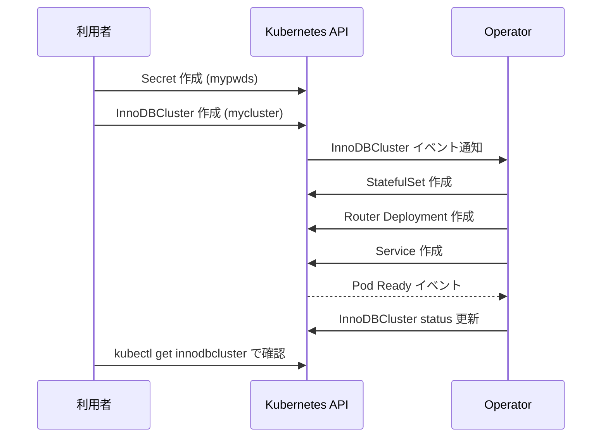

# 第3章 クイックスタート

> 本章で参照する公式リソース
>
> - [samples/sample-secret.yaml L1-L19](https://github.com/mysql/mysql-operator/blob/8.4.9-2.1.11/samples/sample-secret.yaml#L1-L19)
> - [samples/sample-cluster.yaml L14-L23](https://github.com/mysql/mysql-operator/blob/8.4.9-2.1.11/samples/sample-cluster.yaml#L14-L23)

## この章でできるようになること

Secret の作成から InnoDBCluster の起動、Router 経由での接続確認までを一通り実行できるようになる。

## 前提

第2章の手順で Operator をインストール済みであること。
`kubectl get crd` で `innodbclusters.mysql.oracle.com` が存在することを確認しておく。

## 手順の全体像

3ノードの InnoDB Cluster が起動するまでの流れは次のとおりである。



## 手順1 認証情報の Secret を作成する

InnoDBCluster は、root ユーザーの認証情報を Kubernetes の Secret から受け取る。
公式サンプルの Secret 定義は次のとおりである。

[samples/sample-secret.yaml L1-L19](https://github.com/mysql/mysql-operator/blob/8.4.9-2.1.11/samples/sample-secret.yaml#L1-L19)

```yaml
# Copyright (c) 2020, 2022, Oracle and/or its affiliates.
#
# Licensed under the Universal Permissive License v 1.0 as shown at https://oss.oracle.com/licenses/upl/
#
# This sample adds a Secret to reference from an InnoDBCluster manifest.
# It's used to create a privileged MySQL user, a user used by a sysadmin to manage the cluster.
# Although typically named "root", it can be a different name.
# Note: MySQL Operator creates additional (internal) Secrets and MySQL users.
#
# This file requires editing before deployment; other samples here reference the name 'mypwds'
#
apiVersion: v1
kind: Secret
metadata:
  name: mypwds
stringData:
  rootUser: replace me with a username like root
  rootHost: '%'
  rootPassword: set me to a password
```

このファイルはそのままでは使えず、`rootUser` と `rootPassword` を編集してから適用する必要がある。
以下は、動作確認用に値を埋めた例である。

```yaml
apiVersion: v1
kind: Secret
metadata:
  name: mypwds
stringData:
  rootUser: root
  rootHost: '%'
  rootPassword: change-me-to-a-strong-password
```

```console
$ kubectl apply -f mypwds-secret.yaml
secret/mypwds created
```

Operator は、この Secret に指定したユーザーとは別に、クラスタ管理用の内部 Secret と内部ユーザーを自動生成する。

## 手順2 InnoDBCluster を作成する

3ノード構成の InnoDBCluster は、次のサンプルで作成できる。

[samples/sample-cluster.yaml L14-L23](https://github.com/mysql/mysql-operator/blob/8.4.9-2.1.11/samples/sample-cluster.yaml#L14-L23)

```yaml
apiVersion: mysql.oracle.com/v2
kind: InnoDBCluster
metadata:
  name: mycluster
spec:
  secretName: mypwds
  instances: 3
  router:
    instances: 1
  tlsUseSelfSigned: true
```

`secretName` に手順1で作成した Secret 名を指定する点が、両者を結びつける鍵である。
`tlsUseSelfSigned: true` は、TLS 証明書を自分で用意しない場合に Operator が自己署名証明書を生成する設定であり、動作確認用の最短経路として使う。
本番運用での TLS 設定は第12章で扱う。

```console
$ kubectl apply -f sample-cluster.yaml
innodbcluster.mysql.oracle.com/mycluster created
```

## 手順3 起動を確認する

InnoDBCluster の状態は `kubectl get innodbcluster` で確認できる。

```console
$ kubectl get innodbcluster mycluster
NAME        STATUS    ONLINE   INSTANCES   ROUTERS   AGE
mycluster   ONLINE    3        3           1         5m
```

`STATUS` が `ONLINE` になり、`ONLINE` 列（オンライン中のインスタンス数）が `INSTANCES` 列（設定したインスタンス数）と一致すれば、Group Replication のクラスタが正常に組み上がった状態である。
起動直後は `STATUS` が `PENDING` や `INITIALIZING` を経由するため、しばらく待ってから再確認する。

Pod の一覧も合わせて確認する。

```console
$ kubectl get pods -l mysql.oracle.com/cluster=mycluster
NAME          READY   STATUS    RESTARTS   AGE
mycluster-0   2/2     Running   0          5m
mycluster-1   2/2     Running   0          4m
mycluster-2   2/2     Running   0          3m
```

`READY` が `2/2` であることは、MySQL Server コンテナとサイドカーコンテナの両方が起動済みであることを示す。

## 手順4 Router 経由で接続を確認する

アプリケーションからの接続は、個々の Pod ではなく Router が公開する Service 経由で行う。

```console
$ kubectl get service mycluster
NAME        TYPE        CLUSTER-IP     PORT(S)
mycluster   ClusterIP   10.96.10.20    6446/TCP,6447/TCP,6448/TCP,6449/TCP,33060/TCP,33061/TCP
```

クラスタ内の別 Pod から `mysqlsh` で接続を試す例を示す。
以下は動作確認のための例であり、接続元の Pod やイメージは環境によって置き換えてよい。

```console
$ kubectl run myshell --rm -it --image=container-registry.oracle.com/mysql/community-operator:8.4.9-2.1.11 \
    --restart=Never -- mysqlsh root@mycluster:6446 -p
Please provide the password for 'root@mycluster:6446': ***
MySQL  root@mycluster:6446 ssl  JS >
```

接続先ポート `6446` は、Router が公開する読み書き用（プライマリへ振り分ける）ポートである。
ポートごとの用途と、Router の詳細な設定は第11章で扱う。

## トラブルシューティング

InnoDBCluster の `STATUS` が `ONLINE` にならない場合は、まず Pod のイベントを確認する。

```console
$ kubectl describe pod mycluster-0
...
Events:
  Type     Reason     Age   From     Message
  ----     ------     ----  ----     -------
  Warning  Unhealthy  30s   kubelet  Readiness probe failed: Access denied for user 'root'@'%'
```

`secretName` の指定ミスや、Secret 内の `rootUser` と `rootPassword` の未編集が原因であることが多い。
その場合は Pod の Events に認証エラーが記録される。

## まとめ

Secret の作成、InnoDBCluster の作成、`kubectl get innodbcluster` によるステータス確認、Router 経由の接続確認という4手順で、最短で3ノードの InnoDB Cluster を起動できる。
ここで使った `secretName`、`instances`、`router.instances`、`tlsUseSelfSigned` の各フィールドは、次章以降でリファレンスとして詳しく扱う。

## 関連する章

- [第2章 Operator のインストール](02-install-operator.md)
- [第4章 InnoDBCluster リソースの全体像](../part01-innodbcluster-basics/04-innodbcluster-resource.md)
- [第5章 認証情報と Secret](../part01-innodbcluster-basics/05-credentials-secret.md)
- [第11章 MySQL Router](../part02-networking/11-mysql-router.md)
