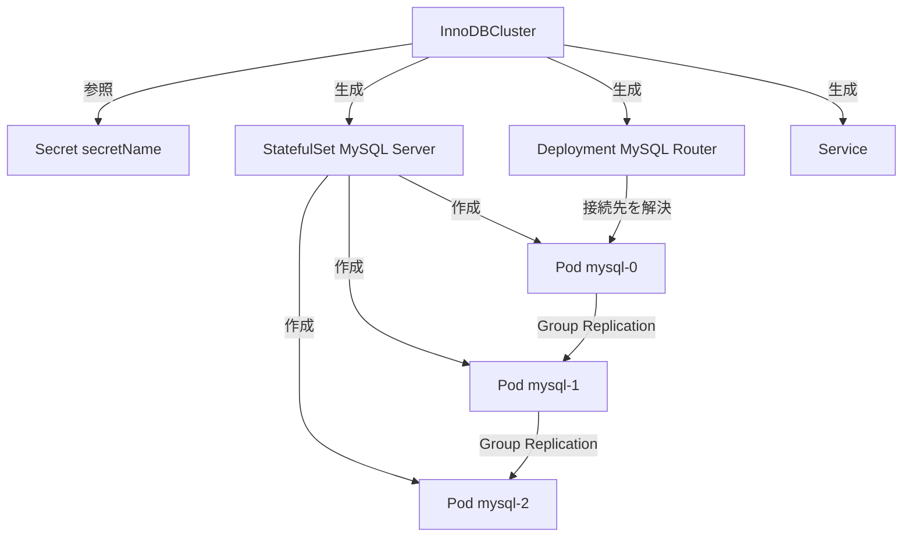

# 第4章 InnoDBCluster リソースの全体像

> 本章で参照する公式リソース
>
> - [helm/mysql-operator/crds/crd.yaml#L1-L90](https://github.com/mysql/mysql-operator/blob/8.4.9-2.1.11/helm/mysql-operator/crds/crd.yaml#L1-L90)
> - [helm/mysql-operator/crds/crd.yaml#L90-L924](https://github.com/mysql/mysql-operator/blob/8.4.9-2.1.11/helm/mysql-operator/crds/crd.yaml#L90-L924)
> - [helm/mysql-operator/crds/crd.yaml#L864-L866](https://github.com/mysql/mysql-operator/blob/8.4.9-2.1.11/helm/mysql-operator/crds/crd.yaml#L864-L866)

## この章でできるようになること

InnoDBCluster という **Custom Resource** の全体構造を把握し、`spec` 直下にどのようなフィールドが並んでいるかを一覧で説明できるようになる。
第5章以降で個別フィールドを説明する前の地図として、本章を先に押さえる。

## 前提

第3章のクイックスタートで InnoDBCluster を1つ作成済みであることを前提とする。

## InnoDBCluster とは何か

MySQL Operator は、MySQL の **InnoDB Cluster**（Group Replication によるマルチプライマリ構成を、単一プライマリ運用に限定して扱う構成）を Kubernetes 上で宣言的に管理するための **Custom Resource Definition**（CRD）を提供する。

その CRD が定義する kind が `InnoDBCluster` である。
利用者は `InnoDBCluster` のマニフェストを1つ適用するだけで、MySQL Server の StatefulSet、MySQL Router の Deployment、内部で使う Secret などを Operator に作らせられる。

以下は最小構成の例である。

```yaml
apiVersion: mysql.oracle.com/v2
kind: InnoDBCluster
metadata:
  name: mycluster
spec:
  secretName: mypwds
  instances: 3
  router:
    instances: 1
```

`apiVersion` は `mysql.oracle.com/v2`、`kind` は `InnoDBCluster` である。
この2つの値は CRD 定義から決まる固定値であり、以後の章のマニフェスト例でも変わらない。

[helm/mysql-operator/crds/crd.yaml#L1-L10](https://github.com/mysql/mysql-operator/blob/8.4.9-2.1.11/helm/mysql-operator/crds/crd.yaml#L1-L10)

```yaml
apiVersion: apiextensions.k8s.io/v1
kind: CustomResourceDefinition
metadata:
  name: innodbclusters.mysql.oracle.com
spec:
  group: mysql.oracle.com
  versions:
    - name: v2
```

`metadata.name` には上限がある。

[helm/mysql-operator/crds/crd.yaml#L16-L21](https://github.com/mysql/mysql-operator/blob/8.4.9-2.1.11/helm/mysql-operator/crds/crd.yaml#L16-L21)

```yaml
            metadata:
              type: object
              properties:
                name:
                  type: string
                  maxLength: 40
```

クラスタ名は40文字以内に収める必要がある。
これは Kubernetes が StatefulSet や Service の名前をクラスタ名から生成するため、長い名前だと Kubernetes 側のリソース名制限に抵触するからである。

## spec のトップレベル構造

`spec` 直下のフィールドは、役割ごとに次の表のグループに分けられる。
行番号は `helm/mysql-operator/crds/crd.yaml` における各フィールドの定義開始行である。

| フィールド | 役割 | crd.yaml 行 | 詳細章 |
|---|---|---|---|
| `secretName` | root ユーザーの認証情報を持つ Secret 名（必須） | L26 | 第5章 |
| `tlsCASecretName` / `tlsSecretName` / `tlsUseSelfSigned` | TLS 証明書関連 | L29–L38 | 第12章 |
| `version` / `edition` | MySQL Server のバージョンと Edition | L39–L46 | 第6章 |
| `imageRepository` / `imagePullPolicy` / `imagePullSecrets` | コンテナイメージの取得元とポリシー | L47–L59 | 第6章 |
| `serviceAccountName` | Pod に割り当てる ServiceAccount | L60–L61 | なし |
| `baseServerId` | `server_id` 採番の基準値 | L62–L67 | 第6章 |
| `datadirVolumeClaimTemplate` | データディレクトリ用 PVC のテンプレート | L68–L71 | 第7章 |
| `mycnf` | `my.cnf` への追加設定 | L72–L74 | 第8章 |
| `instances` | MySQL Server インスタンス数（1〜9） | L75–L80 | 第6章 |
| `podSpec` / `podAnnotations` / `podLabels` | Pod 仕様のカスタマイズ | L81–L89 | 第9章 |
| `keyring` | Keyring（保存時暗号化の鍵管理）の設定 | L90–L181 | 第14章 |
| `initDB` | クローンとダンプによる初期データ投入（`snapshot` は解析はされるが本バージョンでは無視される） | L182–L271 | 第13章 |
| `router` | MySQL Router の構成 | L272–L323 | 第11章 |
| `service` | InnoDBCluster が公開する Service の設定 | L324–L345 | 第10章 |
| `metrics` | メトリクス Exporter の設定 | L346–L398 | 第21章 |
| `backupProfiles` | 再利用可能なバックアップ設定 | L399–L533 | 第15章 |
| `backupSchedules` | 定期バックアップのスケジュール | L534–L633 | 第17章 |
| `logs` | エラーログ、一般ログ、スロークエリログの収集設定 | L634–L819 | 第21章 |
| `readReplicas` | Group Replication に参加しない読み取り専用インスタンス | L820–L859 | 第20章 |
| `serviceFqdnTemplate` | Pod の FQDN テンプレート | L860–L924 | 第10章 |

`secretName` だけが `required` に指定されている必須フィールドである。

[helm/mysql-operator/crds/crd.yaml#L22-L24](https://github.com/mysql/mysql-operator/blob/8.4.9-2.1.11/helm/mysql-operator/crds/crd.yaml#L22-L24)

```yaml
            spec:
              type: object
              required: ["secretName"]
```

それ以外のフィールドはすべて省略可能であり、省略時は Operator 側のデフォルト値が使われる。
デフォルト値は次章以降でフィールドごとに扱う。

## status

Operator は `InnoDBCluster` の `.status` にクラスタの現在状態を書き込む。

[helm/mysql-operator/crds/crd.yaml#L864-L866](https://github.com/mysql/mysql-operator/blob/8.4.9-2.1.11/helm/mysql-operator/crds/crd.yaml#L864-L866)

```yaml
            status:
              type: object
              x-kubernetes-preserve-unknown-fields: true
```

`x-kubernetes-preserve-unknown-fields: true` は、CRD のスキーマとして `status` の内部構造を固定していないことを意味する。
そのため kubectl の `kubectl get innodbcluster` の出力列や `.status` のフィールド名は Operator のバージョンによって変わりうる。

動作確認として、既存クラスタの状態を確認する。

```bash
kubectl get innodbcluster mycluster -o jsonpath='{.status}'
```

```text
{"cluster":{"status":"ONLINE","onlineInstances":3,...}}
```

`status.cluster.status` が `ONLINE` であれば、クラスタは Group Replication として正常に稼働している。

## クラスタ構造の全体像

Operator が `InnoDBCluster` から生成する主なリソースの関係は次の通りである。



Operator は `InnoDBCluster` の変更を検知するたびに、実際の StatefulSet や Pod の状態を望ましい状態へ近づける処理を繰り返す。
この処理が **リコンサイル** である。

## まとめ

InnoDBCluster の `spec` は、認証情報、サーバー構成、ストレージ、ネットワーク、初期化、バックアップ、運用系の設定を1つの Custom Resource にまとめたものである。
必須フィールドは `secretName` のみであり、他は省略時にデフォルト値が適用される。
次章以降では、この表の各グループを個別のフィールドごとに説明する。

## 関連する章

- 前提：[第3章 クイックスタート](../part00-introduction/03-quickstart.md)
- 次章：[第5章 認証情報と Secret](05-credentials-secret.md)
- [第6章 サーバー構成](06-server-config.md)
- [第7章 ストレージと PersistentVolumeClaim](07-storage-pvc.md)
