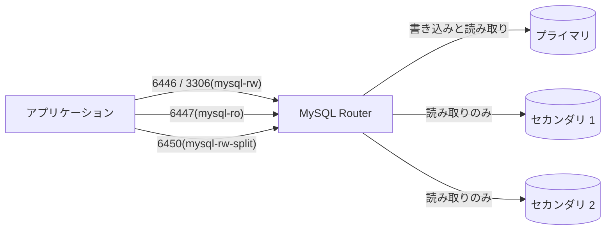

# 第11章 MySQL Router

> 本章で参照する公式リソース
>
> - [helm/mysql-operator/crds/crd.yaml#L272-L323](https://github.com/mysql/mysql-operator/blob/8.4.9-2.1.11/helm/mysql-operator/crds/crd.yaml#L272-L323)（`spec.router`）
> - [mysqloperator/controller/innodbcluster/cluster_api.py#L1102-L1113](https://github.com/mysql/mysql-operator/blob/8.4.9-2.1.11/mysqloperator/controller/innodbcluster/cluster_api.py#L1102-L1113)（Router のポート番号）

## この章でできるようになること

MySQL Router がクラスタ内で果たす役割を理解し、`spec.router` でインスタンス数やポートごとの用途を制御できるようになる。
Router を経由した読み書きの振り分けを、目的のポートを選ぶことで使い分けられるようになる。

## 前提

- [第10章 Service と接続エンドポイント](10-service-connection.md)で Service の種類を理解済みであること。

## MySQL Router の役割

MySQL Router は、アプリケーションと InnoDB Cluster の間に立つプロキシである。
アプリケーションは MySQL Server の Pod に直接つながず、Router が公開する Service に接続する。
Router はそのときの Group Replication のトポロジー（どの Pod がプライマリで、どれがセカンダリか）を把握しており、接続してきたポートに応じて適切なバックエンドへ転送する。



この構成により、アプリケーションはどの Pod が現在のプライマリかを意識せずに接続できる。
Group Replication でフェイルオーバーが起きてプライマリが交代しても、Router が新しいプライマリへの転送先を切り替えるため、アプリケーション側の接続先変更は不要である。

## ポートと用途

Router は複数のポートを公開し、それぞれ転送先の振る舞いが異なる。

[cluster_api.py のポート番号定義](https://github.com/mysql/mysql-operator/blob/8.4.9-2.1.11/mysqloperator/controller/innodbcluster/cluster_api.py#L1102-L1113)は次のとおりである。

```python
mysql_port: int = 3306
mysql_xport: int = 33060
mysql_grport: int = 33061
mysql_metrics_port: int = 9104

router_rwport: int = 6446
router_roport: int = 6447
router_rwxport: int = 6448
router_roxport: int = 6449
router_rwsplitport: int = 6450

router_httpport: int = 8443
```

| ポート | 用途 |
|---|---|
| 6446 | classic プロトコルの読み書き接続（プライマリへ転送） |
| 6447 | classic プロトコルの読み取り専用接続（セカンダリへ転送） |
| 6448 | X Protocol の読み書き接続 |
| 6449 | X Protocol の読み取り専用接続 |
| 6450 | 読み書きスプリット接続（1つのセッション内で読み取りと書き込みを自動的に振り分ける） |
| 8443 | Router の REST API |

[第10章](10-service-connection.md)で扱った `spec.service.defaultPort` は、この中の3306番ポート（Service の既定ポート）がどの振る舞いに対応するかを選ぶフィールドである。

## spec.router によるカスタマイズ

[crd.yaml の spec.router](https://github.com/mysql/mysql-operator/blob/8.4.9-2.1.11/helm/mysql-operator/crds/crd.yaml#L272-L323)は次のとおりである。

```yaml
router:
  type: object
  description: "MySQL Router specification"
  properties:
    instances:
      type: integer
      minimum: 0
      default: 1
      description: "Number of MySQL Router instances to deploy"
    tlsSecretName:
      type: string
      description: "Name of a TLS type Secret containing MySQL Router certificate and private key used for SSL"
    version:
      type: string
      pattern: '^\d+\.\d+\.\d+(-.+)?'
      description: "Override MySQL Router version"
    podSpec:
      type: object
      x-kubernetes-preserve-unknown-fields: true
    podAnnotations:
      type: object
      x-kubernetes-preserve-unknown-fields: true
    podLabels:
      type: object
      x-kubernetes-preserve-unknown-fields: true
    bootstrapOptions:
      description: "Command line options passed to MySQL Router while bootstrapping"
      type: array
      items:
        type: string
    options:
      description: "Command line options passed to MySQL Router while running"
      type: array
      items:
        type: string
    routingOptions:
      description: "Set routing options for the cluster"
      type: object
      properties:
        invalidated_cluster_policy:
          type: string
          enum: ["drop_all", "accept_ro"]
        stats_updates_frequency:
          type: integer
          default: 0
          minimum: 0
        read_only_targets:
          type: string
          enum: ["all", "read_replicas", "secondaries"]
```

| フィールド | 説明 |
|---|---|
| `instances` | Router の Pod 数。既定は1。複数にすると Router 自体の可用性が上がる |
| `version` | Router のバージョンを Server と別に固定したいときに指定する |
| `podSpec` | Router の Pod テンプレートに任意のフィールドを追加する |
| `bootstrapOptions` | Router のブートストラップ時にコマンドラインへ渡すオプション |
| `options` | Router 起動後の実行時にコマンドラインへ渡すオプション |
| `routingOptions.invalidated_cluster_policy` | クラスタが無効と判定されたときの挙動。`drop_all` は全接続を切断し、`accept_ro` は読み取り専用接続のみ許可する |
| `routingOptions.read_only_targets` | 読み取り専用接続の転送先。`secondaries` はセカンダリのみ、`read_replicas` は Read Replica のみ、`all` は両方 |
| `tlsSecretName` | Router 用の TLS Secret。詳細は[第12章](12-tls.md)で扱う |

以下は、Router を2台に増やし、無効化されたクラスタでは読み取り専用接続のみ受け付けるようにする例である。

```yaml
# 以下は例である。instances の値は可用性要件に合わせて調整する。
apiVersion: mysql.oracle.com/v2
kind: InnoDBCluster
metadata:
  name: mycluster
spec:
  secretName: mypwds
  instances: 3
  router:
    instances: 2
    routingOptions:
      invalidated_cluster_policy: accept_ro
```

動作確認は、Router の Pod 数と、Deployment に反映された設定を確認する。

```bash
kubectl get pods -l component=mysqlrouter
```

```text
NAME                          READY   STATUS    RESTARTS   AGE
mycluster-router-7d9f9-abcde  1/1     Running   0          1m
mycluster-router-7d9f9-fghij  1/1     Running   0          1m
```

## Read Replica への転送

`routingOptions.read_only_targets` を `read_replicas` にすると、読み取り専用接続は Group Replication のセカンダリではなく Read Replica に振り分けられる。
Read Replica の作成方法は[第20章 Read Replica](../part05-operations/20-read-replicas.md)で扱う。

## まとめ

MySQL Router は、アプリケーションと InnoDB Cluster の間でプライマリとセカンダリへの振り分けを担うプロキシであり、ポートごとに読み書き、読み取り専用、読み書きスプリットの用途が決まっている。
`spec.router` でインスタンス数やルーティングポリシーを制御できる。

## 関連する章

- [第10章 Service と接続エンドポイント](10-service-connection.md)
- [第12章 TLS と証明書](12-tls.md)
- [第20章 Read Replica](../part05-operations/20-read-replicas.md)
