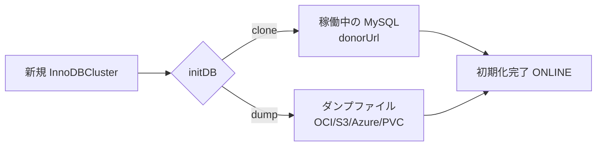

# 第13章 データの初期化（initDB）

> 本章で参照する公式リソース
>
> - [helm/mysql-operator/crds/crd.yaml#L182-L271](https://github.com/mysql/mysql-operator/blob/8.4.9-2.1.11/helm/mysql-operator/crds/crd.yaml#L182-L271)（`initDB` フィールド定義）
> - [mysqloperator/controller/innodbcluster/cluster_api.py#L301-L376](https://github.com/mysql/mysql-operator/blob/8.4.9-2.1.11/mysqloperator/controller/innodbcluster/cluster_api.py#L301-L376)（`CloneInitDBSpec` / `SnapshotInitDBSpec` / `DumpInitDBSpec` / `InitDB` の解析処理）
> - [mysqloperator/sidecar_main.py#L219-L237](https://github.com/mysql/mysql-operator/blob/8.4.9-2.1.11/mysqloperator/sidecar_main.py#L219-L237)（初期化 Pod が実際にデータを投入する処理）

## この章でできるようになること

新規に作成する InnoDB Cluster に、既存データを投入した状態で起動できるようになる。
クローンとダンプからのロードという2種類の初期化方法のうち、自分の状況に合ったものを選び、`InnoDBCluster` リソースの `initDB` フィールドに設定できるようになる。

## 前提

第4章で示した最小構成の `InnoDBCluster` は、空のデータベースでクラスタを起動する。
運用移行やレプリカ環境の構築では、既存の MySQL インスタンスやバックアップからデータを引き継いだ状態でクラスタを起動したい場合が多い。
`initDB` フィールドは、この「起動時の初期データ投入」を担う。

### initDB の2方式

初期化データの流れは、選ぶ方式によって異なる。



`initDB` には `clone` と `dump` の2つのサブフィールドが CRD に定義されており、実際にデータを投入する経路もこの2つに限られる。

```yaml
https://github.com/mysql/mysql-operator/blob/8.4.9-2.1.11/helm/mysql-operator/crds/crd.yaml#L182-L184
```

```yaml
                initDB:
                  type: object
                  properties:
```

一方、Operator 本体の解析処理は `clone` と `dump` に加えて `snapshot` も受け付ける。

```yaml
https://github.com/mysql/mysql-operator/blob/8.4.9-2.1.11/mysqloperator/controller/innodbcluster/cluster_api.py#L350-L376
```

```python
class InitDB:
    clone: Optional[CloneInitDBSpec] = None
    snapshot: Optional[SnapshotInitDBSpec] = None
    dump: Optional[DumpInitDBSpec] = None

    def parse(self, spec: dict, prefix: str) -> None:
        dump = dget_dict(spec, "dump", "spec.initDB", {})
        clone = dget_dict(spec, "clone", "spec.initDB", {})
        snapshot = dget_dict(spec, "snapshot", "spec.initDB", {})
        if len([x for x in [dump, clone, snapshot] if x]) > 1:
            raise ApiSpecError(
                "Only one of dump, snapshot or clone may be specified in spec.initDB")
        if not dump and not clone and not snapshot:
            raise ApiSpecError(
                "One of dump, snapshot or clone may be specified in spec.initDB")

        if clone:
            self.clone = CloneInitDBSpec()
            self.clone.parse(clone, "spec.initDB.clone")
        elif dump:
            self.dump = DumpInitDBSpec()
            self.dump.parse(dump, "spec.initDB.dump")
        elif snapshot:
            self.snapshot = SnapshotInitDBSpec()
            self.snapshot.parse(snapshot, "spec.initDB.snapshot")
```

`initDB` オブジェクトには `x-kubernetes-preserve-unknown-fields: true` が設定されているため、CRD スキーマに `snapshot` が明記されていなくても API サーバーはこのフィールドを拒否しない。
`dump`、`clone`、`snapshot` は排他であり、2つ以上を同時に指定すると Operator がエラーを返す。
どれも指定しない場合も同様にエラーになる。
ただし、この解析処理が `snapshot` を受理することと、それが実際にデータ投入へ使われることは別である。
理由は次節で述べる。

なお `cluster_api.py` には `SQLInitDB` というクラスも定義されている。

```yaml
https://github.com/mysql/mysql-operator/blob/8.4.9-2.1.11/mysqloperator/controller/innodbcluster/cluster_api.py#L346-L348
```

```python
class SQLInitDB:
    storage = None  # TODO type
```

ただし `InitDB.parse()` はこのクラスを呼び出しておらず、`spec.initDB` から SQL スクリプトを直接指定する経路は実装されていない。
SQL スクリプトによる初期化は、後述するように別の手段（Pod の `initContainers` や `mysqlsh` の手動実行）で行う。

### clone による初期化

`clone` は、稼働中の別の MySQL インスタンス（またはクラスタ）からデータをクローンする方式である。
MySQL のクローンプラグインを使ってドナー側からフルコピーを取得するため、ダンプファイルを経由せずに済む。

```yaml
https://github.com/mysql/mysql-operator/blob/8.4.9-2.1.11/helm/mysql-operator/crds/crd.yaml#L185-L202
```

```yaml
                    clone:
                      type: object
                      required: ["donorUrl", "secretKeyRef"]
                      properties:
                        donorUrl:
                          type: string
                          description: "URL of the cluster to clone from"
                        rootUser:
                          type: string
                          default: "root"
                          description: "User name used for cloning"
                        secretKeyRef:
                          type: object
                          required: ["name"]
                          properties:
                            name:
                              type: string
                              description: "Secret name with key 'rootPassword' storing the password for the user specified in rootUser"
```

`donorUrl` はクローン元の接続先（ホスト名とポート）、`secretKeyRef.name` はクローンに使うユーザーのパスワードを保持する Secret の名前である。
Secret には `rootPassword` というキーでパスワードを格納しておく。

以下は自分の環境向けに書く例である。
別クラスタの Service `source-cluster-instances.default.svc.cluster.local:3306` からクローンする。

```yaml
apiVersion: mysql.oracle.com/v2
kind: InnoDBCluster
metadata:
  name: mycluster
spec:
  secretName: mypwds
  instances: 3
  router:
    instances: 1
  initDB:
    clone:
      donorUrl: source-cluster-instances.default.svc.cluster.local:3306
      rootUser: root
      secretKeyRef:
        name: clone-donor-root-secret
```

`clone-donor-root-secret` には、ドナー側の `root` ユーザーのパスワードを `rootPassword` キーで登録しておく。

```bash
kubectl create secret generic clone-donor-root-secret \
  --from-literal=rootPassword='<ドナー側 root パスワード>'
```

クラスタ作成後、初期化が完了したかどうかは Pod のイベントとログで確認する。

```bash
kubectl get innodbcluster mycluster -o jsonpath='{.status.cluster.status}'
```

```text
ONLINE
```

`ONLINE` になれば、クローンによる初期化が完了しクラスタが稼働している状態である。

### dump による初期化

`dump` は、MySQL Shell の `dumpInstance()` や `dumpSchemas()` で取得したダンプをロードして初期化する方式である。
ダンプの保存先として `ociObjectStorage`、`s3`、`azure`、`persistentVolumeClaim` の4種類のストレージを選べる。

```yaml
https://github.com/mysql/mysql-operator/blob/8.4.9-2.1.11/helm/mysql-operator/crds/crd.yaml#L203-L271
```

```yaml
                    dump:
                      type: object
                      required: ["storage"]
                      properties:
                        name:
                          type: string
                          description: "Name of the dump. Not used by the operator, but a descriptive hint for the cluster administrator"
                        path:
                          type: string
                          description: "Path to the dump in the PVC. Use when specifying persistentVolumeClaim. Omit for ociObjectStorage, S3, or azure."
                        options:
                          type: object
                          description: "A dictionary of key-value pairs passed directly to MySQL Shell's loadDump()"
                          x-kubernetes-preserve-unknown-fields: true
                        storage:
                          type: object
                          properties:
                            ociObjectStorage:
                              type: object
                              required: ["bucketName", "prefix", "credentials"]
                              properties:
                                bucketName:
                                  type: string
                                  description: "Name of the OCI bucket where the dump is stored"
                                prefix:
                                  type: string
                                  description: "Path in the bucket where the dump files are stored"
                                credentials:
                                  type: string
                                  description: "Name of a Secret with data for accessing the bucket"
                            s3:
                              type: object
                              required: ["bucketName", "prefix", "config"]
                              properties:
                                bucketName:
                                  type: string
                                  description: "Name of the S3 bucket where the dump is stored"
                                prefix:
                                  type: string
                                  description: "Path in the bucket where the dump files are stored"
                                config:
                                  type: string
                                  description: "Name of a Secret with S3 configuration and credentials"
                                profile:
                                  type: string
                                  default: ""
                                  description: "Profile being used in configuration files"
                                endpoint:
                                  type: string
                                  description: "Override endpoint URL"
                            azure:
                              type: object
                              required: ["containerName", "prefix", "config"]
                              properties:
                                containerName:
                                  type: string
                                  description: "Name of the Azure  BLOB Storage container where the dump is stored"
                                prefix:
                                  type: string
                                  description: "Path in the container where the dump files are stored"
                                config:
                                  type: string
                                  description: "Name of a Secret with Azure BLOB Storage configuration and credentials"
                            persistentVolumeClaim:
                              type: object
                              description : "Specification of the PVC to be used. Used 'as is' in the cloning pod."
                              x-kubernetes-preserve-unknown-fields: true
                          x-kubernetes-preserve-unknown-fields: true
```

`options` は MySQL Shell の `loadDump()` にそのまま渡されるキーと値の辞書であり、`threads` や `skipBinlog` などのロードオプションをここで指定できる。

以下は `persistentVolumeClaim` を使う例である。
既存の PVC `mydump-pvc` にダンプファイル一式が配置されていることを前提とする。

```yaml
apiVersion: mysql.oracle.com/v2
kind: InnoDBCluster
metadata:
  name: mycluster
spec:
  secretName: mypwds
  instances: 3
  router:
    instances: 1
  initDB:
    dump:
      name: my-dump
      path: /mydump
      storage:
        persistentVolumeClaim:
          claimName: mydump-pvc
```

OCI Object Storage を使う場合の例は次のとおりである。
`credentials` に指定する Secret の作成方法は第16章（バックアップ）と共通のため、そちらで扱う。

```yaml
apiVersion: mysql.oracle.com/v2
kind: InnoDBCluster
metadata:
  name: mycluster
spec:
  secretName: mypwds
  instances: 3
  router:
    instances: 1
  initDB:
    dump:
      storage:
        ociObjectStorage:
          bucketName: my-dump-bucket
          prefix: dumps/2026-06
          credentials: oci-credentials
```

初期化ジョブが完了したことは、初期化用 Pod のログと `InnoDBCluster` のステータスで確認する。

```bash
kubectl logs mycluster-initconf-0
```

```text
Loading DDL and Data...
...
Load progress state has been reset for this session. Load is starting anew...
Dump complete, 1 warnings
```

```bash
kubectl get innodbcluster mycluster -o jsonpath='{.status.cluster.status}'
```

```text
ONLINE
```

### snapshot は解析されるが初期化には使われない

`snapshot` は `cluster_api.py` の解析処理では `clone` や `dump` と対等に扱われる。

```yaml
https://github.com/mysql/mysql-operator/blob/8.4.9-2.1.11/mysqloperator/controller/innodbcluster/cluster_api.py#L321-L328
```

```python
class SnapshotInitDBSpec:
    storage: Optional[StorageSpec] = None

    def parse(self, spec: dict, prefix: str) -> None:
        self.storage = StorageSpec()
        self.storage.parse(
            dget_dict(spec, "storage", prefix), prefix+".storage")
```

`storage` の内容は `dump` と同じ `StorageSpec`（`ociObjectStorage` / `s3` / `azure` / `persistentVolumeClaim`）を受け取る。

ただし、初期化 Pod が実際にデータを投入する処理は `clone` と `dump` の2つしか呼び出さない。

```yaml
https://github.com/mysql/mysql-operator/blob/8.4.9-2.1.11/mysqloperator/sidecar_main.py#L219-L237
```

```python
def populate_db(datadir, session, cluster, pod, logger: Logger) -> 'ClassicSession':
    """
    Populate DB from source specified in the cluster spec.
    Also creates main root account specified by user.

    mysqld may get restarted by clone.
    """
    if cluster.parsed_spec.initDB:
        if cluster.parsed_spec.initDB.clone:
            logger.info("Populate with clone")
            return populate_with_clone(datadir, session, cluster, cluster.parsed_spec.initDB.clone, pod, logger)
        elif cluster.parsed_spec.initDB.dump:
            logger.info("Populate with dump")
            return populate_with_dump(datadir, session, cluster, cluster.parsed_spec.initDB.dump, pod, logger)
        else:
            logger.warning(
                "spec.initDB ignored because no supported initialization parameters found")

    create_root_account(session, pod, cluster, logger)
```

`initDB.clone` と `initDB.dump` のどちらでもない場合（つまり `snapshot` だけを指定した場合を含む）、この `else` 節に落ちて `spec.initDB ignored because no supported initialization parameters found` という警告がログに出るだけで、初期化用のデータ投入は行われない。
したがって `initDB.snapshot` は、CRD の解析処理では受理されるものの、8.4.9-2.1.11 時点ではデータ投入の手段として使えない。
`MySQLBackup` のスナップショットバックアップからの復元も同様に未対応であり、詳細は第18章（リストア）で扱う。

## initDB の主なフィールド一覧

| フィールド | 型 | 説明 |
|---|---|---|
| `clone.donorUrl` | string | クローン元の接続先 |
| `clone.rootUser` | string | クローンに使うユーザー名（デフォルト `root`） |
| `clone.secretKeyRef.name` | string | `rootPassword` キーを持つ Secret 名 |
| `dump.name` | string | ダンプの識別用の名前（Operator は参照しない） |
| `dump.path` | string | PVC 内のダンプの相対パス |
| `dump.options` | object | `loadDump()` に渡すオプション |
| `dump.storage.ociObjectStorage` | object | OCI バケットからロード |
| `dump.storage.s3` | object | S3 バケットからロード |
| `dump.storage.azure` | object | Azure BLOB Storage からロード |
| `dump.storage.persistentVolumeClaim` | object | PVC からロード |
| `snapshot.storage` | object | 解析処理では受理されるが、8.4.9-2.1.11 の初期化 Pod では無視される |

## トラブルシューティング

初期化が進まず `InnoDBCluster` のステータスが `INITIALIZING` のまま止まる場合は、初期化用 Pod の状態を確認する。

```bash
kubectl get pods -l component=mysqld -o wide
kubectl describe pod mycluster-initconf-0
```

`clone` でクローン元に到達できない場合、Pod のイベントに接続エラーが出る。
`donorUrl` のホスト名解決とネットワークポリシーを確認する。

## まとめ

`initDB` は、新規クラスタに既存データを投入するためのフィールドであり、実用上は `clone` と `dump` の2方式から選ぶ。
`snapshot` は解析処理では `clone` や `dump` と対等に受理されるが、初期化 Pod の実装は `clone` と `dump` しか呼び出さないため、8.4.9-2.1.11 では指定してもデータは投入されない。
`SQLInitDB` は定義のみでこのフィールド経由では呼び出されないため、SQL スクリプトによる初期化は別の手段で行う。

## 関連する章

- [第4章 InnoDBCluster リソースの全体像](../part01-innodbcluster-basics/04-innodbcluster-resource.md)
- [第7章 ストレージと PersistentVolumeClaim](../part01-innodbcluster-basics/07-storage-pvc.md)
- 第16章 オンデマンドバックアップ（MySQLBackup）
- 第18章 リストア
