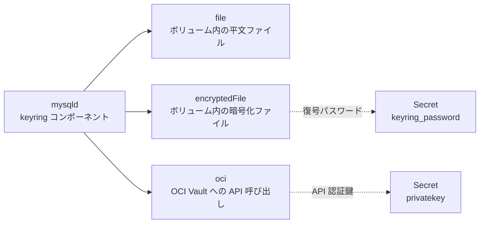

# 第14章 Keyring と保存時暗号化

> 本章で参照する公式リソース
>
> - [helm/mysql-operator/crds/crd.yaml#L90-L181](https://github.com/mysql/mysql-operator/blob/8.4.9-2.1.11/helm/mysql-operator/crds/crd.yaml#L90-L181)（`keyring` フィールド定義）
> - [mysqloperator/controller/innodbcluster/cluster_api.py#L426-L438](https://github.com/mysql/mysql-operator/blob/8.4.9-2.1.11/mysqloperator/controller/innodbcluster/cluster_api.py#L426-L438)（`KeyringFileSpec`）
> - [mysqloperator/controller/innodbcluster/cluster_api.py#L526-L557](https://github.com/mysql/mysql-operator/blob/8.4.9-2.1.11/mysqloperator/controller/innodbcluster/cluster_api.py#L526-L557)（`KeyringEncryptedFileSpec`）
> - [mysqloperator/controller/innodbcluster/cluster_api.py#L651-L661](https://github.com/mysql/mysql-operator/blob/8.4.9-2.1.11/mysqloperator/controller/innodbcluster/cluster_api.py#L651-L661)（`KeyringOciSpec`）

## この章でできるようになること

InnoDB Cluster の**保存時暗号化**（テーブルスペース暗号化）に必要な**Keyring**を構成できるようになる。
`file`、`encryptedFile`、`oci` という3種類の Keyring 種別のうち、自分の環境に合ったものを選び、`InnoDBCluster` リソースの `keyring` フィールドに設定できるようになる。

## 前提

MySQL の保存時暗号化は、テーブルスペースの暗号鍵を Keyring と呼ばれる仕組みで管理する。
Keyring は暗号鍵そのものを保管するコンポーネントであり、暗号化されたテーブルスペースを読み書きするたびに参照される。
Keyring を構成しない場合、`ENCRYPTION='Y'` を指定したテーブルやスキーマの暗号化 DDL は失敗する。

Keyring の種別によって、鍵の保管場所と `mysqld` からの参照経路が異なる。



`keyring` フィールドには `file`、`encryptedFile`、`oci` の3種類のサブフィールドがある。

```yaml
https://github.com/mysql/mysql-operator/blob/8.4.9-2.1.11/helm/mysql-operator/crds/crd.yaml#L90-L93
```

```yaml
                keyring:
                  type: object
                  description: "Keyring specification"
                  properties:
```

いずれか1つを選んで設定する。
どれも設定しない場合、保存時暗号化の機能自体は使えない状態のままクラスタが起動する。

### file（平文ファイル Keyring）

`file` は、Kubernetes のボリュームにマウントしたファイルへ暗号鍵を平文で保存する方式である。
構成が最も単純だが、ボリュームへのアクセス権を持つ者は鍵を読み取れるため、本番運用では後述の `encryptedFile` や `oci` を検討する。

```yaml
https://github.com/mysql/mysql-operator/blob/8.4.9-2.1.11/helm/mysql-operator/crds/crd.yaml#L94-L110
```

```yaml
                    file:
                      type: object
                      description: "Keyring 'File' specification"
                      required: ["storage"]
                      properties:
                        fileName:
                          type: string
                          default: "mysql_keyring"
                          description: "Path to the keyring file name inside the storage volume (will be prefixed by mount path)"
                        readOnly:
                          type: boolean
                          default: false
                          description: "Whether to open the keyring file in read-only mode"
                        storage:
                          type: object
                          description : "Specification of the volume to be mounted where the keyring file resides"
                          x-kubernetes-preserve-unknown-fields: true
```

`storage` には任意の Kubernetes ボリュームソース（`emptyDir`、`persistentVolumeClaim` など）をそのまま記述する。
Operator 側の実装は、この `storage` を Pod の `volumes` に追加し、`mysqld` コンテナと初期化コンテナの両方にマウントする。

```python
https://github.com/mysql/mysql-operator/blob/8.4.9-2.1.11/mysqloperator/controller/innodbcluster/cluster_api.py#L426-L438
```

```python
class KeyringFileSpec(KeyringSpecBase):
    fileName: Optional[str] = None
    readOnly: Optional[bool] = False
    storage: Optional[dict] = None

    def __init__(self, namespace: str, global_manifest_name: str, component_config_configmap_name: str, keyring_mount_path: str):
        self.namespace = namespace
        self.global_manifest_name = global_manifest_name
        self.component_config_configmap_name = component_config_configmap_name
        self.keyring_mount_path = keyring_mount_path

    def parse(self, spec: dict, prefix: str) -> None:
        self.fileName = dget_str(spec, "fileName", prefix)
        self.readOnly = dget_bool(spec, "readOnly", prefix, default_value=False)
        self.storage = dget_dict(spec, "storage", prefix)
```

以下は自分の環境向けに書く例である。
専用の PVC を確保し、そこに Keyring ファイルを保存する。

```yaml
apiVersion: mysql.oracle.com/v2
kind: InnoDBCluster
metadata:
  name: mycluster
spec:
  secretName: mypwds
  instances: 3
  router:
    instances: 1
  keyring:
    file:
      fileName: mysql_keyring
      storage:
        persistentVolumeClaim:
          claimName: keyring-pvc
```

構成後、Keyring プラグインがロードされているかを Pod 内から確認する。

```bash
kubectl exec -it mycluster-0 -- mysql -uroot -p -e "SHOW PLUGINS;" | grep -i keyring
```

```text
component_keyring_file	ACTIVE	KEYRING	NULL	GPL
```

`ACTIVE` と表示されれば Keyring コンポーネントがロードされている状態であり、暗号化テーブルスペースの作成に進める。

### encryptedFile（暗号化ファイル Keyring）

`encryptedFile` は、`file` と同様にファイルへ鍵を保存するが、ファイル自体をパスワードで暗号化する方式である。
パスワードは Secret の `keyring_password` キーで与える。

```yaml
https://github.com/mysql/mysql-operator/blob/8.4.9-2.1.11/helm/mysql-operator/crds/crd.yaml#L111-L130
```

```yaml
                    encryptedFile:
                      type: object
                      description: "Keyring 'Encrypted File' specification"
                      required: ["storage", "password"]
                      properties:
                        fileName:
                          type: string
                          default: "mysql_keyring"
                          description: "Path to the keyring file name inside the storage volume (will be prefixed by mount path)"
                        readOnly:
                          type: boolean
                          default: false
                          description: "Whether to open the keyring file in read-only mode"
                        password:
                          type: string
                          description: "Name of a secret that contains password for the keyring in the key 'keyring_password'"
                        storage:
                          type: object
                          description : "Specification of the volume to be mounted where the keyring file resides"
                          x-kubernetes-preserve-unknown-fields: true
```

Operator の実装は、Secret から `keyring_password` を読み出して検証する。

```python
https://github.com/mysql/mysql-operator/blob/8.4.9-2.1.11/mysqloperator/controller/innodbcluster/cluster_api.py#L539-L557
```

```python
    def parse(self, spec: dict, prefix: str) -> None:
        def get_password_from_secret(secret_name: str) -> str:
            expected_key = 'keyring_password'
            try:
                password = cast(api_client.V1Secret,
                                api_core.read_namespaced_secret(secret_name, self.namespace))

                if not expected_key in password.data:
                   raise ApiSpecError(f"Secret {secret_name} has no key {expected_key}")
                password = password.data[expected_key]

                if not password:
                    raise ApiSpecError(f"Secret {secret_name}'s {expected_key} is empty")

                return utils.b64decode(password)
            except ApiException as e:
                if e.status == 404:
                    raise ApiSpecError(f"Secret {secret_name} is missing")
                raise
```

Secret に `keyring_password` キーがない、または値が空の場合、Operator は `ApiSpecError` を送出してリコンサイルを中断する。
事前に Secret を作成しておく。

```bash
kubectl create secret generic keyring-enc-password \
  --from-literal=keyring_password='<任意の強いパスワード>'
```

以下は自分の環境向けに書く例である。

```yaml
apiVersion: mysql.oracle.com/v2
kind: InnoDBCluster
metadata:
  name: mycluster
spec:
  secretName: mypwds
  instances: 3
  router:
    instances: 1
  keyring:
    encryptedFile:
      fileName: mysql_keyring
      password: keyring-enc-password
      storage:
        persistentVolumeClaim:
          claimName: keyring-pvc
```

Pod が起動しない場合は、まず Secret の存在とキー名を確認する。

```bash
kubectl get secret keyring-enc-password -o jsonpath='{.data.keyring_password}' | base64 -d
```

```text
<設定したパスワードが表示される>
```

### oci（OCI Vault Keyring）

`oci` は、Oracle Cloud Infrastructure の Vault サービスに鍵を保管する方式である。
クラスタ側にはファイルを持たず、Vault への API 呼び出しで鍵を取得するため、鍵の管理をクラスタの外部に委譲できる。

```yaml
https://github.com/mysql/mysql-operator/blob/8.4.9-2.1.11/helm/mysql-operator/crds/crd.yaml#L131-L181
```

```yaml
                    oci:
                      type: object
                      description: "Keyring 'OCI' specification"
                      required: ["user", "keySecret", "keyFingerprint", "tenancy"]
                      properties:
                        user:
                          type: string
                          description: "User identifier in the form of ocid1.user.oc1..."
                          pattern: '^ocid1\.user\.'
                        keySecret:
                          type: string
                          description: "A secret that contains the private key under the field 'privatekey'"
                        keyFingerprint:
                          type: string
                          description: "Private key fingerprint"
                          pattern: '([0-9a-f]{2}:){15}[0-9a-f]{2}$'
                        tenancy:
                          type: string
                          description: "Tenancy identifier in the form ocid1.tenancy.oc1..."
                          pattern:  '^ocid1\.tenancy\.'
                        compartment:
                          type: string
                          description: "Compartment identifier in the form ocid1.compartment.oc1..."
                          pattern:  '^ocid1\.compartment\.'
                        virtualVault:
                          type: string
                          description: "Vault identifier in the form ocid1.vault.oc1..."
                          pattern:  '^ocid1\.vault\.'
                        masterKey:
                          type: string
                          description: "Master key identified in the form ocid1.key.oc1..."
                          pattern:  '^ocid1\.key\.'
                        endpoints:
                          type: object
                          description: ""
                          properties:
                            encryption:
                              type: string
                              description: "Encryption endpoint URI like {identifier}-crypto.kms.{region}.oraclecloud.com"
                            management:
                              type: string
                              description: "Management endpoint URI like {identifier}-management.kms.{region}.oraclecloud.com"
                            vaults:
                              type: string
                              description: "Vaults endpoint URI like vaults.{region}.oci.oraclecloud.com"
                            secrets:
                              type: string
                              description: "Secrets endpoint URI like secrets.vaults.{region}.oci.oraclecloud.com"
                        caCertificate:
                          type: string
                          description: "Secret that contains ca.crt field with CA certificate bundle file that the keyring_oci plugin uses for Oracle Cloud Infrastructure certificate verification"
```

`user`、`tenancy`、`virtualVault`、`masterKey` は OCID 形式であり、それぞれ専用の正規表現パターンで検証される。
`keySecret` には、OCI API 認証用の秘密鍵を `privatekey` フィールドに持つ Secret の名前を指定する。

```python
https://github.com/mysql/mysql-operator/blob/8.4.9-2.1.11/mysqloperator/controller/innodbcluster/cluster_api.py#L651-L661
```

```python
class KeyringOciSpec(KeyringSpecBase):
    user: Optional[str] = None
    keySecret: Optional[str] = None
    keyFingerprint: Optional[str] = None
    tenancy: Optional[str] = None
    compartment: Optional[str] = None
    virtualVault: Optional[str] = None
    masterKey: Optional[str] = None
    caCertificate: Optional[str] = None
    endpointEncryption: Optional[str] = None
```

以下は自分の環境向けに書く例である。
OCID の値はすべて仮のものであり、実際のテナンシー、Vault、鍵の OCID に置き換える。

```yaml
apiVersion: mysql.oracle.com/v2
kind: InnoDBCluster
metadata:
  name: mycluster
spec:
  secretName: mypwds
  instances: 3
  router:
    instances: 1
  keyring:
    oci:
      user: ocid1.user.oc1..aaaaaaaaexampleuser
      keySecret: oci-api-key-secret
      keyFingerprint: "12:34:56:78:9a:bc:de:f0:12:34:56:78:9a:bc:de:f0"
      tenancy: ocid1.tenancy.oc1..aaaaaaaaexampletenancy
      virtualVault: ocid1.vault.oc1..aaaaaaaaexamplevault
      masterKey: ocid1.key.oc1..aaaaaaaaexamplekey
```

`keySecret` に指定する Secret は事前に作成しておく。

```bash
kubectl create secret generic oci-api-key-secret \
  --from-file=privatekey=./oci_api_key.pem
```

Vault との接続確認は Pod 内のログで行う。

```bash
kubectl logs mycluster-0 -c mysql | grep -i keyring_oci
```

```text
[Note] Plugin keyring_oci reported: 'keyring_oci initialization succeeded'
```

## keyring の主なフィールド一覧

| 種別 | フィールド | 説明 |
|---|---|---|
| `file` | `fileName` | Keyring ファイル名（デフォルト `mysql_keyring`） |
| `file` | `readOnly` | 読み取り専用で開くか |
| `file` | `storage` | マウントするボリューム |
| `encryptedFile` | `password` | `keyring_password` キーを持つ Secret 名 |
| `encryptedFile` | `storage` | マウントするボリューム |
| `oci` | `user` / `tenancy` / `virtualVault` / `masterKey` | OCI Vault の識別子（OCID） |
| `oci` | `keySecret` | `privatekey` キーを持つ Secret 名 |
| `oci` | `keyFingerprint` | API 鍵のフィンガープリント |
| `oci` | `endpoints` | KMS と Vault の各エンドポイント URI の上書き |
| `oci` | `caCertificate` | 証明書検証用の CA バンドルを持つ Secret 名 |

## トラブルシューティング

Keyring プラグインがロードされず `mysqld` が起動しない場合、初期化コンテナのログでマウントパスの誤りがないか確認する。

```bash
kubectl logs mycluster-0 -c initmysql
```

`encryptedFile` で `ApiSpecError` が発生する場合は、Secret のキー名が `keyring_password` になっているかを確認する。
`oci` で認証エラーになる場合は、`keyFingerprint` が `keySecret` の秘密鍵と対応しているかを確認する。

## まとめ

Keyring は保存時暗号化の鍵を管理する仕組みであり、`keyring` フィールドで `file`、`encryptedFile`、`oci` のいずれかを選んで構成する。
`file` は構成が単純だが鍵が平文で保存され、`encryptedFile` はパスワードでファイルを保護し、`oci` は鍵の管理を OCI Vault に委譲する。
どの方式も、鍵やパスワードそのものは Secret 経由で渡す点は共通である。

## 関連する章

- [第5章 認証情報と Secret](../part01-innodbcluster-basics/05-credentials-secret.md)
- [第12章 TLS と証明書](../part02-networking/12-tls.md)
- [第13章 データの初期化（initDB）](13-initdb.md)
