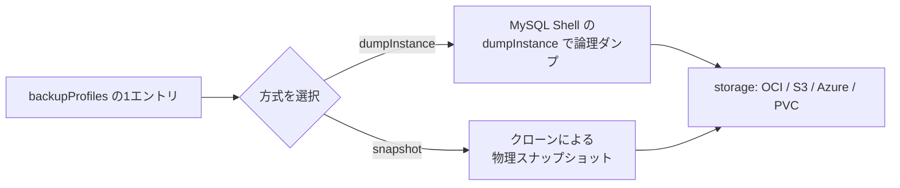
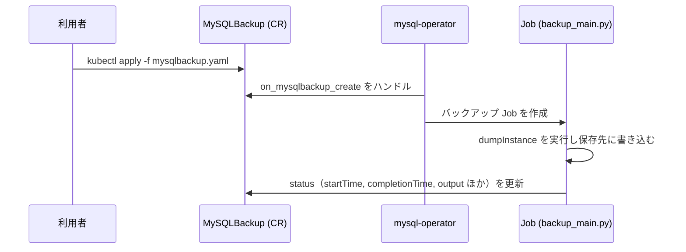

# 第15章 バックアップの概念とプロファイル

> 本章で参照する公式リソース
>
> - [helm/mysql-operator/crds/crd.yaml#L399-L475](https://github.com/mysql/mysql-operator/blob/8.4.9-2.1.11/helm/mysql-operator/crds/crd.yaml#L399-L475)（`backupProfiles` の `dumpInstance`）
> - [helm/mysql-operator/crds/crd.yaml#L476-L533](https://github.com/mysql/mysql-operator/blob/8.4.9-2.1.11/helm/mysql-operator/crds/crd.yaml#L476-L533)（`backupProfiles` の `snapshot`）
> - [helm/mysql-operator/crds/crd.yaml#L899-L1053](https://github.com/mysql/mysql-operator/blob/8.4.9-2.1.11/helm/mysql-operator/crds/crd.yaml#L899-L1053)（`MySQLBackup` CRD 全体）
> - [mysqloperator/backup_main.py#L139-L140](https://github.com/mysql/mysql-operator/blob/8.4.9-2.1.11/mysqloperator/backup_main.py#L139-L140)（`snapshot` 方式の実行部）

## この章でできるようになること

InnoDBCluster の `backupProfiles` を設計し、ダンプとスナップショットのどちらの方式を選ぶべきか判断できるようになる。
バックアップの保存先（OCI Object Storage、S3、Azure BLOB Storage、PVC）を選び、`MySQLBackup` CRD が担う役割の全体像を把握できるようになる。

## 前提

第13章「[データの初期化（initDB）](../part03-initdb-security/13-initdb.md)」で InnoDBCluster を起動済みであること。
バックアップの保存先として OCI、S3、Azure を使う場合は、認証情報を格納した Secret を事前に作成しておくこと。

### バックアッププロファイルとは何か

**バックアッププロファイル**は、バックアップの取得方法（ダンプかスナップショットか）と保存先をひとまとめにした設定である。
InnoDBCluster の `spec.backupProfiles` に名前付きで複数登録しておき、あとから第16章のオンデマンドバックアップや第17章のスケジュールバックアップから `backupProfileName` で参照する。

プロファイルを事前登録せず、バックアップ実行時にインラインで方式と保存先を指定することもできる。
この場合は `backupProfileName` の代わりに `backupProfile` フィールドへ直接プロファイル定義を書く。
両者はどちらも同じスキーマ（`dumpInstance` または `snapshot` ＋ `storage`）を使う。

以下は `backupProfiles` を1件持つ InnoDBCluster の例である。

```yaml
apiVersion: mysql.oracle.com/v2
kind: InnoDBCluster
metadata:
  name: mycluster
spec:
  secretName: mypwds
  instances: 3
  router:
    instances: 1
  backupProfiles:
    - name: daily-dump-to-pvc
      dumpInstance:
        storage:
          persistentVolumeClaim:
            claimName: backup-pvc
```

動作確認は、InnoDBCluster の `spec.backupProfiles` が意図どおり登録されているかを確認するところから始める。

```bash
kubectl get innodbcluster mycluster -o jsonpath='{.spec.backupProfiles[0].name}'
```

```text
daily-dump-to-pvc
```

### ダンプとスナップショットの違い

`backupProfiles` の各エントリは、`dumpInstance` と `snapshot` のどちらか一方を必ず一つだけ持つ。
両方を指定した場合も、どちらも指定しない場合も、バリデーションエラーになる。



**ダンプ**（`dumpInstance`）は、MySQL Shell の `util.dumpInstance()` を使って論理ダンプを取得する方式である。
テーブルデータを SQL 相当の形式で書き出すため、MySQL のバージョンをまたいだ復元や部分的な参照がしやすい一方、データ量が大きいクラスタでは時間がかかる。

**スナップショット**（`snapshot`）は、クローンプラグインによる物理コピーでバックアップを取得する方式として CRD 上に定義されている。
ただし、実行部の `execute_clone_snapshot()` は本バージョンの `backup_main.py` では未実装であり、呼び出されても何も行わない。

[mysqloperator/backup_main.py#L139-L140](https://github.com/mysql/mysql-operator/blob/8.4.9-2.1.11/mysqloperator/backup_main.py#L139-L140)は次のとおりである。

```python
def execute_clone_snapshot(backup_source, profile, backupdir: Optional[str], backup_name: str, logger: logging.Logger) -> dict:
    ...
```

したがって、`8.4.9-2.1.11` の community 版では `snapshot` プロファイルを設定してもバックアップは実行されない。
本書のオンデマンドバックアップ（第16章）とスケジュールバックアップ（第17章）は、実際に動作する `dumpInstance` 方式を中心に解説する。

### バックアップの保存先

`dumpInstance.storage` には、次の4種類のいずれかを設定する。
[helm/mysql-operator/crds/crd.yaml#L422-L475](https://github.com/mysql/mysql-operator/blob/8.4.9-2.1.11/helm/mysql-operator/crds/crd.yaml#L422-L475)は、その定義部分である。

```yaml
                          storage:
                            type: object
                            properties:
                              ociObjectStorage:
                                type: object
                                required: ["bucketName", "credentials"]
                                properties:
                                  bucketName:
                                    type: string
                                    description: "Name of the OCI bucket where backup is stored"
                                  prefix:
                                    type: string
                                    description: "Path in bucket where backup is stored"
                                  credentials:
                                    type: string
                                    description: "Name of a Secret with data for accessing the bucket"
                              s3:
                                type: object
                                required: ["bucketName", "config"]
                                properties:
                                  bucketName:
                                    type: string
                                    description: "Name of the S3 bucket where the dump is stored"
                                  prefix:
                                    type: string
                                    description: "Path in the bucket where the dump files are stored"
                                  config:
                                    type: string
                                    description: "Name of a Secret with S3 configuration and credentials"
                                  profile:
                                    type: string
                                    default: ""
                                    description: "Profile being used in configuration files"
                                  endpoint:
                                    type: string
                                    description: "Override endpoint URL"
                              azure:
                                type: object
                                required: ["containerName", "config"]
                                properties:
                                  containerName:
                                    type: string
                                    description: "Name of the Azure  BLOB Storage container where the dump is stored"
                                  prefix:
                                    type: string
                                    description: "Path in the container where the dump files are stored"
                                  config:
                                    type: string
                                    description: "Name of a Secret with Azure BLOB Storage configuration and credentials"
                              persistentVolumeClaim:
                                type: object
                                description : "Specification of the PVC to be used. Used 'as is' in pod executing the backup."
                                x-kubernetes-preserve-unknown-fields: true
                            x-kubernetes-preserve-unknown-fields: true
```

| 保存先 | 必須フィールド | 用途 |
|---|---|---|
| `ociObjectStorage` | `bucketName`, `credentials` | Oracle Cloud Infrastructure の Object Storage |
| `s3` | `bucketName`, `config` | Amazon S3 互換ストレージ |
| `azure` | `containerName`, `config` | Azure BLOB Storage |
| `persistentVolumeClaim` | なし（既存 PVC を指定） | クラスタと同じ Kubernetes クラスタ内の永続ボリューム |

`credentials` と `config` は、いずれもバケットやコンテナへの認証情報を格納した Secret の名前を指す。
`persistentVolumeClaim` だけは Secret を必要とせず、事前に作成済みの PVC を指定する。

### MySQLBackup CRD の役割

**MySQLBackup**（kind: `MySQLBackup`、短縮名 `mbk`）は、1回のバックアップ実行を表す Custom Resource である。
`spec.clusterName` で対象の InnoDBCluster を指定し、`spec.backupProfileName` または `spec.backupProfile` でどのプロファイルを使うかを指定する。



MySQLBackup オブジェクトを作成すると、operator が対応する Kubernetes Job を1つ生成する。
このバックアップ実行の詳細な手順（オンデマンド実行）は第16章、cron による定期実行は第17章で扱う。

## まとめ

- **バックアッププロファイル**は方式（`dumpInstance` または `snapshot`）と保存先を組にした再利用可能な設定である。
- `snapshot` は CRD 上定義されているが、`8.4.9-2.1.11` の実行部では未実装であり、実運用では `dumpInstance` を使う。
- 保存先は OCI Object Storage、S3、Azure BLOB Storage、PVC の4種類から選べる。
- 実際のバックアップ実行は `MySQLBackup` Custom Resource として表現され、operator が Job を生成して処理する。

## 関連する章

- [第13章 データの初期化（initDB）](../part03-initdb-security/13-initdb.md)
- [第16章 オンデマンドバックアップ（MySQLBackup）](16-ondemand-backup.md)
- [第17章 スケジュールバックアップ](17-scheduled-backup.md)
- [第18章 リストア](18-restore.md)
