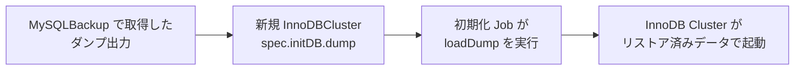

# 第18章 リストア

> 本章で参照する公式リソース
>
> - [helm/mysql-operator/crds/crd.yaml#L182-L271](https://github.com/mysql/mysql-operator/blob/8.4.9-2.1.11/helm/mysql-operator/crds/crd.yaml#L182-L271)（InnoDBCluster の `initDB.dump`）
> - [helm/mysql-operator/crds/crd.yaml#L1007-L1019](https://github.com/mysql/mysql-operator/blob/8.4.9-2.1.11/helm/mysql-operator/crds/crd.yaml#L1007-L1019)（`MySQLBackup` の `status.output`）

## この章でできるようになること

`dumpInstance` 方式で取得したバックアップから、新規の InnoDBCluster をリストアできるようになる。

## 前提

第16章「[オンデマンドバックアップ（MySQLBackup）](16-ondemand-backup.md)」または第17章「[スケジュールバックアップ](17-scheduled-backup.md)」で、リストア対象のバックアップを取得済みであること。
第13章「[データの初期化（initDB）](../part03-initdb-security/13-initdb.md)」で `initDB.dump` を使ったクラスタ起動の基本を理解していること。

### リストアの位置づけ

MySQL Operator には、既存クラスタに対して直接データを書き戻す専用の「リストア」操作はない。
バックアップからの復元は、第13章で扱った `spec.initDB.dump` を使い、そのバックアップを参照する新規の InnoDBCluster を作成する形で行う。



第15章で述べたとおり、`snapshot` 方式は本バージョンでは実行部が未実装であるため、実際にリストアできるのは `dumpInstance` で取得したバックアップだけである。
CRD スキーマ上、`spec.initDB` には `clone` と `dump` の2種類のみが定義されている。
第13章で見たとおり、Operator の解析処理は `snapshot` も unknown field として受け付けるが、初期化 Pod の実装は `clone` と `dump` しか呼び出さないため、`snapshot` を指定してもリストア手段にはならない。
[helm/mysql-operator/crds/crd.yaml#L203-L271](https://github.com/mysql/mysql-operator/blob/8.4.9-2.1.11/helm/mysql-operator/crds/crd.yaml#L203-L271)は `initDB.dump` の定義である。

```yaml
                    dump:
                      type: object
                      required: ["storage"]
                      properties:
                        name:
                          type: string
                          description: "Name of the dump. Not used by the operator, but a descriptive hint for the cluster administrator"
                        path:
                          type: string
                          description: "Path to the dump in the PVC. Use when specifying persistentVolumeClaim. Omit for ociObjectStorage, S3, or azure."
                        options:
                          type: object
                          description: "A dictionary of key-value pairs passed directly to MySQL Shell's loadDump()"
                          x-kubernetes-preserve-unknown-fields: true
                        storage:
                          type: object
                          properties:
                            ociObjectStorage:
                              type: object
                              required: ["bucketName", "prefix", "credentials"]
                              properties:
                                bucketName:
                                  type: string
                                  description: "Name of the OCI bucket where the dump is stored"
                                prefix:
                                  type: string
                                  description: "Path in the bucket where the dump files are stored"
                                credentials:
                                  type: string
                                  description: "Name of a Secret with data for accessing the bucket"
                            # ... (中略：s3, azure も同様に prefix が必須) ...
                            persistentVolumeClaim:
                              type: object
                              description : "Specification of the PVC to be used. Used 'as is' in the cloning pod."
                              x-kubernetes-preserve-unknown-fields: true
                          x-kubernetes-preserve-unknown-fields: true
```

`ociObjectStorage` の `required` に `prefix` が含まれている点に注意する。
第15章で見た `backupProfiles` 側の `dumpInstance.storage.ociObjectStorage` は `prefix` を任意としていたため、この2つの間には非対称性がある。

### バックアップの出力先を特定する

リストアの前に、対象バックアップの `status.output` を確認し、実際の出力ディレクトリ名（またはプレフィックス）を把握する。

```bash
kubectl get mysqlbackup mycluster-manual-backup -o jsonpath='{.status.output}{"\n"}'
```

```text
mycluster-manual-backup-241203120000
```

`initDB.dump.storage` に指定する保存先は、バックアップ時に使った `backupProfiles` の `storage` と同じ種類（PVC なら同じ PVC、OCI/S3/Azure なら同じバケットやコンテナ）を指す。
バックアップ取得時に `prefix` を省略していた場合は、`status.output` から実際に書き込まれたパスを確認してから `initDB.dump` に指定する。

### PVC からのリストア

バックアップを PVC に取得していた場合、以下のように新規 InnoDBCluster の `initDB.dump` へ同じ PVC と出力ディレクトリを指定する。

```yaml
apiVersion: mysql.oracle.com/v2
kind: InnoDBCluster
metadata:
  name: mycluster-restored
spec:
  secretName: mypwds
  instances: 3
  router:
    instances: 1
  initDB:
    dump:
      name: restore-from-manual-backup
      path: mycluster-manual-backup-241203120000
      storage:
        persistentVolumeClaim:
          claimName: backup-pvc
```

`path` は PVC 内でのバックアップディレクトリを指すフィールドであり、OCI、S3、Azure を使う場合は代わりに `storage` 配下の `prefix` を使う。

```bash
kubectl apply -f innodbcluster-restored.yaml
kubectl get innodbcluster mycluster-restored -w
```

```text
NAME                  STATUS   ONLINE   INSTANCES   ROUTERS   AGE
mycluster-restored     PENDING  0        3           1         5s
mycluster-restored     ONLINE   3        3           1         6m
```

`STATUS` が `ONLINE` になれば、リストアを含む初期化が完了している。
第13章で解説したとおり、初期化の進行は初期化 Job のログからも追跡できる。

```bash
kubectl logs job/mycluster-restored-initdb
```

### OCI Object Storage からのリストア

保存先が OCI Object Storage の場合は、`persistentVolumeClaim` の代わりに `ociObjectStorage` を指定し、`prefix` にバックアップの出力先を書く。

```yaml
apiVersion: mysql.oracle.com/v2
kind: InnoDBCluster
metadata:
  name: mycluster-restored
spec:
  secretName: mypwds
  instances: 3
  router:
    instances: 1
  initDB:
    dump:
      name: restore-from-oci-backup
      storage:
        ociObjectStorage:
          bucketName: my-backup-bucket
          prefix: mycluster-manual-backup-241203120000
          credentials: oci-backup-credentials
```

`credentials` に指定する Secret は、バックアップ取得時に使ったものと同じ内容で構わない。
読み取り権限だけで足りるが、多くの運用では取得時と復元時で同一の Secret を使い回す。

### 動作確認

リストア後は、実際にテーブルとデータがそろっているかを Router 経由で接続して確認する。

```bash
kubectl exec -it mycluster-restored-0 -- mysqlsh --sql -e "SHOW DATABASES;"
```

```text
+--------------------+
| Database           |
+--------------------+
| information_schema |
| mysql               |
| performance_schema  |
| sys                 |
| appdb               |
+--------------------+
```

バックアップ取得時に存在していたデータベース（例では `appdb`）が復元されていることを確認する。

## トラブルシューティング

初期化 Job が `loadDump` の途中で失敗する場合、`initDB.dump.storage` の `prefix` や `path` がバックアップの実際の出力先と一致しているかを最初に疑う。
`status.output`（第16章参照）に記録された値と、リストア側の設定を突き合わせて確認する。

## まとめ

- リストアは、既存クラスタへの復元操作ではなく、`initDB.dump` を使った新規 InnoDBCluster の作成として行う。
- `dumpInstance` 方式のバックアップだけが実際にリストア可能であり、`snapshot` 方式は本バージョンでは対応していない。
- リストア先の `storage` は、バックアップ取得時に使った保存先と同じ場所と認証情報を指す必要がある。

## 関連する章

- [第13章 データの初期化（initDB）](../part03-initdb-security/13-initdb.md)
- [第15章 バックアップの概念とプロファイル](15-backup-concepts.md)
- [第16章 オンデマンドバックアップ（MySQLBackup）](16-ondemand-backup.md)
- [第17章 スケジュールバックアップ](17-scheduled-backup.md)
