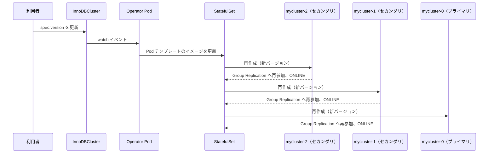

# 第19章 スケーリングとアップグレード

> 本章で参照する公式リソース
>
> - [helm/mysql-operator/crds/crd.yaml L75-L80](https://github.com/mysql/mysql-operator/blob/8.4.9-2.1.11/helm/mysql-operator/crds/crd.yaml#L75-L80)
> - [helm/mysql-operator/crds/crd.yaml L39-L42](https://github.com/mysql/mysql-operator/blob/8.4.9-2.1.11/helm/mysql-operator/crds/crd.yaml#L39-L42)
> - [mysqloperator/controller/innodbcluster/operator_cluster.py L400-L419](https://github.com/mysql/mysql-operator/blob/8.4.9-2.1.11/mysqloperator/controller/innodbcluster/operator_cluster.py#L400-L419)
> - [mysqloperator/controller/innodbcluster/operator_cluster.py L422-L457](https://github.com/mysql/mysql-operator/blob/8.4.9-2.1.11/mysqloperator/controller/innodbcluster/operator_cluster.py#L422-L457)

## この章でできるようになること

InnoDBCluster の `instances` と `version` を書き換えて、稼働中のクラスタをスケーリングおよびアップグレードできるようになる。

## 前提

InnoDBCluster が作成済みで、Group Replication のプライマリとセカンダリの構成が ONLINE の状態にあることを前提とする。
クラスタの状態確認手順そのものは第22章で扱う。

## instances によるスケーリング

InnoDBCluster の `spec.instances` は、クラスタに参加する MySQL Server インスタンスの数を表す。

[helm/mysql-operator/crds/crd.yaml L75-L80](https://github.com/mysql/mysql-operator/blob/8.4.9-2.1.11/helm/mysql-operator/crds/crd.yaml#L75-L80)

```yaml
instances:
  type: integer
  minimum: 1
  maximum: 9
  default: 1
  description: "Number of MySQL replica instances for the cluster"
```

`instances` は1以上9以下の範囲で指定できる。
この値を変更すると、Operator は StatefulSet の `replicas` を新しい値に書き換える。

[mysqloperator/controller/innodbcluster/operator_cluster.py L400-L419](https://github.com/mysql/mysql-operator/blob/8.4.9-2.1.11/mysqloperator/controller/innodbcluster/operator_cluster.py#L400-L419)

```python
@kopf.on.field(consts.GROUP, consts.VERSION, consts.INNODBCLUSTER_PLURAL,
               field="spec.instances")  # type: ignore
def on_innodbcluster_field_instances(old, new, body: Body,
                                     logger: Logger, **kwargs):
    cluster = InnoDBCluster(body)

    # ignore spec changes if the cluster is still being initialized
    if not cluster.ready:
        logger.debug(f"Ignoring spec.instances change for unready cluster")
        return

    # TODO - identify what cluster statuses should allow changes to the size of the cluster

    sts = cluster.get_stateful_set()
    if sts and old != new:
        logger.info(
            f"Updating InnoDB Cluster StatefulSet.replicas from {old} to {new}")
        cluster.parsed_spec.validate(logger)
        with ClusterMutex(cluster):
            cluster_objects.update_stateful_set_spec(sts, {"spec": {"replicas": new}})
```

`instances` を増やす方向のスケールアウトでは、StatefulSet が新しい Pod を起動したあと、Operator のサイドカーがその Pod を Group Replication に参加させる。
参加した Pod は、既存のプライマリからデータを転送するリカバリを経て ONLINE になる。
逆に `instances` を減らすスケールインでは、StatefulSet が序数の大きい Pod から順に削除し、Operator がその Pod を Group Replication のメンバーから除外する。

以下は3インスタンス構成のクラスタを5インスタンスへスケールアウトする例である。

```console
$ kubectl patch innodbcluster mycluster --type=merge -p '{"spec":{"instances":5}}'
innodbcluster.mysql.oracle.com/mycluster patched
```

スケールアウトの進行は `kubectl get pods` と `kubectl get innodbcluster` で確認できる。

```console
$ kubectl get pods -l mysql.oracle.com/cluster=mycluster
NAME          READY   STATUS    RESTARTS   AGE
mycluster-0   2/2     Running   0          10m
mycluster-1   2/2     Running   0          10m
mycluster-2   2/2     Running   0          10m
mycluster-3   2/2     Running   0          40s
mycluster-4   0/2     Pending   0          5s

$ kubectl get innodbcluster mycluster
NAME        STATUS   ONLINE   INSTANCES   ROUTERS   AGE
mycluster   ONLINE   5        5           1         12m
```

`ONLINE` 列の値が `INSTANCES` 列と一致すれば、追加した Pod がすべて Group Replication に参加を終えている。

## version によるバージョンアップグレード

InnoDBCluster の `spec.version` は、クラスタが動かす MySQL Server のバージョンを表す。

[helm/mysql-operator/crds/crd.yaml L39-L42](https://github.com/mysql/mysql-operator/blob/8.4.9-2.1.11/helm/mysql-operator/crds/crd.yaml#L39-L42)

```yaml
version:
  type: string
  pattern: '^\d+\.\d+\.\d+(-.+)?'
  description: "MySQL Server version"
```

`version` を書き換えると、Operator は Router のアカウントを先に更新したうえで、StatefulSet の Pod テンプレートに設定されたイメージタグを新しいバージョンへ差し替える。

[mysqloperator/controller/innodbcluster/operator_cluster.py L422-L457](https://github.com/mysql/mysql-operator/blob/8.4.9-2.1.11/mysqloperator/controller/innodbcluster/operator_cluster.py#L422-L457)

```python
@kopf.on.field(consts.GROUP, consts.VERSION, consts.INNODBCLUSTER_PLURAL,
               field="spec.version")  # type: ignore
def on_innodbcluster_field_version(old, new, body: Body,
                                   logger: Logger, **kwargs):
    cluster = InnoDBCluster(body)

    # ignore spec changes if the cluster is still being initialized
    if not cluster.ready:
        logger.debug(f"Ignoring spec.version change for unready cluster")
        return

    # TODO - identify what cluster statuses should allow this change

    sts = cluster.get_stateful_set()
    if sts and old != new:
        logger.info(
            f"Propagating spec.version={new} for {cluster.namespace}/{cluster.name} (was {old})")

        with ClusterMutex(cluster):
            cluster_ctl = ClusterController(cluster)
            try:
                cluster_ctl.on_router_upgrade(logger)
                cluster_ctl.on_server_version_change(new)
            except:
                # revert version in the spec
                raise

            # should not be earlier, as on_server_version_change() checks also for the version and raises
            # a PermanentError while validate() raises ApiSpecError which is turned by Kopf to a TemporaryError
            # spec.version requires this special handling
            cluster.parsed_spec.validate(logger)
            cluster_objects.update_mysql_image(sts, cluster, cluster.parsed_spec, logger)

            router_deploy = cluster.get_router_deployment()
            if router_deploy:
                router_objects.update_router_image(router_deploy, cluster.parsed_spec, logger)
```

Operator はイメージタグを書き換えるだけであり、Pod を1台ずつ再作成する処理そのものは Kubernetes 標準の StatefulSet コントローラーが担う。
StatefulSet のデフォルトの更新戦略（`RollingUpdate`）は、序数の大きい Pod から1台ずつ、直前の Pod が `Ready` になるまで次の更新に進まない。
これにより、常に過半数の Group Replication メンバーが生存した状態を保ちながら、セカンダリから順に新しいバージョンへ入れ替わる。



以下は MySQL Server を `8.4.9` から `8.4.10` へアップグレードする例である。

```console
$ kubectl patch innodbcluster mycluster --type=merge -p '{"spec":{"version":"8.4.10"}}'
innodbcluster.mysql.oracle.com/mycluster patched
```

アップグレードの進行は Pod のイメージとローリングの状況で確認する。

```console
$ kubectl get pods -l mysql.oracle.com/cluster=mycluster -o jsonpath='{range .items[*]}{.metadata.name}{"\t"}{.spec.containers[0].image}{"\n"}{end}'
mycluster-0	container-registry.oracle.com/mysql/community-server:8.4.9
mycluster-1	container-registry.oracle.com/mysql/community-server:8.4.10
mycluster-2	container-registry.oracle.com/mysql/community-server:8.4.10
```

すべての Pod のイメージタグが新しいバージョンに揃い、`kubectl get innodbcluster` の `STATUS` が `ONLINE` に戻れば、アップグレードは完了である。

`version` に指定できる値には対応範囲があり、範囲外を指定すると Operator がリコンサイルを恒久的なエラーとして扱う点は、第22章のトラブルシューティングで扱う。

## トラブルシューティング

- **スケールアウトした Pod が `Pending` のまま進まない**：新規 Pod 用の PVC がバインドできていないことが多い。PVC の状態確認は第22章を参照する。
- **`version` を変更してもイメージが更新されない**：`cluster.ready` が `false` のとき（クラスタ初期化中）は変更が無視される。`kubectl get innodbcluster` の `STATUS` が `ONLINE` になってから再実行する。
- **ローリングの途中で Pod が `CrashLoopBackOff` になる**：新バージョンの互換性エラーの可能性がある。対象 Pod のログとダウングレード可否は第22章のログ確認手順で切り分ける。

## まとめ

`instances` の変更は StatefulSet の `replicas` を、`version` の変更は Pod テンプレートのイメージタグを書き換える形で Operator に伝わる。
実際の Pod の入れ替えは Kubernetes 標準の StatefulSet コントローラーが1台ずつ順に行い、Group Replication の過半数を保ちながら安全に進む。

## 関連する章

- [第1章 MySQL Operator の概要とアーキテクチャ](../part00-introduction/01-overview.md)
- [第20章 Read Replica](20-read-replicas.md)
- [第22章 トラブルシューティングと診断](22-troubleshooting.md)
