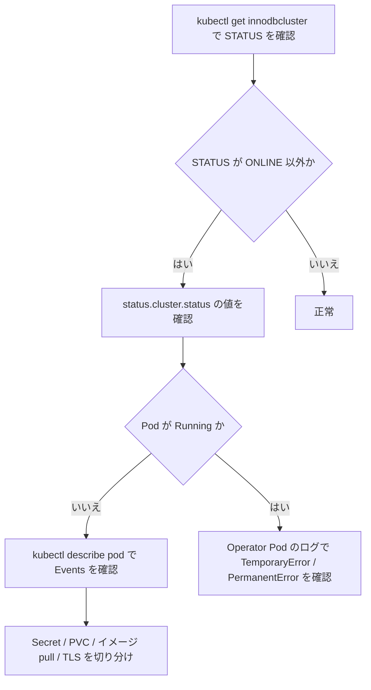

# 第22章 トラブルシューティングと診断

> 本章で参照する公式リソース
>
> - [helm/mysql-operator/crds/crd.yaml L869-L888](https://github.com/mysql/mysql-operator/blob/8.4.9-2.1.11/helm/mysql-operator/crds/crd.yaml#L869-L888)
> - [mysqloperator/controller/diagnose.py L27-L51](https://github.com/mysql/mysql-operator/blob/8.4.9-2.1.11/mysqloperator/controller/diagnose.py#L27-L51)
> - [mysqloperator/controller/diagnose.py L318-L377](https://github.com/mysql/mysql-operator/blob/8.4.9-2.1.11/mysqloperator/controller/diagnose.py#L318-L377)

## この章でできるようになること

InnoDBCluster の `status` と Operator Pod のログを読み、クラスタが正常に稼働していない原因を切り分けられるようになる。

## 前提

`kubectl` でクラスタと Operator の Namespace の双方にアクセスできることを前提とする。

## InnoDBCluster の status を読む

`kubectl get innodbcluster` の出力列は、CRD の `additionalPrinterColumns` で定義されている。

[helm/mysql-operator/crds/crd.yaml L869-L888](https://github.com/mysql/mysql-operator/blob/8.4.9-2.1.11/helm/mysql-operator/crds/crd.yaml#L869-L888)

```yaml
additionalPrinterColumns:
  - name: Status
    type: string
    description: Status of the InnoDB Cluster
    jsonPath: .status.cluster.status
  - name: Online
    type: integer
    description: Number of ONLINE InnoDB Cluster instances
    jsonPath: .status.cluster.onlineInstances
  - name: Instances
    type: integer
    description: Number of InnoDB Cluster instances configured
    jsonPath: .spec.instances
  - name: Routers
    type: integer
    description: Number of Router instances configured for the InnoDB Cluster
    jsonPath: .spec.router.instances
  - name: Age
    type: date
    jsonPath: .metadata.creationTimestamp
```

`Status` 列は `.status.cluster.status` を表示し、`Online` 列は Group Replication に参加している ONLINE インスタンス数を表示する。
`Online` が `Instances` より小さい状態が続く場合は、一部のインスタンスがクラスタに参加できていないことを意味する。

```console
$ kubectl get innodbcluster mycluster
NAME        STATUS    ONLINE   INSTANCES   ROUTERS   AGE
mycluster   ONLINE    3        3           1         2h
```

`.status.cluster.status` に入る値は、Operator が内部の診断ロジックで判定する **ClusterDiagStatus** の値である。

[mysqloperator/controller/diagnose.py L318-L377](https://github.com/mysql/mysql-operator/blob/8.4.9-2.1.11/mysqloperator/controller/diagnose.py#L318-L377)

```python
class ClusterDiagStatus(enum.Enum):
    ONLINE = "ONLINE"
    # - All members are reachable or part of the quorum
    # - Reachable members form a quorum between themselves
    # - There are no unreachable members that are not in the quorum
    # - All members are ONLINE

    ONLINE_PARTIAL = "ONLINE_PARTIAL"
    # - All members are reachable or part of the quorum
    # - Some reachable members form a quorum between themselves
    # - There may be members outside of the quorum in any state, but they must not form a quorum
    # Note that there may be members that think are ONLINE, but minority in a view with UNREACHABLE members

    OFFLINE = "OFFLINE"
    # - All members are reachable
    # - All cluster members are OFFLINE/ERROR (or being deleted)
    # - GTID set of all members are consistent
    # We're sure that the cluster is completely down with no quorum hiding somewhere
    # The cluster can be safely rebooted

    NO_QUORUM = "NO_QUORUM"
    # - All members are reachable
    # - All cluster members are either OFFLINE/ERROR or ONLINE but with no quorum
    # A split-brain with no-quorum still falls in this category
    # The cluster can be safely restored

    SPLIT_BRAIN = "SPLIT_BRAIN"
    # - Some but not all members are unreachable
    # - There are multiple ONLINE/RECOVERING members forming a quorum, but with >1
    # different views
    # If some members are not reachable, they could either be forming more errant
    # groups or be unavailable, but that doesn't make much dfifference.

    ONLINE_UNCERTAIN = "ONLINE_UNCERTAIN"
    # - Some members are unreachable
    # - Reachable members form a quorum between themselves
    # - There are unreachable members that are not in the quorum and have unknown state
    # Because there are members with unknown state, the possibility that there's a
    # split-brain exists.

    OFFLINE_UNCERTAIN = "OFFLINE_UNCERTAIN"
    # OFFLINE with unreachable members

    NO_QUORUM_UNCERTAIN = "NO_QUORUM_UNCERTAIN"
    # NO_QUORUM with unreachable members

    SPLIT_BRAIN_UNCERTAIN = "SPLIT_BRAIN_UNCERTAIN"
    # SPLIT_BRAIN with unreachable members

    UNKNOWN = "UNKNOWN"
    # - No reachable/connectable members
    # We have no idea about the state of the cluster, so nothing can be done about it
    # (even if we wanted)

    INITIALIZING = "INITIALIZING"
    # - Cluster is not marked as initialized in Kubernetes
    # The cluster hasn't been created/initialized yet, so we can safely create it

    FINALIZING = "FINALIZING"
    # - Cluster object is marked as being deleted
```

`ONLINE` 以外の値が続く場合は、クラスタ全体、あるいは個々のインスタンスの診断に進む。
`NO_QUORUM` はクォーラムを構成する過半数のメンバーが失われた状態、`SPLIT_BRAIN` は複数のメンバー集団が互いに独立したビューを持つ状態であり、いずれも手動での復旧作業が必要になることが多い。

個々のインスタンスの状態は **InstanceDiagStatus** で表される。

[mysqloperator/controller/diagnose.py L27-L51](https://github.com/mysql/mysql-operator/blob/8.4.9-2.1.11/mysqloperator/controller/diagnose.py#L27-L51)

```python
class InstanceDiagStatus(enum.Enum):
    # GR ONLINE
    ONLINE = "ONLINE"

    # GR RECOVERING
    RECOVERING = "RECOVERING"

    # GR ERROR
    ERROR = "ERROR"

    # GR OFFLINE or any indication that makes it's certain that GR is not ONLINE or RECOVERING
    OFFLINE = "OFFLINE"

    # Instance is not a member (and never was)
    # in addition to being OFFLINE
    NOT_MANAGED = "NOT_MANAGED"

    # Instance of an unmanaged replication group. Probably was already member but got removed
    UNMANAGED = "UNMANAGED"

    # Instance is not reachable, maybe networking issue
    UNREACHABLE = "UNREACHABLE"

    # Uncertain because we can't connect or query it
    UNKNOWN = "UNKNOWN"
```

`RECOVERING` はクラスタへの参加処理が進行中であることを示し、時間の経過とともに `ONLINE` へ遷移すれば問題ない。
`UNREACHABLE` が続く場合は、Pod のネットワーク到達性、あるいは Pod 自体が起動できているかを疑う。

## Operator Pod のログを確認する

Operator は kopf 上に実装されており、リコンサイルの進行やエラーは Operator Pod のログに出力される。

```console
$ kubectl get pods -n mysql-operator
NAME                              READY   STATUS    RESTARTS   AGE
mysql-operator-7d9f8c9b6b-abcde   1/1     Running   0          3h

$ kubectl logs -n mysql-operator deploy/mysql-operator --tail=100
2026-07-06T09:00:01.234 kopf.objects [INFO] Handler 'on_innodbcluster_field_instances' succeeded.
```

対象の InnoDBCluster に関するログだけを絞り込みたい場合は、クラスタ名で `grep` する。

```console
$ kubectl logs -n mysql-operator deploy/mysql-operator --tail=1000 | grep mycluster
2026-07-06T09:00:01.234 kopf.objects [INFO] [default/mycluster] Updating InnoDB Cluster StatefulSet.replicas from 3 to 5
```

kopf のログには、一時的なエラー（`TemporaryError`、次のリコンサイルで再試行される）と恒久的なエラー（`PermanentError`、利用者による spec の修正が必要）が区別されて出力される。
恒久的なエラーが出ている場合は、直前の `kubectl apply` や `kubectl patch` で指定した値そのものを見直す。

## よくある失敗と対処

### Secret 不備

`spec.secretName` に指定した Secret が存在しない、または必須キーの `rootPassword` を含まない場合、Pod は起動できずに待機し続ける。
`rootUser` と `rootHost` は省略しても既定値（それぞれ `root`、`%`）にフォールバックするため、これらの欠落は起動失敗の原因にならない。

```console
$ kubectl get secret mypwds
Error from server (NotFound): secrets "mypwds" not found
```

Secret を作成してから InnoDBCluster を再適用するか、既存の Secret のキー構成を確認する。
Secret の構成そのものは第5章で扱う。

### PVC バインド失敗

`datadirVolumeClaimTemplate` で指定したストレージクラスが存在しない、または要求したサイズを満たす PersistentVolume が用意できない場合、Pod は `Pending` のまま進まない。

```console
$ kubectl get pvc -l mysql.oracle.com/cluster=mycluster
NAME                     STATUS    VOLUME   CAPACITY   ACCESS MODES   STORAGECLASS   AGE
datadir-mycluster-3      Pending                                     fast-ssd       5m

$ kubectl describe pvc datadir-mycluster-3
...
Events:
  Warning  ProvisioningFailed  ...  storageclass.storage.k8s.io "fast-ssd" not found
```

`kubectl describe pvc` の `Events` に原因が示される。
ストレージクラス名の誤りが最も多い原因であり、`kubectl get storageclass` で実在するクラス名を確認してから修正する。

### イメージ pull 失敗

`imageRepository` の誤りや、プライベートレジストリ用の `imagePullSecrets` の設定漏れがあると、Pod は `ImagePullBackOff` になる。

```console
$ kubectl get pods mycluster-0
NAME          READY   STATUS             RESTARTS   AGE
mycluster-0   0/2     ImagePullBackOff   0          3m

$ kubectl describe pod mycluster-0
...
Events:
  Warning  Failed  ...  Failed to pull image "container-registry.oracle.com/mysql/community-server:8.4.9": rpc error: ...
```

`imageRepository` の値と、レジストリへの認証情報（`imagePullSecrets`）を確認する。
community 版のイメージは認証なしで取得できるが、enterprise 版やミラーレジストリを使う場合は `imagePullSecrets` の設定が必要になる。

### TLS 設定ミス

`tlsUseSelfSigned` を `false` にしたまま `tlsSecretName` や `tlsCASecretName` を指定していない、あるいは指定した Secret の証明書とキーの組が不整合な場合、MySQL Server コンテナが起動直後に終了を繰り返す。

```console
$ kubectl get pods mycluster-0
NAME          READY   STATUS             RESTARTS   AGE
mycluster-0   1/2     CrashLoopBackOff   4          6m

$ kubectl logs mycluster-0 -c mysql --previous
...
[ERROR] [MY-000000] [Server] Failed to setup SSL: certificate and private key do not match
```

`kubectl logs --previous` で直前に終了したコンテナのログを確認できる。
証明書とキーの対応関係は、Secret 作成時に使った鍵ペアそのものまで遡って確認する。
TLS の設定手順そのものは第12章で扱う。



## まとめ

InnoDBCluster の `status.cluster.status` は ClusterDiagStatus、各インスタンスの状態は InstanceDiagStatus で表され、`ONLINE` 以外の値は Pod の起動状況と Operator Pod のログから原因を切り分ける手がかりになる。
Secret 不備、PVC バインド失敗、イメージ pull 失敗、TLS 設定ミスは、いずれも Pod の `Events` かコンテナログの直接確認で原因が判明することが多い。

## 関連する章

- [第19章 スケーリングとアップグレード](19-scaling-upgrade.md)
- [第20章 Read Replica](20-read-replicas.md)
- [第21章 メトリクスとログ](21-metrics-logs.md)
