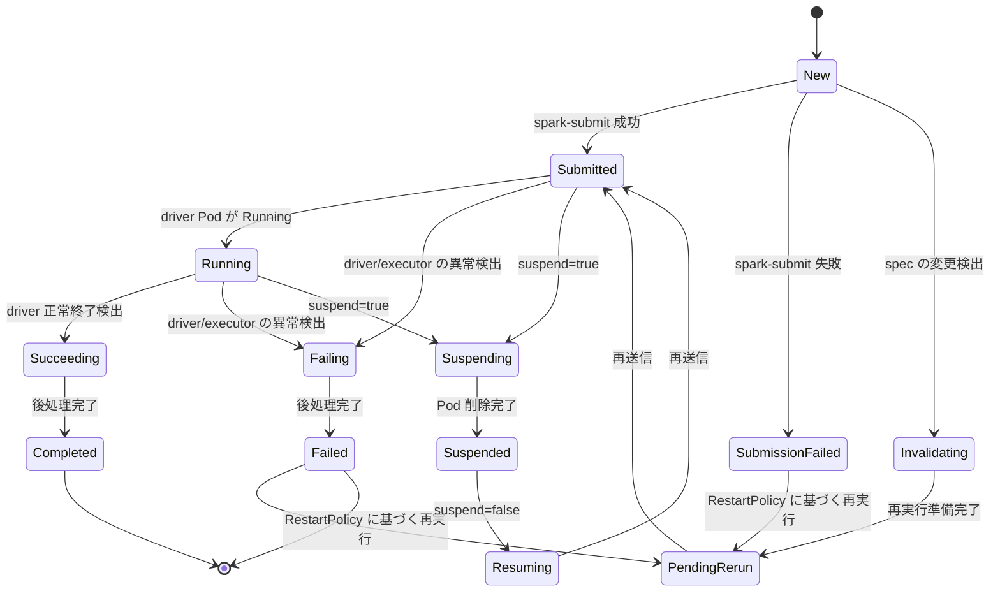

# 第1章 Spark Operator とは

> - [kubeflow/spark-operator README.md L14-L15](https://github.com/kubeflow/spark-operator/blob/v2.5.1/README.md#L14-L15)
> - [api/v1beta2/sparkapplication_types.go L192-L199](https://github.com/kubeflow/spark-operator/blob/v2.5.1/api/v1beta2/sparkapplication_types.go#L192-L199)
> - [api/v1beta2/scheduledsparkapplication_types.go L93-L100](https://github.com/kubeflow/spark-operator/blob/v2.5.1/api/v1beta2/scheduledsparkapplication_types.go#L93-L100)
> - [config/crd/bases/sparkoperator.k8s.io_sparkconnects.yaml L1-L17](https://github.com/kubeflow/spark-operator/blob/v2.5.1/config/crd/bases/sparkoperator.k8s.io_sparkconnects.yaml#L1-L17)
> - [internal/controller/sparkapplication/controller.go L208-L237](https://github.com/kubeflow/spark-operator/blob/v2.5.1/internal/controller/sparkapplication/controller.go#L208-L237)

## この章でできるようになること

- Spark Operator が Kubernetes 上で果たす役割を説明できる。
- 3つの Custom Resource（**SparkApplication**、**ScheduledSparkApplication**、**SparkConnect**）の目的を区別できる。
- コントローラが SparkApplication の状態をどのようにリコンサイルするか、状態遷移の流れを把握できる。

## 前提

Kubernetes の Custom Resource と CRD の基本概念、および Operator パターンの概要を理解していることを前提とする。

## Spark Operator の役割

**Spark Operator**（[kubeflow/spark-operator](https://github.com/kubeflow/spark-operator)）は、Apache Spark のアプリケーションを Kubernetes 上で宣言的に管理するための Operator である。

[README.md の "What is Spark Operator?" 節](https://github.com/kubeflow/spark-operator/blob/v2.5.1/README.md#L14-L15)には、次のように記載されている。

```text
The Kubernetes Operator for Apache Spark aims to make specifying and running [Spark](https://github.com/apache/spark) applications as easy and idiomatic as running other workloads on Kubernetes. It uses
[Kubernetes custom resources](https://kubernetes.io/docs/concepts/extend-kubernetes/api-extension/custom-resources/) for specifying, running, and surfacing status of Spark applications.
```

従来の `spark-submit` コマンドでは、Kubernetes 上で Spark アプリケーションを実行する場合でもコマンドラインから手動で送信する必要があった。
Spark Operator は `spark-submit` の処理をコントローラ内で自動化し、Custom Resource の spec に記述した内容をもとに driver Pod や executor Pod を生成する。
利用者はマニフェストを `kubectl apply` するだけで、Spark アプリケーションの送信・状態監視・再実行が Kubernetes のネイティブな仕組みで完結する。

## アーキテクチャ

Spark Operator は、Helm chart でインストールすると主に2つの Deployment で構成される。

- **controller**：Custom Resource のイベントを Watch し、`spark-submit` の実行、Pod の状態監視、UI 用 Service の作成などを担当する。
- **webhook**：Mutating Admission Webhook として、Spark Pod にデフォルト値の注入や追加の Volume マウントなどを行う。

controller は `controller-runtime` をベースとしたリコンサイルループで動作する。
`spark.jobNamespaces` で指定した Namespace の SparkApplication を監視し、状態に応じたハンドラを呼び出す。

## 3つの CRD

Spark Operator は3種類の Custom Resource を提供する。

### **SparkApplication**

[api/v1beta2/sparkapplication_types.go の SparkApplication 型定義](https://github.com/kubeflow/spark-operator/blob/v2.5.1/api/v1beta2/sparkapplication_types.go#L192-L199)は次のとおりである。

```go
// SparkApplication is the Schema for the sparkapplications API
type SparkApplication struct {
	metav1.TypeMeta   `json:",inline"`
	metav1.ObjectMeta `json:"metadata"`

	Spec   SparkApplicationSpec   `json:"spec"`
	Status SparkApplicationStatus `json:"status,omitempty"`
}
```

**SparkApplication** は1回限りの Spark ジョブを表現する。
`spec` に Spark のメインクラス、アプリケーションファイル、driver・executor のリソース指定などを記述する。
ショートネームは `sparkapp` であり、`kubectl get sparkapp` で状態を確認できる。

### **ScheduledSparkApplication**

[api/v1beta2/scheduledsparkapplication_types.go の ScheduledSparkApplication 型定義](https://github.com/kubeflow/spark-operator/blob/v2.5.1/api/v1beta2/scheduledsparkapplication_types.go#L93-L100)は次のとおりである。

```go
// ScheduledSparkApplication is the Schema for the scheduledsparkapplications API.
type ScheduledSparkApplication struct {
	metav1.TypeMeta   `json:",inline"`
	metav1.ObjectMeta `json:"metadata"`

	Spec   ScheduledSparkApplicationSpec   `json:"spec"`
	Status ScheduledSparkApplicationStatus `json:"status,omitempty"`
}
```

**ScheduledSparkApplication** は Cron 形式のスケジュールで SparkApplication を自動生成する。
`spec.schedule` に Cron 式（`@every 3m` や `0 2 * * *` 等）を指定し、`spec.concurrencyPolicy` で並行実行の可否（`Allow`・`Forbid`・`Replace`）を制御する。
ショートネームは `scheduledsparkapp` である。

### **SparkConnect**

[config/crd/bases/sparkoperator.k8s.io_sparkconnects.yaml の CRD 定義](https://github.com/kubeflow/spark-operator/blob/v2.5.1/config/crd/bases/sparkoperator.k8s.io_sparkconnects.yaml#L1-L17)は次のとおりである。

```yaml
---
apiVersion: apiextensions.k8s.io/v1
kind: CustomResourceDefinition
metadata:
  annotations:
    api-approved.kubernetes.io: https://github.com/kubeflow/spark-operator/pull/1298
    controller-gen.kubebuilder.io/version: v0.17.1
  name: sparkconnects.sparkoperator.k8s.io
spec:
  group: sparkoperator.k8s.io
  names:
    kind: SparkConnect
    listKind: SparkConnectList
    plural: sparkconnects
    shortNames:
    - sparkconn
    singular: sparkconnect
```

**SparkConnect** は Spark Connect サーバを Kubernetes 上で起動し、長時間接続型の対話セッションを提供する。
API バージョンは `v1alpha1` であり、`v1beta2` の SparkApplication とは独立した型である。
ショートネームは `sparkconn` である。

## リコンサイルの流れ

controller は SparkApplication の状態（`status.applicationState.state`）に応じて分岐し、各状態に対応するハンドラを呼び出す。

[internal/controller/sparkapplication/controller.go の Reconcile 関数](https://github.com/kubeflow/spark-operator/blob/v2.5.1/internal/controller/sparkapplication/controller.go#L208-L237)の switch 文は次のようになっている。

```go
switch app.Status.AppState.State {
case v1beta2.ApplicationStateNew:
    return r.reconcileNewSparkApplication(ctx, req)
case v1beta2.ApplicationStateSubmitted:
    return r.reconcileSubmittedSparkApplication(ctx, req)
case v1beta2.ApplicationStateFailedSubmission:
    return r.reconcileFailedSubmissionSparkApplication(ctx, req)
case v1beta2.ApplicationStateRunning:
    return r.reconcileRunningSparkApplication(ctx, req)
# ... (中略) ...
case v1beta2.ApplicationStateSuspended:
    return r.reconcileSuspendedSparkApplication(ctx, req)
case v1beta2.ApplicationStateSuspending:
    return r.reconcileSuspendingSparkApplication(ctx, req)
case v1beta2.ApplicationStateResuming:
    return r.reconcileResumingSparkApplication(ctx, req)
}
```

状態遷移の全体像を Mermaid で示す。



主な状態は次のとおりである。

| 状態 | 意味 |
| --- | --- |
| `New` | Custom Resource が作成された初期状態。spark-submit を送信する |
| `Submitted` | spark-submit が完了し、driver Pod の起動を待っている |
| `Running` | driver Pod が Running であり、executor も稼働中である |
| `Succeeding` | driver が正常に終了し、後処理を進めている |
| `Failing` | driver または executor に障害を検出し、後処理を進めている |
| `Completed` | アプリケーションが正常に完了した（終端状態） |
| `Failed` | アプリケーションが失敗した（終端状態） |
| `PendingRerun` | RestartPolicy に基づき再実行を待っている |
| `Suspending` | `spec.suspend: true` により Pod の削除を進めている |
| `Suspended` | サスペンド状態で、次の resume を待っている |
| `Resuming` | サスペンドからの復帰のため再送信する |

## まとめ

- Spark Operator は Spark アプリケーションを Custom Resource として宣言的に管理し、`spark-submit` の自動化と状態監視を提供する。
- **SparkApplication**（バッチジョブ）、**ScheduledSparkApplication**（定期実行）、**SparkConnect**（対話セッション）の3つの CRD を提供する。
- controller は状態機械に基づいて SparkApplication をリコンサイルし、`New` から `Submitted`・`Running` を経て `Completed` または `Failed` へ遷移させる。

## 関連する章

- [第2章 インストール](02-installation.md)
- [第3章 クイックスタート](03-quickstart.md)
