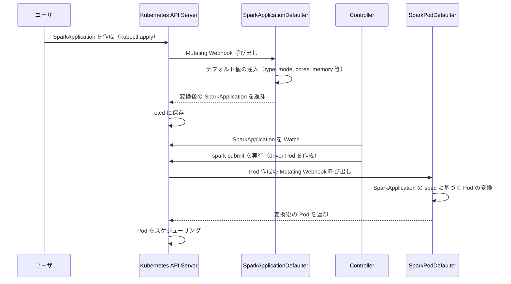

# 第15章 Webhook とデフォルト注入

> - [internal/webhook/sparkapplication_defaulter.go L31-L61](https://github.com/kubeflow/spark-operator/blob/v2.5.1/internal/webhook/sparkapplication_defaulter.go#L31-L61)
> - [internal/webhook/sparkpod_defaulter.go L44-L101](https://github.com/kubeflow/spark-operator/blob/v2.5.1/internal/webhook/sparkpod_defaulter.go#L44-L101)
> - [internal/webhook/sparkpod_defaulter.go L139-L178](https://github.com/kubeflow/spark-operator/blob/v2.5.1/internal/webhook/sparkpod_defaulter.go#L139-L178)
> - [api/v1beta2/defaults.go L38-L70](https://github.com/kubeflow/spark-operator/blob/v2.5.1/api/v1beta2/defaults.go#L38-L70)
> - [api/v1beta2/defaults.go L72-L106](https://github.com/kubeflow/spark-operator/blob/v2.5.1/api/v1beta2/defaults.go#L72-L106)
> - [charts/spark-operator-chart/values.yaml L291-L322](https://github.com/kubeflow/spark-operator/blob/v2.5.1/charts/spark-operator-chart/values.yaml#L291-L322)

## この章でできるようになること

- Mutating Webhook が SparkApplication と Spark Pod に対してどのようなデフォルト注入を行うかを理解できる。
- Webhook の注入フローを把握し、トラブルシューティング時に注入結果を確認できる。

## 前提

- 第2章で Helm chart によるインストールを経験していること。
- 第5章で driver・executor の設定項目を理解していること。

## Webhook の概要

Spark Operator は2種類の Mutating Webhook を提供する。

1. **SparkApplicationDefaulter**：SparkApplication Custom Resource の作成・更新時にデフォルト値を注入する。
2. **SparkPodDefaulter**：Spark Pod（driver・executor）の作成時に SparkApplication の spec に基づいて Pod を変換する。

Webhook は Helm values の `webhook.enable: true`（デフォルト）で有効になる。
[values.yaml の webhook セクション](https://github.com/kubeflow/spark-operator/blob/v2.5.1/charts/spark-operator-chart/values.yaml#L291-L322)の主要な設定は次のとおりである。

```yaml
webhook:
  enable: true
  replicas: 1
  failurePolicy: Fail
  timeoutSeconds: 10
```

`failurePolicy: Fail` は Webhook が応答しない場合に Pod の作成を拒否する。
`Ignore` に変更すると Webhook の障害時でも Pod が作成されるが、デフォルト値の注入が行われない。

## 注入の流れ

Webhook によるデフォルト注入の全体像を Mermaid で示す。



## SparkApplicationDefaulter

**SparkApplicationDefaulter** は SparkApplication の作成・更新時に呼び出され、欠落しているフィールドにデフォルト値を注入する。

[internal/webhook/sparkapplication_defaulter.go の SparkApplicationDefaulter](https://github.com/kubeflow/spark-operator/blob/v2.5.1/internal/webhook/sparkapplication_defaulter.go#L31-L61)は次のように実装されている。

```go
// +kubebuilder:webhook:admissionReviewVersions=v1,failurePolicy=fail,...,
//   name=mutate-sparkapplication.sparkoperator.k8s.io,
//   path=/mutate-sparkoperator-k8s-io-v1beta2-sparkapplication,...

// SparkApplicationDefaulter sets default values for a SparkApplication.
type SparkApplicationDefaulter struct{}

// Default implements admission.CustomDefaulter.
func (d *SparkApplicationDefaulter) Default(ctx context.Context, obj runtime.Object) error {
	app, ok := obj.(*v1beta2.SparkApplication)
	if !ok {
		return nil
	}

	// Only set the default values for spark applications with new state or invalidating state.
	state := util.GetApplicationState(app)
	if state != v1beta2.ApplicationStateNew && state != v1beta2.ApplicationStateInvalidating {
		return nil
	}

	logger := log.FromContext(ctx)
	logger.Info("Mutating SparkApplication", "state", util.GetApplicationState(app))
	operatorscheme.WebhookScheme.Default(app)
	return nil
}
```

`Default` メソッドは `operatorscheme.WebhookScheme.Default(app)` を呼び出し、[api/v1beta2/defaults.go](https://github.com/kubeflow/spark-operator/blob/v2.5.1/api/v1beta2/defaults.go)で定義されたデフォルト値注入ロジックを実行する。

### 注入されるデフォルト値

[api/v1beta2/defaults.go の SetSparkApplicationDefaults](https://github.com/kubeflow/spark-operator/blob/v2.5.1/api/v1beta2/defaults.go#L38-L70)で注入されるデフォルト値は次のとおりである。

```go
func SetSparkApplicationDefaults(app *SparkApplication) {
	if app == nil {
		return
	}

	if app.Spec.Type == "" {
		app.Spec.Type = SparkApplicationTypeScala
	}

	if app.Spec.Mode == "" {
		app.Spec.Mode = DeployModeCluster
	}

	if app.Spec.RestartPolicy.Type == "" {
		app.Spec.RestartPolicy.Type = RestartPolicyNever
	}

	if app.Spec.RestartPolicy.Type != RestartPolicyNever {
		if app.Spec.RestartPolicy.OnFailureRetryInterval == nil {
			app.Spec.RestartPolicy.OnFailureRetryInterval = ptr.To[int64](5)
		}
		if app.Spec.RestartPolicy.OnSubmissionFailureRetryInterval == nil {
			app.Spec.RestartPolicy.OnSubmissionFailureRetryInterval = ptr.To[int64](5)
		}
	}

	setDriverSpecDefaults(&app.Spec.Driver, app.Spec.SparkConf)
	setExecutorSpecDefaults(&app.Spec.Executor, app.Spec.SparkConf, app.Spec.DynamicAllocation)
}
```

SparkApplication レベルのデフォルト値を次の表にまとめる。

| フィールド | デフォルト値 | 条件 |
| --- | --- | --- |
| `spec.type` | `Scala` | 未指定の場合 |
| `spec.mode` | `cluster` | 未指定の場合 |
| `spec.restartPolicy.type` | `Never` | 未指定の場合 |
| `spec.restartPolicy.onFailureRetryInterval` | `5`（秒） | `restartPolicy.type` が `Never` 以外で未指定の場合 |
| `spec.restartPolicy.onSubmissionFailureRetryInterval` | `5`（秒） | `restartPolicy.type` が `Never` 以外で未指定の場合 |

[api/v1beta2/defaults.go の setDriverSpecDefaults・setExecutorSpecDefaults](https://github.com/kubeflow/spark-operator/blob/v2.5.1/api/v1beta2/defaults.go#L72-L106)で注入される driver・executor のデフォルト値は次のとおりである。

```go
func setDriverSpecDefaults(spec *DriverSpec, sparkConf map[string]string) {
	if _, exists := sparkConf["spark.driver.cores"]; !exists && spec.Cores == nil {
		spec.Cores = new(int32)
		*spec.Cores = 1
	}
	if _, exists := sparkConf["spark.driver.memory"]; !exists && spec.Memory == nil {
		spec.Memory = new(string)
		*spec.Memory = "1g"
	}
}

func setExecutorSpecDefaults(spec *ExecutorSpec, sparkConf map[string]string, allocSpec *DynamicAllocation) {
	if _, exists := sparkConf["spark.executor.cores"]; !exists && spec.Cores == nil {
		spec.Cores = new(int32)
		*spec.Cores = 1
	}
	if _, exists := sparkConf["spark.executor.memory"]; !exists && spec.Memory == nil {
		spec.Memory = new(string)
		*spec.Memory = "1g"
	}

	isDynamicAllocationEnabled := isDynamicAllocationEnabled(sparkConf, allocSpec)

	if spec.Instances == nil &&
		sparkConf["spark.executor.instances"] == "" &&
		!isDynamicAllocationEnabled {
		spec.Instances = ptr.To[int32](1)
	}

	if isDynamicAllocationEnabled && allocSpec != nil && allocSpec.ShuffleTrackingEnabled == nil {
		allocSpec.ShuffleTrackingEnabled = ptr.To(true)
	}
}
```

driver・executor のデフォルト値を次の表にまとめる。

| フィールド | デフォルト値 | 条件 |
| --- | --- | --- |
| `spec.driver.cores` | `1` | `sparkConf` と `spec.driver.cores` がともに未指定の場合 |
| `spec.driver.memory` | `1g` | `sparkConf` と `spec.driver.memory` がともに未指定の場合 |
| `spec.executor.cores` | `1` | `sparkConf` と `spec.executor.cores` がともに未指定の場合 |
| `spec.executor.memory` | `1g` | `sparkConf` と `spec.executor.memory` がともに未指定の場合 |
| `spec.executor.instances` | `1` | 動的リソース割り当てが無効で未指定の場合 |
| `spec.dynamicAllocation.shuffleTrackingEnabled` | `true` | 動的リソース割り当てが有効で未指定の場合 |

## SparkPodDefaulter

**SparkPodDefaulter** は Spark Pod（driver・executor）の作成時に呼び出され、SparkApplication の spec に基づいて Pod を変換する。

[internal/webhook/sparkpod_defaulter.go の SparkPodDefaulter](https://github.com/kubeflow/spark-operator/blob/v2.5.1/internal/webhook/sparkpod_defaulter.go#L44-L101)は次のように実装されている。

```go
// +kubebuilder:webhook:admissionReviewVersions=v1,failurePolicy=fail,...,
//   name=mutate-pod.sparkoperator.k8s.io,
//   path=/mutate--v1-pod,...

// SparkPodDefaulter defaults Spark pods.
type SparkPodDefaulter struct {
	client             client.Client
	sparkJobNamespaces map[string]bool
}

// Default implements admission.CustomDefaulter.
func (d *SparkPodDefaulter) Default(ctx context.Context, obj runtime.Object) error {
	pod, ok := obj.(*corev1.Pod)
	if !ok {
		return nil
	}

	namespace := pod.Namespace
	if !d.isSparkJobNamespace(namespace) {
		return nil
	}

	appName := pod.Labels[common.LabelSparkAppName]
	if appName == "" {
		return nil
	}

	app := &v1beta2.SparkApplication{}
	if err := d.client.Get(ctx, types.NamespacedName{Name: appName, Namespace: namespace}, app); err != nil {
		return fmt.Errorf("failed to get SparkApplication %s/%s: %v", namespace, appName, err)
	}

	logger := log.FromContext(ctx)
	logger.Info("Mutating Pod", "phase", pod.Status.Phase)
	if err := mutateSparkPod(pod, app); err != nil {
		return fmt.Errorf("failed to mutate Spark pod: %v", err)
	}

	return nil
}
```

SparkPodDefaulter は Pod のラベル `sparkoperator.k8s.io/spark-app-name` を確認し、対応する SparkApplication を取得して `mutateSparkPod` を呼び出す。

### Pod 変換の処理一覧

[internal/webhook/sparkpod_defaulter.go の mutateSparkPod](https://github.com/kubeflow/spark-operator/blob/v2.5.1/internal/webhook/sparkpod_defaulter.go#L139-L178)は次のように実装されている。

```go
func mutateSparkPod(pod *corev1.Pod, app *v1beta2.SparkApplication) error {
	options := []mutateSparkPodOption{
		addOwnerReference,
		addEnvVars,
		addEnvFrom,
		addHadoopConfigMap,
		addSparkConfigMap,
		addGeneralConfigMaps,
		addVolumes,
		addContainerPorts,
		addHostNetwork,
		addHostAliases,
		addInitContainers,
		addSidecarContainers,
		addDNSConfig,
		addPriorityClassName,
		addSchedulerName,
		addNodeSelectors,
		addAffinity,
		addTolerations,
		addMemoryLimit,
		addGPU,
		addPrometheusConfig,
		addContainerSecurityContext,
		addPodSecurityContext,
		addTerminationGracePeriodSeconds,
		addPodLifeCycleConfig,
		addShareProcessNamespace,
	}

	for _, option := range options {
		if err := option(pod, app); err != nil {
			return err
		}
	}

	return nil
}
```

SparkPodDefaulter が Pod に注入する設定を次の表にまとめる。

| 注入処理 | 説明 |
| --- | --- |
| `addOwnerReference` | driver Pod に SparkApplication の OwnerReference を追加 |
| `addEnvVars` | `spec.driver.env`・`spec.executor.env` の環境変数を注入 |
| `addEnvFrom` | `spec.driver.envFrom`・`spec.executor.envFrom` を注入 |
| `addHadoopConfigMap` | `spec.hadoopConfigMap` を Volume としてマウント |
| `addSparkConfigMap` | `spec.sparkConfigMap` を Volume としてマウント |
| `addGeneralConfigMaps` | `spec.driver.configMaps`・`spec.executor.configMaps` をマウント |
| `addVolumes` | `spec.volumes` と `volumeMounts` を注入 |
| `addContainerPorts` | `spec.driver.ports`・`spec.executor.ports` を注入 |
| `addHostNetwork` | `spec.driver.hostNetwork`・`spec.executor.hostNetwork` を注入 |
| `addHostAliases` | `spec.driver.hostAliases`・`spec.executor.hostAliases` を注入 |
| `addInitContainers` | `spec.driver.initContainers`・`spec.executor.initContainers` を注入 |
| `addSidecarContainers` | `spec.driver.sidecars`・`spec.executor.sidecars` を注入 |
| `addDNSConfig` | `spec.driver.dnsConfig`・`spec.executor.dnsConfig` を注入 |
| `addPriorityClassName` | `spec.driver.priorityClassName`・`spec.executor.priorityClassName` を注入 |
| `addSchedulerName` | `spec.batchScheduler` または `spec.driver.schedulerName`・`spec.executor.schedulerName` を注入 |
| `addNodeSelectors` | `spec.driver.nodeSelector`・`spec.executor.nodeSelector` を注入 |
| `addAffinity` | `spec.driver.affinity`・`spec.executor.affinity` を注入 |
| `addTolerations` | `spec.driver.tolerations`・`spec.executor.tolerations` を注入 |
| `addMemoryLimit` | `spec.driver.memoryLimit`・`spec.executor.memoryLimit` をリソース制限として注入 |
| `addGPU` | `spec.driver.gpu`・`spec.executor.gpu` をリソース制限として注入 |
| `addPrometheusConfig` | Prometheus メトリクス公開用の ConfigMap・ポートを注入 |
| `addContainerSecurityContext` | `spec.driver.securityContext`・`spec.executor.securityContext` を注入 |
| `addPodSecurityContext` | `spec.driver.podSecurityContext`・`spec.executor.podSecurityContext` を注入 |
| `addTerminationGracePeriodSeconds` | `spec.driver.terminationGracePeriodSeconds`・`spec.executor.terminationGracePeriodSeconds` を注入 |
| `addPodLifeCycleConfig` | `spec.driver.lifecycle`・`spec.executor.lifecycle` を注入 |
| `addShareProcessNamespace` | `spec.driver.shareProcessNamespace`・`spec.executor.shareProcessNamespace` を注入 |

## Webhook の無効化

Webhook を無効化すると、デフォルト値の注入と Pod の変換が行われなくなる。
Webhook を無効化する場合は、SparkApplication のマニフェストに必要なフィールドをすべて明示的に指定する必要がある。

Webhook を無効化するには、Helm values で `webhook.enable: false` を設定する。

```bash
helm upgrade spark-operator spark-operator/spark-operator \
    --namespace spark-operator \
    --set webhook.enable=false
```

Webhook を無効化した場合の注意点を次の表にまとめる。

| 影響 | 説明 |
| --- | --- |
| デフォルト値の未注入 | `type`・`mode`・`cores`・`memory` 等を明示的に指定する必要がある |
| Pod 変換の未実行 | `env`・`volumes`・`affinity`・`tolerations` 等が Pod に注入されない |
| Volume マウントの未実行 | `sparkConfigMap`・`hadoopConfigMap` が自動マウントされない |

## まとめ

- Spark Operator は **SparkApplicationDefaulter**（SparkApplication のデフォルト値注入）と **SparkPodDefaulter**（Spark Pod の変換）の2種類の Mutating Webhook を提供する。
- SparkApplicationDefaulter は `type`（`Scala`）、`mode`（`cluster`）、`restartPolicy.type`（`Never`）、`cores`（`1`）、`memory`（`1g`）等のデフォルト値を注入する。
- SparkPodDefaulter は SparkApplication の spec に基づいて、環境変数・Volume・Affinity・Toleration・セキュリティコンテキスト等を Pod に注入する。
- Webhook を無効化すると、デフォルト値の注入と Pod の変換が行われない。必要なフィールドをすべて明示的に指定する必要がある。

## 関連する章

- [第2章 インストール](../part00-introduction/02-installation.md)
- [第5章 driver と executor の設定](../part01-sparkapplication-basics/05-driver-executor.md)
- [第14章 Helm values リファレンス](14-helm-values.md)
