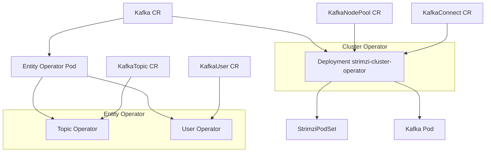
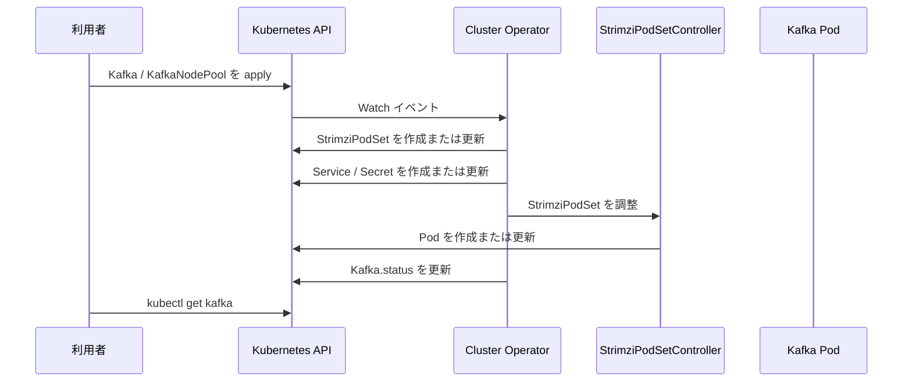

# 第1章 Strimzi Kafka Operator とは

> 本章で参照する公式リソース
>
> - [install/cluster-operator/060-Deployment-strimzi-cluster-operator.yaml L1-L35](https://github.com/strimzi/strimzi-kafka-operator/blob/1.1.0/install/cluster-operator/060-Deployment-strimzi-cluster-operator.yaml#L1-L35)
> - [helm-charts/helm3/strimzi-kafka-operator/Chart.yaml L1-L6](https://github.com/strimzi/strimzi-kafka-operator/blob/1.1.0/helm-charts/helm3/strimzi-kafka-operator/Chart.yaml#L1-L6)
> - [CHANGELOG.md L3-L18](https://github.com/strimzi/strimzi-kafka-operator/blob/1.1.0/CHANGELOG.md#L3-L18)
> - [install/cluster-operator/040-Crd-kafka.yaml L1-L18](https://github.com/strimzi/strimzi-kafka-operator/blob/1.1.0/install/cluster-operator/040-Crd-kafka.yaml#L1-L18)
> - [install/cluster-operator/041-Crd-kafkaconnect.yaml L1-L18](https://github.com/strimzi/strimzi-kafka-operator/blob/1.1.0/install/cluster-operator/041-Crd-kafkaconnect.yaml#L1-L18)
> - [install/cluster-operator/042-Crd-strimzipodset.yaml L1-L18](https://github.com/strimzi/strimzi-kafka-operator/blob/1.1.0/install/cluster-operator/042-Crd-strimzipodset.yaml#L1-L18)
> - [install/cluster-operator/043-Crd-kafkatopic.yaml L1-L18](https://github.com/strimzi/strimzi-kafka-operator/blob/1.1.0/install/cluster-operator/043-Crd-kafkatopic.yaml#L1-L18)
> - [install/cluster-operator/044-Crd-kafkauser.yaml L1-L18](https://github.com/strimzi/strimzi-kafka-operator/blob/1.1.0/install/cluster-operator/044-Crd-kafkauser.yaml#L1-L18)
> - [install/cluster-operator/045-Crd-kafkanodepool.yaml L1-L18](https://github.com/strimzi/strimzi-kafka-operator/blob/1.1.0/install/cluster-operator/045-Crd-kafkanodepool.yaml#L1-L18)
> - [install/cluster-operator/046-Crd-kafkabridge.yaml L1-L18](https://github.com/strimzi/strimzi-kafka-operator/blob/1.1.0/install/cluster-operator/046-Crd-kafkabridge.yaml#L1-L18)
> - [install/cluster-operator/047-Crd-kafkaconnector.yaml L1-L18](https://github.com/strimzi/strimzi-kafka-operator/blob/1.1.0/install/cluster-operator/047-Crd-kafkaconnector.yaml#L1-L18)
> - [install/cluster-operator/048-Crd-kafkamirrormaker2.yaml L1-L18](https://github.com/strimzi/strimzi-kafka-operator/blob/1.1.0/install/cluster-operator/048-Crd-kafkamirrormaker2.yaml#L1-L18)
> - [install/cluster-operator/049-Crd-kafkarebalance.yaml L1-L18](https://github.com/strimzi/strimzi-kafka-operator/blob/1.1.0/install/cluster-operator/049-Crd-kafkarebalance.yaml#L1-L18)

## この章でできるようになること

- Strimzi Kafka Operator が Kubernetes 上で果たす役割を説明できる。
- Cluster Operator と Entity Operator（Topic Operator および User Operator）の役割分担を把握できる。
- 本書が扱う 10 種類の CRD の用途を区別できる。
- Custom Resource から Pod が生成されるまでのリコンサイルの流れを追える。

## 前提

Kubernetes の Custom Resource と CRD の基本概念、および Operator パターンの概要を理解していることを前提とする。

## Strimzi が解決する課題

**Strimzi Kafka Operator**（[strimzi/strimzi-kafka-operator](https://github.com/strimzi/strimzi-kafka-operator)）は、Apache Kafka を Kubernetes 上で宣言的に運用するための Operator である。

従来の Kafka 運用では、ブローカーの起動、ストレージの割り当て、TLS 証明書の更新、トピックやユーザーの管理を手動スクリプトや個別ツールで行う必要があった。
Strimzi はこれらの作業を Custom Resource の spec に集約し、Cluster Operator が Kubernetes リソースとして実現する。
利用者はマニフェストを `kubectl apply` するだけで、クラスタの構築から証明書のローテーションまでを同一のワークフローで扱える。

本書は **KRaft** モード（合意プロトコルを Kafka 自身が担う構成）を前提とする。
Strimzi 1.x では KRaft のみがサポート対象であり、本書では旧来の外部合意ストアに関する手順は扱わない。

## オペレーターの構成

Strimzi は主に次の 3 つのオペレーターで構成される。

- **Cluster Operator**：Kafka クラスタ、Kafka Connect、MirrorMaker 2、Bridge などの Custom Resource を監視し、Pod や Service などの Kubernetes リソースを生成する。
- **Topic Operator**：`KafkaTopic` Custom Resource と Kafka クラスタ内のトピックを同期する。
  Entity Operator の一部としてデプロイされる。
- **User Operator**：`KafkaUser` Custom Resource と Kafka クラスタ内のユーザー認証情報や ACL を同期する。
  Entity Operator の一部としてデプロイされる。

Cluster Operator は Helm chart またはインストール用 YAML から Deployment としてクラスタに配置する。

[install/cluster-operator/060-Deployment-strimzi-cluster-operator.yaml L1-L35](https://github.com/strimzi/strimzi-kafka-operator/blob/1.1.0/install/cluster-operator/060-Deployment-strimzi-cluster-operator.yaml#L1-L35)は次のとおりである。

```yaml
apiVersion: apps/v1
kind: Deployment
metadata:
  name: strimzi-cluster-operator
  labels:
    app: strimzi
spec:
  replicas: 1
  selector:
    matchLabels:
      name: strimzi-cluster-operator
      strimzi.io/kind: cluster-operator
  template:
    metadata:
      labels:
        name: strimzi-cluster-operator
        strimzi.io/kind: cluster-operator
    spec:
      serviceAccountName: strimzi-cluster-operator
      volumes:
        - name: strimzi-tmp
          emptyDir:
            medium: Memory
            sizeLimit: 1Mi
        - name: co-config-volume
          configMap:
            name: strimzi-cluster-operator
      containers:
        - name: strimzi-cluster-operator
          image: quay.io/strimzi/operator:1.1.0
          ports:
            - containerPort: 8080
              name: http
          args:
            - /opt/strimzi/bin/cluster_operator_run.sh
```

次の図は、3 つのオペレーターと Custom Resource の関係を示す。



## 10 種類の CRD

Strimzi 1.1.0 が提供する Custom Resource は次の 10 種類である。
API グループは `kafka.strimzi.io`（`StrimziPodSet` のみ `core.strimzi.io`）であり、安定版は `v1` である。

| kind | 用途 | ショートネーム |
|---|---|---|
| Kafka | Kafka クラスタ全体の設定（バージョン、リスナー、認証局など） | `k` |
| KafkaNodePool | ノード群のロール、レプリカ数、ストレージ | `knp` |
| KafkaTopic | トピックのパーティション数や設定 | `kt` |
| KafkaUser | ユーザー認証と ACL | `ku` |
| KafkaConnect | Kafka Connect クラスタ | `kc` |
| KafkaConnector | Connect コネクターの定義 | `kctr` |
| KafkaMirrorMaker2 | クラスタ間レプリケーション | `kmm2` |
| KafkaBridge | HTTP 経由の Kafka アクセス | `kb` |
| KafkaRebalance | Cruise Control によるリバランス | `kr` |
| StrimziPodSet | Kafka ブローカー Pod の集合管理 | `sps` |

各 CRD の `kind` 定義は install 用マニフェストから引用する。
例として [install/cluster-operator/040-Crd-kafka.yaml L9-L18](https://github.com/strimzi/strimzi-kafka-operator/blob/1.1.0/install/cluster-operator/040-Crd-kafka.yaml#L9-L18)は次のとおりである。

```yaml
  group: kafka.strimzi.io
  names:
    kind: Kafka
    listKind: KafkaList
    singular: kafka
    plural: kafkas
    shortNames:
    - k
    categories:
    - strimzi
```

[install/cluster-operator/042-Crd-strimzipodset.yaml L9-L18](https://github.com/strimzi/strimzi-kafka-operator/blob/1.1.0/install/cluster-operator/042-Crd-strimzipodset.yaml#L9-L18)は次のとおりである。

```yaml
  group: core.strimzi.io
  names:
    kind: StrimziPodSet
    listKind: StrimziPodSetList
    singular: strimzipodset
    plural: strimzipodsets
    shortNames:
    - sps
    categories:
    - strimzi
```

## バージョン 1.1.0 の主な変更点

[CHANGELOG.md L3-L18](https://github.com/strimzi/strimzi-kafka-operator/blob/1.1.0/CHANGELOG.md#L3-L18)には、次の変更が記載されている。

```markdown
## 1.1.0

* Allow failed `KafkaConnectors` to be stopped and reject pausing of failed connectors since this operation is not supported by Kafka Connect
* Add support for Apache Kafka 4.3.0 and 4.2.1
* Remove support for Kafka 4.1.x
* Reconcile Cruise Control before Entity Operator when both are enabled.
* New Cluster operator configuration option `STRIMZI_PKCS12_KEYSTORE_GENERATION` to disable generating PKCS12 stores in CA and Kafka user `Secret` resources.
* Support for Gateway API-based `type: tlsroute` listener
* Support for dependency scope configuration of Maven artifacts in Kafka Connect Build
* Support for configuring per-broker listener annotation and label templates.
* Improved support for custom Apache Kafka versions
* Add `UseBackgroundPodDeletion` feature gate (alpha, disabled by default) to use background deletion propagation when deleting pods during rolling updates. 
* Strimzi Drain Cleaner updated to 1.6.0 (included in the Strimzi installation files)
* Strimzi Access Operator updated to 0.3.0 - included in Strimzi installation files, examples, and documentation
* KafkaBridge and KafkaMirrorMaker2 now use PEM files instead of P12/JKS for TLS authentication and TLS truststore. PEM files are accessed directly from secrets using KubernetesSecretConfigProvider.
* It's now possible to configure mTLS `validityDays` and `renewalDays` for each `KafkaUser`
```

本書では Kafka 4.3.0 をデフォルトのブローカーバージョンとして例に用いる。

## リコンサイルの流れ

利用者が `Kafka` や `KafkaNodePool` を作成すると、Cluster Operator がリコンサイルループで状態を収束させる。
Operator は Custom Resource の spec を読み取り、`StrimziPodSet` や Service、Secret などを生成または更新する。
Pod の作成は Cluster Operator 内の StrimziPodSetController が担う。
`status` フィールドに Ready 条件が記録され、利用者は `kubectl get kafka` で進捗を確認できる。



動作確認として、Cluster Operator が稼働している環境で次を実行する。

```bash
kubectl get deployment strimzi-cluster-operator -n <operator-namespace>
```

期待される出力の例は次のとおりである。

```text
NAME                       READY   UP-TO-DATE   AVAILABLE   AGE
strimzi-cluster-operator   1/1     1            1           5m
```

## まとめ

Strimzi は Kubernetes 上で Kafka を宣言的に運用する Operator である。
Cluster Operator がクラスタ基盤を、Entity Operator がトピックとユーザーを管理する。
10 種類の CRD を組み合わせることで、導入からレプリケーション、リバランスまでを同一の API で扱える。

## 関連する章

- [第2章 インストール](02-installation.md)
- [第3章 クイックスタート](03-quickstart.md)
- [第4章 KafkaNodePool とノードロール](../part01-kafka-cluster/04-kafkanodepool.md)
