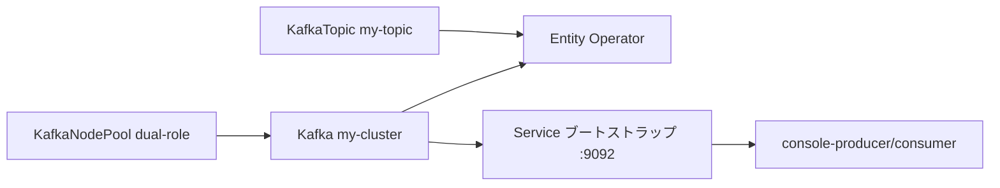

# 第3章 クイックスタート

> 本章で参照する公式リソース
>
> - [examples/kafka/kafka-single-node.yaml L1-L46](https://github.com/strimzi/strimzi-kafka-operator/blob/1.1.0/examples/kafka/kafka-single-node.yaml#L1-L46)
> - [examples/topic/kafka-topic.yaml L1-L12](https://github.com/strimzi/strimzi-kafka-operator/blob/1.1.0/examples/topic/kafka-topic.yaml#L1-L12)

## この章でできるようになること

- 最小構成の Kafka クラスタをデプロイできる。
- `KafkaTopic` を作成し、Topic Operator の動作を確認できる。
- kafka-console-producer と consumer で認証なしのメッセージ送受信を検証できる。

## 前提

[第2章 インストール](02-installation.md)の手順で Cluster Operator が稼働していること。
Kafka をデプロイする Namespace（本章では `kafka`）を作成できること。

## Namespace の準備

Kafka クラスタを配置する Namespace を作成する。

```bash
kubectl create namespace kafka
```

第2章のデフォルト手順では Cluster Operator は `strimzi` Namespace のみを監視する。
本章では `kafka` Namespace にクラスタを置くため、監視対象に `kafka` を追加する。

kubectl apply でインストールした場合は、Deployment の環境変数を更新し、監視対象 Namespace に RoleBinding を作成する。
RoleBinding の subject Namespace も `strimzi` に合わせて置換する。

```bash
kubectl set env deployment/strimzi-cluster-operator -n strimzi \
  STRIMZI_NAMESPACE=strimzi,kafka
for f in \
  020-RoleBinding-strimzi-cluster-operator.yaml \
  023-RoleBinding-strimzi-cluster-operator.yaml \
  031-RoleBinding-strimzi-cluster-operator-entity-operator-delegation.yaml; do
  curl -s "https://raw.githubusercontent.com/strimzi/strimzi-kafka-operator/1.1.0/install/cluster-operator/${f}" \
    | sed 's/namespace: myproject/namespace: strimzi/g' \
    | kubectl apply -n kafka -f -
done
```

Helm でインストールした場合は、values の `watchNamespaces` に `kafka` を追加してアップグレードする。
Helm は `.Release.Namespace` も監視対象に含める。

```bash
helm upgrade strimzi-kafka-operator strimzi/strimzi-kafka-operator \
  --namespace strimzi \
  --version 1.1.0 \
  --reuse-values \
  --set watchNamespaces[0]=kafka
```

## Kafka クラスタのデプロイ

最小構成のマニフェストは [examples/kafka/kafka-single-node.yaml L1-L46](https://github.com/strimzi/strimzi-kafka-operator/blob/1.1.0/examples/kafka/kafka-single-node.yaml#L1-L46)である。

```yaml
apiVersion: kafka.strimzi.io/v1
kind: KafkaNodePool
metadata:
  name: dual-role
  labels:
    strimzi.io/cluster: my-cluster
spec:
  replicas: 1
  roles:
    - controller
    - broker
  storage:
    type: jbod
    volumes:
      - id: 0
        type: persistent-claim
        size: 100Gi
        kraftMetadata: shared
---

apiVersion: kafka.strimzi.io/v1
kind: Kafka
metadata:
  name: my-cluster
spec:
  kafka:
    version: 4.3.0
    metadataVersion: 4.3-IV0
    listeners:
      - name: plain
        port: 9092
        type: internal
        tls: false
      - name: tls
        port: 9093
        type: internal
        tls: true
    config:
      offsets.topic.replication.factor: 1
      transaction.state.log.replication.factor: 1
      transaction.state.log.min.isr: 1
      default.replication.factor: 1
      min.insync.replicas: 1
  entityOperator:
    topicOperator: {}
    userOperator: {}
```

`KafkaNodePool` は 1 レプリカの dual-role ノード（コントローラーとブローカーを兼務）を定義する。
`Kafka` はブローカーバージョン、内部リスナー（plain 9092 と tls 9093）、レプリケーション係数、Entity Operator を指定する。
本章のクラスタは認可なしと認証なしのオープン構成である。

```bash
kubectl apply -f kafka-single-node.yaml -n kafka
```

期待される出力の例は次のとおりである。

```text
kafkanodepool.kafka.strimzi.io/dual-role created
kafka.kafka.strimzi.io/my-cluster created
```

クラスタが Ready になるまで待つ。

```bash
kubectl get kafka my-cluster -n kafka -w
```

期待される出力の例は次のとおりである。

```text
NAME         READY   WARNINGS   KAFKA VERSION   METADATA VERSION
my-cluster   True               4.3.0           4.3-IV0
```

`StrimziPodSet` と Pod も確認する。

```bash
kubectl get strimzipodset -n kafka
kubectl get pod -l strimzi.io/cluster=my-cluster -n kafka
```

期待される出力の例は次のとおりである。

```text
NAME                     PODS   READY PODS   CURRENT PODS   AGE
my-cluster-dual-role     1      1            1              3m
```

```text
NAME                         READY   STATUS    RESTARTS   AGE
my-cluster-dual-role-0       1/1     Running   0          3m
my-cluster-entity-operator-...   2/2     Running   0          2m
```

## KafkaTopic の作成

[examples/topic/kafka-topic.yaml L1-L12](https://github.com/strimzi/strimzi-kafka-operator/blob/1.1.0/examples/topic/kafka-topic.yaml#L1-L12)を適用する。

```yaml
apiVersion: kafka.strimzi.io/v1
kind: KafkaTopic
metadata:
  name: my-topic
  labels:
    strimzi.io/cluster: my-cluster
spec:
  partitions: 1
  replicas: 1
  config:
    retention.ms: 7200000
    segment.bytes: 1073741824
```

`strimzi.io/cluster` ラベルが `Kafka` リソース名と一致している必要がある。

```bash
kubectl apply -f kafka-topic.yaml -n kafka
kubectl get kafkatopic my-topic -n kafka
```

期待される出力の例は次のとおりである。

```text
NAME       CLUSTER      PARTITIONS   REPLICATION FACTOR   READY
my-topic   my-cluster   1            1                    True
```

## メッセージ送受信の確認

以下は動作確認用の手順例である。
plain リスナー（`my-cluster-kafka-bootstrap:9092`）へ認証なしで接続する。

producer 用の Pod を起動する。
console producer は送信レコードを標準出力へ返さない。

```bash
kubectl run kafka-producer -ti --restart=Never -n kafka \
  --image=quay.io/strimzi/kafka:1.1.0-kafka-4.3.0 \
  --command -- /bin/bash -c \
  'echo hello-from-quickstart | bin/kafka-console-producer.sh --bootstrap-server my-cluster-kafka-bootstrap:9092 --topic my-topic'
```

producer Pod はメッセージ送信後に終了する。
受信確認は consumer 側で行う。

consumer 用の Pod で受信を確認する。

```bash
kubectl run kafka-consumer -ti --restart=Never -n kafka \
  --image=quay.io/strimzi/kafka:1.1.0-kafka-4.3.0 \
  --command -- bin/kafka-console-consumer.sh \
  --bootstrap-server my-cluster-kafka-bootstrap:9092 \
  --topic my-topic --from-beginning
```

期待される出力には、producer が送信した文字列が表示される。

```text
hello-from-quickstart
```

確認後、一時 Pod を削除する。

```bash
kubectl delete pod kafka-producer kafka-consumer -n kafka
```

認証と認可、ユーザー管理は第2部（第9〜11章）と [第13章 KafkaUser の管理](../part03-topics-users/13-kafkauser.md)で扱う。

## 構成の全体像



## まとめ

`KafkaNodePool` と `Kafka` を適用すれば、1 ノードの KRaft クラスタが起動する。
`KafkaTopic` は Topic Operator が同期する。
plain リスナー経由で producer と consumer を動かし、端到端の動作を確認できる。

## 関連する章

- [第2章 インストール](02-installation.md)
- [第4章 KafkaNodePool とノードロール](../part01-kafka-cluster/04-kafkanodepool.md)
- [第5章 Kafka Custom Resource の基本構造](../part01-kafka-cluster/05-kafka-resource.md)
- [第13章 KafkaUser の管理](../part03-topics-users/13-kafkauser.md)
