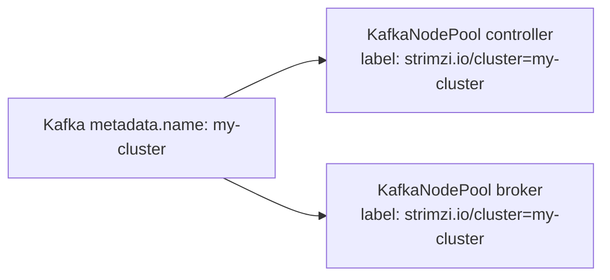

# 第4章 KafkaNodePool とノードロール

> 本章で参照する公式リソース
>
> - [install/cluster-operator/045-Crd-kafkanodepool.yaml L60-L158](https://github.com/strimzi/strimzi-kafka-operator/blob/1.1.0/install/cluster-operator/045-Crd-kafkanodepool.yaml#L60-L158)
> - [examples/kafka/kafka-persistent.yaml L1-L37](https://github.com/strimzi/strimzi-kafka-operator/blob/1.1.0/examples/kafka/kafka-persistent.yaml#L1-L37)
> - [examples/kafka/kafka-with-dual-role-nodes.yaml L1-L18](https://github.com/strimzi/strimzi-kafka-operator/blob/1.1.0/examples/kafka/kafka-with-dual-role-nodes.yaml#L1-L18)
> - [examples/kafka/kafka-persistent.yaml L1-L64](https://github.com/strimzi/strimzi-kafka-operator/blob/1.1.0/examples/kafka/kafka-persistent.yaml#L1-L64)
> - [examples/kafka/kafka-single-node.yaml L1-L18](https://github.com/strimzi/strimzi-kafka-operator/blob/1.1.0/examples/kafka/kafka-single-node.yaml#L1-L18)

## この章でできるようになること

- **KafkaNodePool** Custom Resource でノード群のロール、レプリカ数、ストレージを定義できる。
- コントローラーとブローカーを分離する構成と dual-role 構成の違いを説明できる。
- `strimzi.io/cluster` ラベルで `Kafka` リソースとノードプールを結びつけられる。
- デプロイ後のノードプールと Pod の状態を確認できる。

## 前提

[第3章 クイックスタート](../part00-introduction/03-quickstart.md)で構築したオープンクラスタ（`my-cluster`、認証なし、認可なし）を前提とする。
デフォルト StorageClass が利用でき、動的プロビジョニングで PVC が Bound になるクラスタを前提とする。
KRaft モードではノードに `controller` または `broker` ロール（または両方）を割り当てる。

## KafkaNodePool の役割

Strimzi 1.x では、Kafka ブローカー Pod のスケールとストレージは `KafkaNodePool` で管理する。
1 つの `Kafka` クラスタに複数のノードプールを定義でき、ロールごとにレプリカ数やディスク構成を変えられる。

[install/cluster-operator/045-Crd-kafkanodepool.yaml L60-L158](https://github.com/strimzi/strimzi-kafka-operator/blob/1.1.0/install/cluster-operator/045-Crd-kafkanodepool.yaml#L60-L158)は次のとおりである。

```yaml
              replicas:
                type: integer
                minimum: 0
                description: The number of pods in the pool.
              storage:
                type: object
                properties:
                  class:
                    type: string
                    description: The storage class to use for dynamic volume allocation.
                  deleteClaim:
                    type: boolean
                    description: Specifies whether the persistent volume claim is deleted when a Kafka node is deleted. Optional. Defaults to `false`.
                  id:
                    type: integer
                    minimum: 0
                    description: Storage identification number. It is mandatory only for storage volumes defined in a storage of type 'jbod'.
                  kraftMetadata:
                    type: string
                    enum:
                    - shared
                    description: "Specifies whether this volume should be used for storing KRaft metadata. This property is optional. When set, the only currently supported value is `shared`. At most one volume can have this property set."
                  selector:
                    additionalProperties:
                      type: string
                    type: object
                    description: Specifies a specific persistent volume to use. It contains key:value pairs representing labels for selecting such a volume.
                  size:
                    type: string
                    description: "When `type=persistent-claim`, defines the size of the persistent volume claim, such as 100Gi. Mandatory when `type=persistent-claim`."
                  sizeLimit:
                    type: string
                    pattern: "^([0-9.]+)([eEinumkKMGTP]*[-+]?[0-9]*)$"
                    description: "When type=ephemeral, defines the total amount of local storage required for this EmptyDir volume (for example 1Gi)."
                  type:
                    type: string
                    enum:
                    - ephemeral
                    - persistent-claim
                    - jbod
                    description: "Storage type, must be either 'ephemeral', 'persistent-claim', or 'jbod'."
                  volumeAttributesClass:
                    type: string
                    description: Specifies `VolumeAttributeClass` name for dynamically configuring storage attributes.
                  volumes:
                    type: array
                    items:
                      type: object
                      properties:
                        class:
                          type: string
                          description: The storage class to use for dynamic volume allocation.
                        deleteClaim:
                          type: boolean
                          description: Specifies whether the persistent volume claim is deleted when a Kafka node is deleted. Optional. Defaults to `false`.
                        id:
                          type: integer
                          minimum: 0
                          description: Storage identification number. Mandatory for storage volumes defined with a `jbod` storage type configuration.
                        kraftMetadata:
                          type: string
                          enum:
                          - shared
                          description: "Specifies whether this volume should be used for storing KRaft metadata. This property is optional. When set, the only currently supported value is `shared`. At most one volume can have this property set."
                        selector:
                          additionalProperties:
                            type: string
                          type: object
                          description: Specifies a specific persistent volume to use. It contains key:value pairs representing labels for selecting such a volume.
                        size:
                          type: string
                          description: "When `type=persistent-claim`, defines the size of the persistent volume claim, such as 100Gi. Mandatory when `type=persistent-claim`."
                        sizeLimit:
                          type: string
                          pattern: "^([0-9.]+)([eEinumkKMGTP]*[-+]?[0-9]*)$"
                          description: "When type=ephemeral, defines the total amount of local storage required for this EmptyDir volume (for example 1Gi)."
                        type:
                          type: string
                          enum:
                          - ephemeral
                          - persistent-claim
                          description: "Storage type, must be either 'ephemeral' or 'persistent-claim'."
                        volumeAttributesClass:
                          type: string
                          description: Specifies `VolumeAttributeClass` name for dynamically configuring storage attributes.
                      required:
                      - type
                    description: List of volumes as Storage objects representing the JBOD disks array.
                required:
                - type
                description: Storage configuration (disk). Cannot be updated.
              roles:
                type: array
                items:
                  type: string
                  enum:
                  - controller
                  - broker
                description: The roles assigned to the node pool. Supported values are `broker` and `controller`. This property is required.
```

`replicas` はプール内の Pod 数である。
`roles` は KRaft におけるノードの役割を指定する。
`storage` はディスク構成であり、type の変更など一部の更新はできない。
サイズ拡張や JBOD ボリュームの追加は第6章で扱う。

## ノードロールの使い分け

KRaft では次のロールが使える。

| ロール | 役割 |
|---|---|
| `controller` | メタデータの合意とクラスタ状態の管理 |
| `broker` | パーティションの読み書き |
| `controller` と `broker` の両方 | 1 ノードで両役割を兼務（dual-role） |

本番ではコントローラーとブローカーを分離する構成が一般的である。
[examples/kafka/kafka-persistent.yaml L1-L37](https://github.com/strimzi/strimzi-kafka-operator/blob/1.1.0/examples/kafka/kafka-persistent.yaml#L1-L37)は、コントローラー用とブローカー用の 2 プールを定義する。

```yaml
apiVersion: kafka.strimzi.io/v1
kind: KafkaNodePool
metadata:
  name: controller
  labels:
    strimzi.io/cluster: my-cluster
spec:
  replicas: 3
  roles:
    - controller
  storage:
    type: jbod
    volumes:
      - id: 0
        type: persistent-claim
        size: 100Gi
        kraftMetadata: shared
---

apiVersion: kafka.strimzi.io/v1
kind: KafkaNodePool
metadata:
  name: broker
  labels:
    strimzi.io/cluster: my-cluster
spec:
  replicas: 3
  roles:
    - broker
  storage:
    type: jbod
    volumes:
      - id: 0
        type: persistent-claim
        size: 100Gi
        kraftMetadata: shared
---
```

第3章で dual-role プールをデプロイ済みの場合は、公式手順に沿って分離構成へ移行する。
手順の概要は次のとおりである。

1. ブローカー専用の `KafkaNodePool` を追加して apply する。
2. 新ブローカーが Ready になるまで待つ。
3. Cruise Control の `remove-brokers` で dual-role ノードからパーティションを退避する。
4. 旧 dual-role プールの `roles` から `broker` を外し、コントローラー専用にする。

以下は dual-role プール `dual-role` からブローカー専用プール `broker` を追加する例である。

```yaml
apiVersion: kafka.strimzi.io/v1
kind: KafkaNodePool
metadata:
  name: broker
  labels:
    strimzi.io/cluster: my-cluster
spec:
  replicas: 3
  roles:
    - broker
  storage:
    type: jbod
    volumes:
      - id: 0
        type: persistent-claim
        size: 100Gi
        kraftMetadata: shared
```

```bash
kubectl apply -f broker-pool.yaml -n kafka
```

期待される出力の例は次のとおりである。

```text
kafkanodepool.kafka.strimzi.io/broker created
```

```bash
until [ "$(kubectl get pod -l strimzi.io/pool-name=broker,strimzi.io/cluster=my-cluster -n kafka \
  --no-headers 2>/dev/null | wc -l)" -ge 3 ]; do
  sleep 2
done
kubectl wait pod -l strimzi.io/pool-name=broker,strimzi.io/cluster=my-cluster -n kafka \
  --for=condition=Ready --timeout=600s
```

期待される出力の例は次のとおりである。

```text
pod/my-cluster-broker-1 condition met
pod/my-cluster-broker-2 condition met
pod/my-cluster-broker-3 condition met
```

```bash
kubectl get kafkanodepool broker -n kafka
kubectl get pod -l 'strimzi.io/cluster=my-cluster,strimzi.io/pool-name in (dual-role,broker)' -n kafka
```

期待される出力の例は次のとおりである。

```text
NAME     DESIRED REPLICAS   ROLES          NODEIDS
broker   3                  ["broker"]     [1,2,3]
```

```text
NAME                  READY   STATUS    RESTARTS   AGE
my-cluster-dual-role-0   1/1     Running   0          10m
my-cluster-broker-1      1/1     Running   0          5m
my-cluster-broker-2      1/1     Running   0          5m
my-cluster-broker-3      1/1     Running   0          5m
```

`KafkaNodePool` の status には `Ready` 条件は生成されない。
新ブローカー Pod の Ready を待ってから次へ進む。

`KafkaRebalance` を使う前に Cruise Control を有効化する（[第19章](../part06-cruise-control/19-cruise-control.md)）。

```bash
kubectl patch kafka my-cluster -n kafka --type=merge -p '{"spec":{"cruiseControl":{}}}'
```

期待される出力の例は次のとおりである。

```text
kafka.kafka.strimzi.io/my-cluster patched
```

patch 後は `observedGeneration` が `generation` に追いつくのを待ってから Ready を確認する。

```bash
GEN=$(kubectl get kafka my-cluster -n kafka -o jsonpath='{.metadata.generation}')
kubectl wait kafka/my-cluster -n kafka \
  --for=jsonpath="{.status.observedGeneration}=${GEN}" --timeout=600s
kubectl wait kafka/my-cluster -n kafka --for=condition=Ready --timeout=600s
```

期待される出力の例は次のとおりである。

```text
kafka.kafka.strimzi.io/my-cluster condition met
kafka.kafka.strimzi.io/my-cluster condition met
```

dual-role ノードの node ID を取得し、パーティション退避対象に指定する。

```bash
DUAL_ROLE_ID=$(kubectl get kafkanodepool dual-role -n kafka -o jsonpath='{.status.nodeIds[0]}')
echo "remove broker ID: ${DUAL_ROLE_ID}"
```

期待される出力の例は次のとおりである。

```text
remove broker ID: 0
```

```bash
kubectl apply -f - <<EOF
apiVersion: kafka.strimzi.io/v1
kind: KafkaRebalance
metadata:
  name: split-remove-brokers
  labels:
    strimzi.io/cluster: my-cluster
spec:
  mode: remove-brokers
  brokers: [${DUAL_ROLE_ID}]
EOF
```

期待される出力の例は次のとおりである。

```text
kafkarebalance.kafka.strimzi.io/split-remove-brokers created
```

```bash
kubectl wait kafkarebalance/split-remove-brokers -n kafka \
  --for=jsonpath='{.status.conditions[?(@.type=="ProposalReady")].status}'=True --timeout=600s
kubectl annotate kafkarebalance split-remove-brokers -n kafka strimzi.io/rebalance=approve --overwrite
kubectl wait kafkarebalance/split-remove-brokers -n kafka \
  --for=jsonpath='{.status.conditions[?(@.type=="Ready")].status}'=True --timeout=1800s
```

期待される出力の例は次のとおりである。

```text
kafkarebalance.kafka.strimzi.io/split-remove-brokers condition met
kafkarebalance.kafka.strimzi.io/split-remove-brokers annotated
kafkarebalance.kafka.strimzi.io/split-remove-brokers condition met
```

dual-role プールをコントローラー専用にする。

```bash
kubectl patch kafkanodepool dual-role -n kafka --type=merge \
  -p '{"spec":{"roles":["controller"]}}'
```

期待される出力の例は次のとおりである。

```text
kafkanodepool.kafka.strimzi.io/dual-role patched
```

旧 Pod が消えたことだけを見ると、削除から再作成までの空白期間や `kubectl get` の一時失敗で誤って成功と判定し得るため、対象 Pod が `strimzi.io/broker-role=false` かつ `Ready=True` になるまで待つ。
本章の single-node 前提では `dual-role` プールの Pod 名は `my-cluster-dual-role-0` に決まる。
ラベルキー `strimzi.io/broker-role` は Operator が Pod に付与する（`Labels.java` の `withStrimziBrokerRole`）。

```bash
# コントローラー専用への収束を待つ。望む終了状態(broker-role=false かつ Ready=True)を
# 満たすまでポーリングする。空白期間や一時失敗では条件を満たさず待機を継続する。
STATE=
for i in $(seq 1 120); do
  STATE=$(kubectl get pod my-cluster-dual-role-0 -n kafka \
    -o jsonpath='{.metadata.labels.strimzi\.io/broker-role}{":"}{.status.conditions[?(@.type=="Ready")].status}' 2>/dev/null)
  if [ "$STATE" = "false:True" ]; then break; fi
  sleep 5
done
if [ "$STATE" != "false:True" ]; then
  echo "controller-only convergence failed: state=${STATE:-empty}"
  exit 1
fi
kubectl get pod my-cluster-dual-role-0 -n kafka \
  -o jsonpath='{.metadata.labels.strimzi\.io/broker-role}{":"}{.status.conditions[?(@.type=="Ready")].status}{"\n"}'
kubectl get kafkanodepool dual-role -n kafka -o jsonpath='{.status.roles}{"\n"}'
```

期待される出力の例は次のとおりである。
ポーリングループは成功時に出力を返さない。

```text
false:True
["controller"]
```

コントローラー専用 Pod には `strimzi.io/broker-role: "false"` が付く。

分離構成の全体例は [examples/kafka/kafka-persistent.yaml L1-L64](https://github.com/strimzi/strimzi-kafka-operator/blob/1.1.0/examples/kafka/kafka-persistent.yaml#L1-L64)を参照する。

```yaml
apiVersion: kafka.strimzi.io/v1
kind: KafkaNodePool
metadata:
  name: controller
  labels:
    strimzi.io/cluster: my-cluster
spec:
  replicas: 3
  roles:
    - controller
  storage:
    type: jbod
    volumes:
      - id: 0
        type: persistent-claim
        size: 100Gi
        kraftMetadata: shared
---

apiVersion: kafka.strimzi.io/v1
kind: KafkaNodePool
metadata:
  name: broker
  labels:
    strimzi.io/cluster: my-cluster
spec:
  replicas: 3
  roles:
    - broker
  storage:
    type: jbod
    volumes:
      - id: 0
        type: persistent-claim
        size: 100Gi
        kraftMetadata: shared
---

apiVersion: kafka.strimzi.io/v1
kind: Kafka
metadata:
  name: my-cluster
spec:
  kafka:
    version: 4.3.0
    metadataVersion: 4.3-IV0
    listeners:
      - name: plain
        port: 9092
        type: internal
        tls: false
      - name: tls
        port: 9093
        type: internal
        tls: true
    config:
      offsets.topic.replication.factor: 3
      transaction.state.log.replication.factor: 3
      transaction.state.log.min.isr: 2
      default.replication.factor: 3
      min.insync.replicas: 2
  entityOperator:
    topicOperator: {}
    userOperator: {}
```

開発や検証では dual-role でノード数を抑えられる。
[examples/kafka/kafka-with-dual-role-nodes.yaml L1-L18](https://github.com/strimzi/strimzi-kafka-operator/blob/1.1.0/examples/kafka/kafka-with-dual-role-nodes.yaml#L1-L18)は 3 レプリカの dual-role プールである。

```yaml
apiVersion: kafka.strimzi.io/v1
kind: KafkaNodePool
metadata:
  name: dual-role
  labels:
    strimzi.io/cluster: my-cluster
spec:
  replicas: 3
  roles:
    - controller
    - broker
  storage:
    type: jbod
    volumes:
      - id: 0
        type: persistent-claim
        size: 100Gi
        kraftMetadata: shared
```

最小構成は [examples/kafka/kafka-single-node.yaml L1-L18](https://github.com/strimzi/strimzi-kafka-operator/blob/1.1.0/examples/kafka/kafka-single-node.yaml#L1-L18)のとおり 1 レプリカである。

```yaml
apiVersion: kafka.strimzi.io/v1
kind: KafkaNodePool
metadata:
  name: dual-role
  labels:
    strimzi.io/cluster: my-cluster
spec:
  replicas: 1
  roles:
    - controller
    - broker
  storage:
    type: jbod
    volumes:
      - id: 0
        type: persistent-claim
        size: 100Gi
        kraftMetadata: shared
```

## strimzi.io/cluster ラベル

`KafkaNodePool` は `metadata.labels.strimzi.io/cluster` で親クラスタを指定する。
値は対応する `Kafka` リソースの `metadata.name` と一致させる。



同じラベルを持つ `KafkaTopic` や `KafkaUser` も同じクラスタに紐づく。
ラベルの不一致は Operator がリソースを無視する原因になる。

## スケール時の挙動概要

ブローカー専用の `KafkaNodePool` では `replicas` を増減できる。
コントローラー専用プールの `replicas` 変更（スケール）は Strimzi 1.1.0 では非サポートである。
`replicas` を増やすと、Cluster Operator はクラスタ全体で一意の node ID を割り当てて Pod を追加する。
減らす場合は、パーティションの移動やリバランスが必要になることがある。
詳細な手順は第23章（スケーリングとローリング更新）で扱う。

## 動作確認

ノードプールの一覧を確認する。

```bash
kubectl get kafkanodepool -n kafka
```

期待される出力の例（本章の移行手順完了後）は次のとおりである。
node ID はクラスタの割り当て結果に依存する。

```text
NAME         DESIRED REPLICAS   ROLES            NODEIDS
dual-role    1                  ["controller"]   [0]
broker       3                  ["broker"]       [1,2,3]
```

Pod 名の末尾は node ID である（例: `my-cluster-broker-1`）。
node ID はクラスタ全体で一意であり、コントローラープールとブローカープールで同じ ID を共有しない。

クラスタに属する Kafka 関連 Pod を確認する。
`strimzi.io/kind=Kafka` は Kafka ノード Pod に加え Entity Operator と Cruise Control の Pod にも付く。

```bash
kubectl get pod -l strimzi.io/cluster=my-cluster,strimzi.io/kind=Kafka -n kafka
```

期待される出力には、プール名と node ID を含む Pod 名に加え、Entity Operator と Cruise Control の Pod が含まれる。

```text
NAME                                          READY   STATUS    RESTARTS   AGE
my-cluster-dual-role-0                        1/1     Running   0          10m
my-cluster-broker-1                           1/1     Running   0          8m
my-cluster-broker-2                           1/1     Running   0          8m
my-cluster-broker-3                           1/1     Running   0          8m
my-cluster-entity-operator-7d8f9c6b4d-abcde   2/2     Running   0          9m
my-cluster-cruise-control-6f5d8b7c4e-fghij   1/1     Running   0          7m
```

node ID は `kubectl get kafkanodepool` の `NODEIDS` 列で確認する。

## まとめ

`KafkaNodePool` は KRaft ノードのロール、台数、ストレージを宣言的に定義する。
本番はコントローラーとブローカーの分離、検証は dual-role が使いやすい。
`strimzi.io/cluster` ラベルで `Kafka` リソースと結びつける。

## 関連する章

- [第3章 クイックスタート](../part00-introduction/03-quickstart.md)
- [第5章 Kafka Custom Resource の基本構造](05-kafka-resource.md)
- [第6章 ストレージ設定](06-storage.md)
