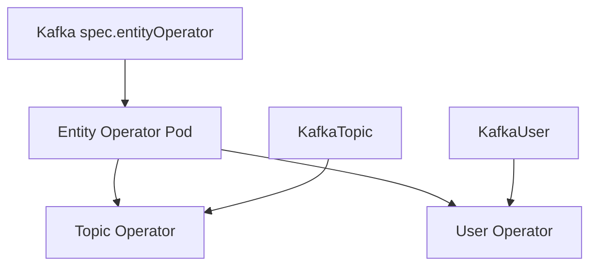

# 第5章 Kafka Custom Resource の基本構造

> 本章で参照する公式リソース
>
> - [install/cluster-operator/040-Crd-kafka.yaml L63-L72](https://github.com/strimzi/strimzi-kafka-operator/blob/1.1.0/install/cluster-operator/040-Crd-kafka.yaml#L63-L72)
> - [install/cluster-operator/040-Crd-kafka.yaml L1943-L1958](https://github.com/strimzi/strimzi-kafka-operator/blob/1.1.0/install/cluster-operator/040-Crd-kafka.yaml#L1943-L1958)
> - [kafka-versions.yaml L296-L316](https://github.com/strimzi/strimzi-kafka-operator/blob/1.1.0/kafka-versions.yaml#L296-L316)
> - [examples/kafka/kafka-persistent.yaml L39-L64](https://github.com/strimzi/strimzi-kafka-operator/blob/1.1.0/examples/kafka/kafka-persistent.yaml#L39-L64)

## この章でできるようになること

- `Kafka` Custom Resource の `spec.kafka` 主要フィールドを読み解ける。
- `version` と `metadataVersion` の関係を説明できる。
- ブローカー `config` のレプリケーション関連キーを適切に設定できる。
- Entity Operator を有効化する意味を理解できる。

## 前提

[第4章 KafkaNodePool とノードロール](04-kafkanodepool.md)でノードプールの定義方法を理解していること。

## spec.kafka の構造

`Kafka` CRD の `spec.kafka` には、ブローカーバージョン、リスナー、ブローカー設定などが含まれる。

[install/cluster-operator/040-Crd-kafka.yaml L63-L65](https://github.com/strimzi/strimzi-kafka-operator/blob/1.1.0/install/cluster-operator/040-Crd-kafka.yaml#L63-L65)は次のとおりである。

```yaml
                  version:
                    type: string
                    description: The Kafka broker version. Defaults to the latest version. Consult the user documentation to understand the process required to upgrade or downgrade the version.
```

`version` は Apache Kafka のブローカーバージョンである。
`metadataVersion` は KRaft のメタデータフォーマットバージョンである。
省略時は `version` に対応するデフォルト値が使われる。

リスナーの詳細は [第7章 リスナーと外部アクセス](07-listeners.md)で扱う。

## サポートされる Kafka バージョン

Cluster Operator がサポートするバージョンは [kafka-versions.yaml L296-L316](https://github.com/strimzi/strimzi-kafka-operator/blob/1.1.0/kafka-versions.yaml#L296-L316)で定義される。

```yaml
- version: 4.2.0
  metadata: 4.2-IV1
  url: https://archive.apache.org/dist/kafka/4.2.0/kafka_2.13-4.2.0.tgz
  checksum: 16CE46E590BA915F01B720EA514445E49C88BF129CF4CEAB88878B122D54EF24F0DEDB88D0EB178957F58057A6C6A9ADBEA8B8059307585DAEA13129B85BA1D8
  third-party-libs: 4.2.0
  supported: true
  default: false
- version: 4.2.1
  metadata: 4.2-IV1
  url: https://archive.apache.org/dist/kafka/4.2.1/kafka_2.13-4.2.1.tgz
  checksum: F643E31266268E920AA98EAD9A061026C98DAC2886932AD468565BA59BCB7FB4F98A4C4F62727367E1BD87515F3B016E6F6CCCCAD8B12BDEF8B091B0FB577170
  third-party-libs: 4.2.1
  supported: true
  default: false
- version: 4.3.0
  metadata: 4.3-IV0
  url: https://archive.apache.org/dist/kafka/4.3.0/kafka_2.13-4.3.0.tgz
  checksum: EE36CF508B519769E253ACDFA13ADD23F405AB42B241CA641589843DF6A5C7BC72289301EB410A645CE7CD1CD0FE20921143B9074DFBFE72605943140D4E8CB1
  third-party-libs: 4.3.x
  supported: true
  default: true
```

Strimzi 1.1.0 では Kafka 4.2.0、4.2.1、4.3.0 が `supported: true` である。
デフォルトは 4.3.0 である。

`metadataVersion` には `version` とは別の文字列（例: `4.3-IV0`）を指定する。
アップグレード時はブローカーバージョンとメタデータバージョンの両方を計画的に更新する。

## ブローカー config

`spec.kafka.config` には Kafka のブローカー設定を記述する。
レプリケーション係数はクラスタのノード数と整合させる必要がある。

[examples/kafka/kafka-persistent.yaml L39-L64](https://github.com/strimzi/strimzi-kafka-operator/blob/1.1.0/examples/kafka/kafka-persistent.yaml#L39-L64)は次のとおりである。

```yaml
apiVersion: kafka.strimzi.io/v1
kind: Kafka
metadata:
  name: my-cluster
spec:
  kafka:
    version: 4.3.0
    metadataVersion: 4.3-IV0
    listeners:
      - name: plain
        port: 9092
        type: internal
        tls: false
      - name: tls
        port: 9093
        type: internal
        tls: true
    config:
      offsets.topic.replication.factor: 3
      transaction.state.log.replication.factor: 3
      transaction.state.log.min.isr: 2
      default.replication.factor: 3
      min.insync.replicas: 2
  entityOperator:
    topicOperator: {}
    userOperator: {}
```

| キー | 意味 |
|---|---|
| `default.replication.factor` | 新規トピックのデフォルトレプリカ数 |
| `min.insync.replicas` | 書き込み成功に必要な最小 in-sync レプリカ数 |
| `offsets.topic.replication.factor` | `__consumer_offsets` のレプリカ数 |
| `transaction.state.log.replication.factor` | トランザクション状態ログのレプリカ数 |
| `transaction.state.log.min.isr` | トランザクションログの最小 ISR |

3 ブローカー構成ではレプリカ数 3、`min.insync.replicas` 2 が一般的である。
1 ノード構成ではすべて 1 に下げる（[第3章](../part00-introduction/03-quickstart.md)の例を参照）。

## Entity Operator

`spec.entityOperator` を設定すると、Topic Operator と User Operator を含む Entity Operator Pod をデプロイできる。
`topicOperator` と `userOperator` の両方が未設定のときは Entity Operator 自体がデプロイされない。
どちらか一方だけを設定すると、その Operator のみがデプロイされる。

[install/cluster-operator/040-Crd-kafka.yaml L1943-L1958](https://github.com/strimzi/strimzi-kafka-operator/blob/1.1.0/install/cluster-operator/040-Crd-kafka.yaml#L1943-L1958)は次のとおりである。

```yaml
              entityOperator:
                type: object
                properties:
                  topicOperator:
                    type: object
                    properties:
                      watchedNamespace:
                        type: string
                        description: The namespace the Topic Operator should watch.
                      image:
                        type: string
                        description: The image to use for the Topic Operator.
                      reconciliationIntervalMs:
                        type: integer
                        minimum: 0
                        description: Interval between periodic reconciliations in milliseconds.
```

空のオブジェクト `topicOperator: {}` でデフォルト設定の Topic Operator が有効になる。
`KafkaTopic` と `KafkaUser` を Custom Resource で管理する場合は Entity Operator が必要である。



## 動作確認

クラスタのバージョンと状態を確認する。

```bash
kubectl get kafka my-cluster -n kafka -o wide
```

期待される出力の例は次のとおりである。

```text
NAME         READY   WARNINGS   KAFKA VERSION   METADATA VERSION
my-cluster   True               4.3.0           4.3-IV0
```

jsonpath で個別フィールドを取得する。

```bash
kubectl get kafka my-cluster -n kafka \
  -o jsonpath='{.spec.kafka.version}{"\n"}{.status.kafkaVersion}{"\n"}'
```

期待される出力の例は次のとおりである。

```text
4.3.0
4.3.0
```

## まとめ

`Kafka` Custom Resource はクラスタ全体のポリシーを定義する。
`version` と `metadataVersion` は KRaft の互換性に直結する。
`config` のレプリケーション係数はノード数と整合させ、Entity Operator でトピックとユーザーを宣言的に管理する。

## 関連する章

- [第4章 KafkaNodePool とノードロール](04-kafkanodepool.md)
- [第7章 リスナーと外部アクセス](07-listeners.md)
