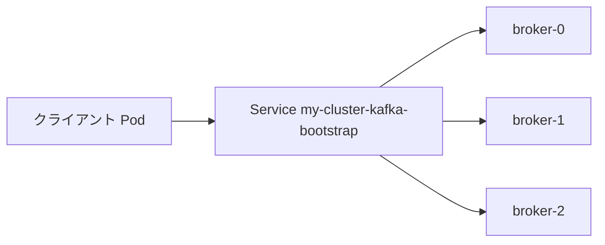

# 第7章 リスナーと外部アクセス

> 本章で参照する公式リソース
>
> - [install/cluster-operator/040-Crd-kafka.yaml L72-L119](https://github.com/strimzi/strimzi-kafka-operator/blob/1.1.0/install/cluster-operator/040-Crd-kafka.yaml#L72-L119)
> - [examples/kafka/kafka-persistent.yaml L47-L55](https://github.com/strimzi/strimzi-kafka-operator/blob/1.1.0/examples/kafka/kafka-persistent.yaml#L47-L55)

## この章でできるようになること

- `spec.kafka.listeners` の type、port、tls、authentication を設定できる。
- 内部接続用ブートストラップ Service の名前規則を説明できる。
- 外部公開（LoadBalancer、NodePort など）の考え方を理解できる。
- リスナーごとの Service を確認できる。

## 前提

[第5章 Kafka Custom Resource の基本構造](05-kafka-resource.md)で `spec.kafka` の概要を理解していること。
本章は第3章のオープンクラスタ（`dual-role` 1台、`plain` 9092）を前提とする。
`loadbalancer` リスナーは LoadBalancer を提供する Kubernetes 環境（クラウド LB や MetalLB 等）が必要である。
provisioner が無い環境では Operator が ingress address の割り当てを待ち続け、Ready と外部 IP の期待値を再現できない。

## listeners スキーマ

各リスナーは名前、ポート、タイプ、TLS 設定を持つ。

[install/cluster-operator/040-Crd-kafka.yaml L72-L119](https://github.com/strimzi/strimzi-kafka-operator/blob/1.1.0/install/cluster-operator/040-Crd-kafka.yaml#L72-L119)は次のとおりである。

```yaml
                  listeners:
                    type: array
                    minItems: 1
                    items:
                      type: object
                      properties:
                        name:
                          type: string
                          pattern: "^[a-z0-9]{1,11}$"
                          description: Name of the listener. The name will be used to identify the listener and the related Kubernetes objects. The name has to be unique within given a Kafka cluster. The name can consist of lowercase characters and numbers and be up to 11 characters long.
                        port:
                          type: integer
                          minimum: 9092
                          description: "Port number used by the listener inside Kafka. The port number has to be unique within a given Kafka cluster. Allowed port numbers are 9092 and higher with the exception of ports 9404 and 9999, which are already used for Prometheus and JMX. Depending on the listener type, the port number might not be the same as the port number that connects Kafka clients."
                        type:
                          type: string
                          enum:
                          - internal
                          - route
                          - tlsroute
                          - loadbalancer
                          - nodeport
                          - ingress
                          - cluster-ip
                          description: "Type of the listener. The supported types are as follows: \n\n* `internal` type exposes Kafka internally only within the Kubernetes cluster.\n* `route` type uses OpenShift Routes to expose Kafka.\n* `loadbalancer` type uses LoadBalancer type services to expose Kafka.\n* `nodeport` type uses NodePort type services to expose Kafka.\n* `ingress` (deprecated) type uses Kubernetes Nginx Ingress to expose Kafka with TLS passthrough.\n* `cluster-ip` type uses a per-broker `ClusterIP` service.\n"
                        tls:
                          type: boolean
                          description: "Enables TLS encryption on the listener. This is a required property. For `route` and `ingress` type listeners, TLS encryption must be always enabled."
                        authentication:
                          type: object
                          properties:
                            listenerConfig:
                              x-kubernetes-preserve-unknown-fields: true
                              type: object
                              description: Configuration to be used for a specific listener. All values are prefixed with `listener.name.<listener_name>`.
                            sasl:
                              type: boolean
                              description: Enable or disable SASL on this listener.
                            type:
                              type: string
                              enum:
                              - tls
                              - scram-sha-512
                              - custom
                              description: Authentication type. `scram-sha-512` type uses SASL SCRAM-SHA-512 Authentication. `tls` type uses TLS Client Authentication. `tls` type is supported only on TLS listeners. `custom` type allows for any authentication type to be used.
                          required:
                          - type
                          description: Authentication configuration for this listener.
```

| type | 説明 |
|---|---|
| `internal` | クラスタ内部のみで到達可能 |
| `cluster-ip` | ブローカーごとに ClusterIP Service |
| `loadbalancer` | LoadBalancer Service で外部公開 |
| `nodeport` | NodePort で外部公開 |
| `route` | OpenShift Route |
| `tlsroute` | Gateway API の TLSRoute |
| `ingress` | Nginx Ingress（非推奨） |

`tls: true` はリスナーで TLS 暗号化を有効にする。
`authentication` は [第10章 リスナー認証](../part02-security/10-authentication.md)で扱う。

## 内部リスナーの例

[examples/kafka/kafka-persistent.yaml L47-L55](https://github.com/strimzi/strimzi-kafka-operator/blob/1.1.0/examples/kafka/kafka-persistent.yaml#L47-L55)は、平文と TLS の 2 つの内部リスナーを定義する。

```yaml
    listeners:
      - name: plain
        port: 9092
        type: internal
        tls: false
      - name: tls
        port: 9093
        type: internal
        tls: true
```

クライアントはブートストラップ用 Service に接続する。
名前は `<cluster-name>-kafka-bootstrap` である（例: `my-cluster-kafka-bootstrap`）。
ポートはリスナー名に対応する Service ポートを使う（`plain` なら 9092）。



## 外部公開の考え方

`loadbalancer` や `nodeport` を使うと、Kubernetes クラスタ外から Kafka に接続できる。
`configuration` 配下の `bootstrap.annotations` と `brokers[].annotations` で Service に annotation を付与できる。
`bootstrap.host` と `brokers[].host` は `route` または `ingress` リスナー専用である。

以下は既存クラスタ `my-cluster` に外部公開用 `loadbalancer` リスナーを追加する最小例である。

```yaml
apiVersion: kafka.strimzi.io/v1
kind: Kafka
metadata:
  name: my-cluster
spec:
  kafka:
    version: 4.3.0
    metadataVersion: 4.3-IV0
    listeners:
      - name: plain
        port: 9092
        type: internal
        tls: false
      - name: tls
        port: 9093
        type: internal
        tls: true
      - name: external
        port: 9094
        type: loadbalancer
        tls: true
        configuration:
          bootstrap:
            annotations:
              service.beta.kubernetes.io/aws-load-balancer-internal: "true"
    config:
      offsets.topic.replication.factor: 1
      transaction.state.log.replication.factor: 1
      transaction.state.log.min.isr: 1
      default.replication.factor: 1
      min.insync.replicas: 1
  entityOperator:
    topicOperator: {}
    userOperator: {}
```

```bash
kubectl apply -f kafka-external.yaml -n kafka
```

期待される出力の例は次のとおりである。

```text
kafka.kafka.strimzi.io/my-cluster configured
```

Kafka のローリング更新と外部 Service の生成を待つ。

```bash
GEN=$(kubectl get kafka my-cluster -n kafka -o jsonpath='{.metadata.generation}')
kubectl wait kafka/my-cluster -n kafka \
  --for=jsonpath="{.status.observedGeneration}=${GEN}" --timeout=600s
kubectl wait kafka/my-cluster -n kafka --for=condition=Ready --timeout=600s
```

期待される出力の例は次のとおりである。

```text
kafka.kafka.strimzi.io/my-cluster condition met
kafka.kafka.strimzi.io/my-cluster condition met
```

外部向けブートストラップ Service のアドレスを確認する。

```bash
kubectl get svc my-cluster-kafka-external-bootstrap -n kafka
```

期待される出力の例は次のとおりである。

```text
NAME                                    TYPE           CLUSTER-IP     EXTERNAL-IP    PORT(S)          AGE
my-cluster-kafka-external-bootstrap     LoadBalancer   10.96.200.1    203.0.113.10   9094:31234/TCP   5m
```

クラスタに紐づく Kafka 向け Service を一覧する。

```bash
kubectl get svc -l strimzi.io/cluster=my-cluster,strimzi.io/kind=Kafka -n kafka
```

期待される出力の例は次のとおりである。
ブローカー別 Service 名は `my-cluster-<プール名>-<node ID>` 形式であり、`external` を含まない。

```text
NAME                                    TYPE           CLUSTER-IP     EXTERNAL-IP    PORT(S)                                        AGE
my-cluster-kafka-bootstrap              ClusterIP      10.96.100.1    <none>         9091/TCP,9092/TCP,9093/TCP                     15m
my-cluster-kafka-brokers                ClusterIP      None           <none>         9090/TCP,9091/TCP,8443/TCP,9092/TCP,9093/TCP   15m
my-cluster-kafka-external-bootstrap     LoadBalancer   10.96.200.1    203.0.113.10   9094:31234/TCP                                 5m
my-cluster-dual-role-0                  LoadBalancer   10.96.200.2    203.0.113.11   9094:31235/TCP                                 5m
```

外部公開では次を検討する。

- クライアントが受け取る advertised アドレスが外部から到達可能か
- TLS と認証の設定（平文の外部公開は避ける）
- `loadBalancerSourceRanges` による送信元 IP 制限

認証と TLS の組み合わせは第2部で扱う。

## 動作確認

クラスタに紐づく Service を一覧する。

```bash
kubectl get svc -l strimzi.io/cluster=my-cluster -n kafka
```

期待される出力の例は次のとおりである。

```text
NAME                                    TYPE           CLUSTER-IP      EXTERNAL-IP    PORT(S)                              AGE
my-cluster-kafka-bootstrap              ClusterIP      10.96.100.1     <none>         9091/TCP,9092/TCP,9093/TCP           15m
my-cluster-kafka-brokers                ClusterIP      None            <none>         9090/TCP,9091/TCP,8443/TCP,9092/TCP,9093/TCP   15m
my-cluster-kafka-external-bootstrap     LoadBalancer   10.96.200.1     203.0.113.10   9094:31234/TCP                       5m
my-cluster-dual-role-0                  LoadBalancer   10.96.200.2     203.0.113.11   9094:31235/TCP                       5m
```

ブートストラップ Service にはレプリケーション用ポート 9091 も公開される。
headless Service のポート順は 9090、9091、8443、9092、9093 である。

ブートストラップ Service のエンドポイントを確認する。

```bash
kubectl get endpoints my-cluster-kafka-bootstrap -n kafka
```

期待される出力の例は次のとおりである。

```text
NAME                         ENDPOINTS                                                     AGE
my-cluster-kafka-bootstrap   10.244.1.10:9091,10.244.1.10:9092,10.244.1.10:9093           15m
```

各ブローカー Pod の IP に対し、9091（レプリケーション）、9092（plain）、9093（tls）の3ポートが登録される。

## まとめ

`listeners` で接続方式、暗号化、認証をリスナー単位に定義する。
クラスタ内クライアントは `<cluster>-kafka-bootstrap` ブートストラップ Service に接続する。
外部公開は LoadBalancer や NodePort を使い、advertised アドレスとセキュリティを合わせて設計する。

## 関連する章

- [第5章 Kafka Custom Resource の基本構造](05-kafka-resource.md)
- [第9章 TLS と認証局](../part02-security/09-tls-certificates.md)
- [第10章 リスナー認証](../part02-security/10-authentication.md)
