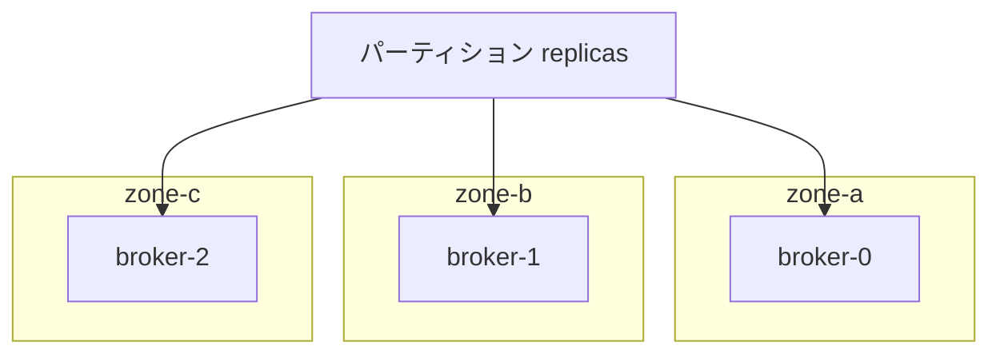

# 第8章 リソース、スケジューリング、Pod テンプレート

> 本章で参照する公式リソース
>
> - [install/cluster-operator/045-Crd-kafkanodepool.yaml L159-L220](https://github.com/strimzi/strimzi-kafka-operator/blob/1.1.0/install/cluster-operator/045-Crd-kafkanodepool.yaml#L159-L220)
> - [install/cluster-operator/045-Crd-kafkanodepool.yaml L337-L339](https://github.com/strimzi/strimzi-kafka-operator/blob/1.1.0/install/cluster-operator/045-Crd-kafkanodepool.yaml#L337-L339)
> - [install/cluster-operator/040-Crd-kafka.yaml L441-L456](https://github.com/strimzi/strimzi-kafka-operator/blob/1.1.0/install/cluster-operator/040-Crd-kafka.yaml#L441-L456)
> - [install/cluster-operator/040-Crd-kafka.yaml L514-L545](https://github.com/strimzi/strimzi-kafka-operator/blob/1.1.0/install/cluster-operator/040-Crd-kafka.yaml#L514-L545)
> - [documentation/modules/configuring/proc-dedicated-nodes.adoc L25-L40](https://github.com/strimzi/strimzi-kafka-operator/blob/1.1.0/documentation/modules/configuring/proc-dedicated-nodes.adoc#L25-L40)

## この章でできるようになること

- `resources` で CPU とメモリの requests/limits を設定できる。
- `jvmOptions` でヒープサイズや GC ログを調整できる。
- `template` で affinity、tolerations、ラベルを Pod に付与できる。
- `rack` 設定でラック認識レプリカ配置を有効にできる。

## 前提

[第4章 KafkaNodePool とノードロール](04-kafkanodepool.md)でノードプールの構造を理解していること。
本章は第3章のオープンクラスタ（`my-cluster`）を前提とする。
`resources`、affinity、toleration、rack の動作確認は [第4章](04-kafkanodepool.md)で追加した `broker` プールの Pod を対象とする。
`rack` 設定にはワーカーノードに `topology.kubernetes.io/zone` ラベルが付いていることが必要である。
ラベルが無いと Operator が付与する必須 node affinity を満たせず Pod が `Pending` になる。

## resources と jvmOptions

ノードプール単位でリソース要求を指定できる。
[install/cluster-operator/045-Crd-kafkanodepool.yaml L159-L220](https://github.com/strimzi/strimzi-kafka-operator/blob/1.1.0/install/cluster-operator/045-Crd-kafkanodepool.yaml#L159-L220)では `resources` と `jvmOptions` が `spec` 直下にある。

```yaml
              resources:
                type: object
                properties:
                  claims:
                    type: array
                    items:
                      type: object
                      properties:
                        name:
                          type: string
                        request:
                          type: string
                  limits:
                    additionalProperties:
                      anyOf:
                      - type: integer
                      - type: string
                      pattern: "^(\\+|-)?(([0-9]+(\\.[0-9]*)?)|(\\.[0-9]+))(([KMGTPE]i)|[numkMGTPE]|([eE](\\+|-)?(([0-9]+(\\.[0-9]*)?)|(\\.[0-9]+))))?$"
                      x-kubernetes-int-or-string: true
                    type: object
                  requests:
                    additionalProperties:
                      anyOf:
                      - type: integer
                      - type: string
                      pattern: "^(\\+|-)?(([0-9]+(\\.[0-9]*)?)|(\\.[0-9]+))(([KMGTPE]i)|[numkMGTPE]|([eE](\\+|-)?(([0-9]+(\\.[0-9]*)?)|(\\.[0-9]+))))?$"
                      x-kubernetes-int-or-string: true
                    type: object
                description: CPU and memory resources to reserve.
              jvmOptions:
                type: object
                properties:
                  "-XX":
                    additionalProperties:
                      type: string
                    type: object
                    description: A map of -XX options to the JVM.
                  "-Xmx":
                    type: string
                    pattern: "^[0-9]+[mMgG]?$"
                    description: -Xmx option to to the JVM.
                  "-Xms":
                    type: string
                    pattern: "^[0-9]+[mMgG]?$"
                    description: -Xms option to to the JVM.
                  gcLoggingEnabled:
                    type: boolean
                    description: Specifies whether the Garbage Collection logging is enabled. The default is false.
                  javaSystemProperties:
                    type: array
                    items:
                      type: object
                      properties:
                        name:
                          type: string
                          description: The system property name.
                        value:
                          type: string
                          description: The system property value.
                    description: A map of additional system properties which will be passed using the `-D` option to the JVM.
                description: JVM Options for pods.
              template:
```

`Kafka` の `spec.kafka` にも同様の `jvmOptions` がある。
`KafkaNodePool` と `Kafka` の両方に設定した場合、ノードプール側の値が優先される。
項目単位でのマージは行われない。

[install/cluster-operator/040-Crd-kafka.yaml L514-L545](https://github.com/strimzi/strimzi-kafka-operator/blob/1.1.0/install/cluster-operator/040-Crd-kafka.yaml#L514-L545)は次のとおりである。

```yaml
                  jvmOptions:
                    type: object
                    properties:
                      "-XX":
                        additionalProperties:
                          type: string
                        type: object
                        description: A map of -XX options to the JVM.
                      "-Xmx":
                        type: string
                        pattern: "^[0-9]+[mMgG]?$"
                        description: -Xmx option to to the JVM.
                      "-Xms":
                        type: string
                        pattern: "^[0-9]+[mMgG]?$"
                        description: -Xms option to to the JVM.
                      gcLoggingEnabled:
                        type: boolean
                        description: Specifies whether the Garbage Collection logging is enabled. The default is false.
                      javaSystemProperties:
                        type: array
                        # ... (中略) ...
                        description: A map of additional system properties which will be passed using the `-D` option to the JVM.
                    description: JVM Options for pods.
```

ヒープサイズ（`-Xms` / `-Xmx`）はコンテナのメモリ limit より小さく留める。
GC ログは障害調査時に有効にする。
`resources` と `jvmOptions` の具体例は次節の `KafkaNodePool` マニフェスト例を参照する。

## template による Pod カスタマイズ

`template` では Pod、コンテナ、StrimziPodSet などの Kubernetes リソースにメタデータやスケジューリング設定を注入できる。
[install/cluster-operator/045-Crd-kafkanodepool.yaml L337-L339](https://github.com/strimzi/strimzi-kafka-operator/blob/1.1.0/install/cluster-operator/045-Crd-kafkanodepool.yaml#L337-L339)は `template.pod` 配下にある。

```yaml
                      affinity:
                        type: object
                        properties:
```

以下はブローカープール向けの設定例である。
専用ノードへスケジュールする場合は、先に対象ノードへラベルと taint を付与する。

```bash
kubectl label node <node-name> dedicated=kafka
kubectl taint node <node-name> dedicated=kafka:NoSchedule
```

期待される出力の例は次のとおりである。

```text
node/<node-name> labeled
node/<node-name> tainted
```

[documentation/modules/configuring/proc-dedicated-nodes.adoc L25-L40](https://github.com/strimzi/strimzi-kafka-operator/blob/1.1.0/documentation/modules/configuring/proc-dedicated-nodes.adoc#L25-L40)は次のとおりである。

```asciidoc
.Prerequisites

* xref:deploying-cluster-operator-str[The Cluster Operator must be deployed.] 
* Dedicated worker nodes without scheduled workloads

.Procedure

. Taint and label the dedicated worker nodes to prevent other pods from being scheduled on them and to identify them when scheduling the Kafka pods:
+
[source,shell]
----
kubectl taint node <name_of_node> dedicated=kafka:NoSchedule
kubectl label node <name_of_node> dedicated=kafka
----

. Configure `tolerations` and `nodeAffinity` in either your `Kafka` or `KafkaNodePool` custom resource to match the taint and label.
```

`KafkaNodePool` リソースに反映して apply する。

```yaml
apiVersion: kafka.strimzi.io/v1
kind: KafkaNodePool
metadata:
  name: broker
  labels:
    strimzi.io/cluster: my-cluster
spec:
  replicas: 3
  roles:
    - broker
  storage:
    type: jbod
    volumes:
      - id: 0
        type: persistent-claim
        size: 100Gi
        kraftMetadata: shared
  resources:
    requests:
      memory: 4Gi
      cpu: "1"
    limits:
      memory: 4Gi
      cpu: "2"
  jvmOptions:
    "-Xms": 2048m
    "-Xmx": 2048m
    gcLoggingEnabled: true
  template:
    pod:
      tolerations:
        - key: dedicated
          operator: Equal
          value: kafka
          effect: NoSchedule
      affinity:
        nodeAffinity:
          requiredDuringSchedulingIgnoredDuringExecution:
            nodeSelectorTerms:
              - matchExpressions:
                  - key: dedicated
                    operator: In
                    values:
                      - kafka
      topologySpreadConstraints:
        - maxSkew: 1
          topologyKey: topology.kubernetes.io/zone
          whenUnsatisfiable: DoNotSchedule
          labelSelector:
            matchLabels:
              strimzi.io/cluster: my-cluster
              strimzi.io/broker-role: "true"
```

```bash
kubectl apply -f broker-pool-scheduling.yaml -n kafka
```

期待される出力の例は次のとおりである。

```text
kafkanodepool.kafka.strimzi.io/broker configured
```

nodeAffinity で Pod を配置するには、対象ノードに `dedicated=kafka` ラベルが必要である。
taint と toleration は、他の Pod が専用ノードへスケジュールされないようにするための別設定である。
ラベルが無いと nodeAffinity を満たせず Pod は `Pending` のままになる。
taint に対応する toleration が無い Pod も同様に `Pending` になる。

`topologySpreadConstraints` でゾーン間の偏りを抑えられる。
ブローカーだけを対象にする場合は `strimzi.io/broker-role: "true"` も selector に含める。

## rack によるラック認識配置

`Kafka` の `spec.kafka.rack` で `broker.rack` を設定し、レプリカをラックに分散させられる。

[install/cluster-operator/040-Crd-kafka.yaml L441-L457](https://github.com/strimzi/strimzi-kafka-operator/blob/1.1.0/install/cluster-operator/040-Crd-kafka.yaml#L441-L457)は次のとおりである。

```yaml
                  rack:
                    type: object
                    properties:
                      envVarName:
                        type: string
                        description: The name of the environment variable that defines the rack ID. Its value sets the `broker.rack` configuration for Kafka brokers and the `client.rack` configuration for Kafka Connect or MirrorMaker 2.
                      topologyKey:
                        type: string
                        example: topology.kubernetes.io/zone
                        description: "A key that matches labels assigned to the Kubernetes cluster nodes. The value of the label is used to set a broker's `broker.rack` config, and the `client.rack` config for Kafka Connect or MirrorMaker 2."
                      type:
                        type: string
                        enum:
                        - topology-label
                        - environment-variable
                        description: "Specifies the rack awareness type. Supported types are `topology-label` and `environment-variable`. `topology-label` uses a Kubernetes worker node label to set the `broker.rack` configuration for Kafka brokers and the `client.rack` configuration for Kafka Connect and MirrorMaker 2. `environment-variable` uses an environment variable to set the `broker.rack` configuration for Kafka brokers and the `client.rack` configuration for Kafka Connect and MirrorMaker 2. When not specified, `topology-label` type is used by default."
                    description: Configuration of the `broker.rack` broker config.
```

`type` を省略すると `topology-label` が使われる。
`topology-label` では `topologyKey` が必須である。

`rack` を有効化する前に、ワーカーノードにゾーンラベルが付いていることを確認する。

```bash
kubectl get nodes -L topology.kubernetes.io/zone
```

期待される出力の例は次のとおりである。

```text
NAME       STATUS   ROLES    AGE   VERSION   ZONE
node-1     Ready    worker   10d   v1.30.0   zone-a
node-2     Ready    worker   10d   v1.30.0   zone-b
```

以下は `rack` 設定の最小例である。
`Kafka` リソースへ patch して反映する。

```bash
kubectl patch kafka my-cluster -n kafka --type=merge -p '
{"spec":{"kafka":{"rack":{"topologyKey":"topology.kubernetes.io/zone"}}}}'
```

期待される出力の例は次のとおりである。

```text
kafka.kafka.strimzi.io/my-cluster patched
```

patch 後は `observedGeneration` が `generation` に追いつくのを待ってから Ready を確認する。

```bash
GEN=$(kubectl get kafka my-cluster -n kafka -o jsonpath='{.metadata.generation}')
kubectl wait kafka/my-cluster -n kafka \
  --for=jsonpath="{.status.observedGeneration}=${GEN}" --timeout=600s
kubectl wait kafka/my-cluster -n kafka --for=condition=Ready --timeout=600s
```

期待される出力の例は次のとおりである。

```text
kafka.kafka.strimzi.io/my-cluster condition met
kafka.kafka.strimzi.io/my-cluster condition met
```

Kafka は同じラックにレプリカを集中させないようパーティションを配置する。

`broker.rack` は静的 `server.config` に `${strimzidir:...}` プレースホルダとして書き込まれ、init コンテナがノードのゾーンラベルから実値を解決する。
ブローカーの dynamic config の `kafka-configs.sh --describe` では確認できない。

```bash
BROKER_POD=$(kubectl get pod -n kafka -l strimzi.io/cluster=my-cluster,strimzi.io/pool-name=broker \
  -o jsonpath='{.items[0].metadata.name}')
kubectl exec "${BROKER_POD}" -n kafka -- \
  grep '^broker\.rack=' /opt/kafka/custom-config/server.config
kubectl exec "${BROKER_POD}" -n kafka -- cat /opt/kafka/init/rack.id
```

期待される出力の例は次のとおりである。

```text
broker.rack=${strimzidir:/opt/kafka/init:rack.id}
zone-a
```

`rack.id` の値は Pod がスケジュールされたノードの `topology.kubernetes.io/zone` ラベルに対応する。



## 動作確認

ブローカープールの Pod のリソースと affinity を確認する。

```bash
BROKER_POD=$(kubectl get pod -n kafka -l strimzi.io/cluster=my-cluster,strimzi.io/pool-name=broker \
  -o jsonpath='{.items[0].metadata.name}')
kubectl describe pod "${BROKER_POD}" -n kafka
```

期待される出力の `Limits` と `Requests` 節に、設定した CPU とメモリが表示される。

```text
    Limits:
      cpu:     2
      memory:  4Gi
    Requests:
      cpu:     1
      memory:  4Gi
```

`Node-Selectors` 節には nodeAffinity は表示されない。
次のコマンドで Pod spec を確認する。

```bash
kubectl get pod "${BROKER_POD}" -n kafka \
  -o jsonpath='{.spec.affinity.nodeAffinity}{"\n"}{.spec.tolerations}{"\n"}'
```

期待される出力には、`dedicated=kafka` の toleration と nodeAffinity の matchExpressions が含まれる。
`rack` 有効化後は Operator が `topology.kubernetes.io/zone` の `Exists` 条件を同じ `matchExpressions` に追加する。
admission の `DefaultTolerationSeconds` により `node.kubernetes.io/not-ready` と `node.kubernetes.io/unreachable` の toleration も付与される。

```text
{"requiredDuringSchedulingIgnoredDuringExecution":{"nodeSelectorTerms":[{"matchExpressions":[{"key":"dedicated","operator":"In","values":["kafka"]},{"key":"topology.kubernetes.io/zone","operator":"Exists"}]}]}}
[{"effect":"NoSchedule","key":"dedicated","operator":"Equal","value":"kafka"},{"effect":"NoExecute","key":"node.kubernetes.io/not-ready","operator":"Exists","tolerationSeconds":300},{"effect":"NoExecute","key":"node.kubernetes.io/unreachable","operator":"Exists","tolerationSeconds":300}]
```

## まとめ

`resources` と `jvmOptions` でブローカーの計算資源と JVM を制御する。
`template` でスケジューリングやメタデータを細かく調整できる。
`rack` で可用性ゾーンを意識したレプリカ配置を実現する。

## 関連する章

- [第4章 KafkaNodePool とノードロール](04-kafkanodepool.md)
- [第6章 ストレージ設定](06-storage.md)
