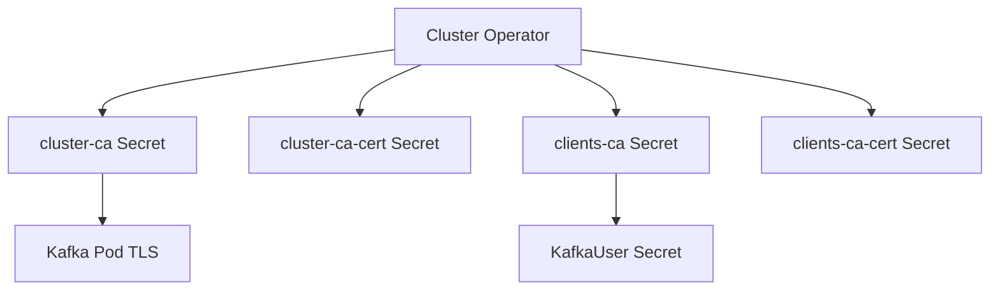

# 第9章 TLS と認証局

> 本章で参照する公式リソース
>
> - [install/cluster-operator/040-Crd-kafka.yaml L3338-L3385](https://github.com/strimzi/strimzi-kafka-operator/blob/1.1.0/install/cluster-operator/040-Crd-kafka.yaml#L3338-L3385)
> - [examples/security/tls-auth/kafka.yaml L47-L55](https://github.com/strimzi/strimzi-kafka-operator/blob/1.1.0/examples/security/tls-auth/kafka.yaml#L47-L55)

## この章でできるようになること

- Strimzi が自動生成する cluster CA と clients CA の役割を説明できる。
- 生成される Secret の名前規則を把握できる。
- 証明書の更新ポリシー（`renewalDays`、`certificateExpirationPolicy`）を設定できる。
- クラスタ作成後の CA 関連 Secret を確認できる。

## 前提

[第7章 リスナーと外部アクセス](../part01-kafka-cluster/07-listeners.md)で `tls: true` のリスナーを理解していること。
本章は第3章のオープンクラスタを前提とする。
デフォルト StorageClass が利用でき、動的プロビジョニングで PVC が Bound になるクラスタを前提とする。
独自 CA の手順は未デプロイの新規クラスタ向けであり、第3章の `my-cluster` とは別名で構築する。
独自 CA 手順では、cluster CA と clients CA それぞれの PEM 形式証明書と秘密鍵（`cluster-ca.crt`、`cluster-ca.key`、`clients-ca.crt`、`clients-ca.key`）を作業端末に用意していること。
証明書の有効期限確認には `openssl` コマンドが利用できること。

## 2 種類の CA

Strimzi は TLS 通信のために 2 つの認証局（CA）を管理する。

- **cluster CA**（`spec.clusterCa`）：ブローカー間通信とブローカーサーバー証明書に使用
- **clients CA**（`spec.clientsCa`）：クライアント証明書（mTLS）の署名に使用

[install/cluster-operator/040-Crd-kafka.yaml L3338-L3385](https://github.com/strimzi/strimzi-kafka-operator/blob/1.1.0/install/cluster-operator/040-Crd-kafka.yaml#L3338-L3385)は次のとおりである。

```yaml
              clusterCa:
                type: object
                properties:
                  generateCertificateAuthority:
                    type: boolean
                    description: If true then Certificate Authority certificates will be generated automatically. Otherwise the user will need to provide a Secret with the CA certificate. Default is true.
                  generateSecretOwnerReference:
                    type: boolean
                    description: "If `true`, the Cluster and Client CA Secrets are configured with the `ownerReference` set to the `Kafka` resource. If the `Kafka` resource is deleted when `true`, the CA Secrets are also deleted. If `false`, the `ownerReference` is disabled. If the `Kafka` resource is deleted when `false`, the CA Secrets are retained and available for reuse. Default is `true`."
                  validityDays:
                    type: integer
                    minimum: 1
                    description: The number of days generated certificates should be valid for. The default is 365.
                  renewalDays:
                    type: integer
                    minimum: 1
                    description: "The number of days in the certificate renewal period. This is the number of days before the a certificate expires during which renewal actions may be performed. When `generateCertificateAuthority` is true, this will cause the generation of a new certificate. When `generateCertificateAuthority` is true, this will cause extra logging at WARN level about the pending certificate expiry. Default is 30."
                  certificateExpirationPolicy:
                    type: string
                    enum:
                    - renew-certificate
                    - replace-key
                    description: How should CA certificate expiration be handled when `generateCertificateAuthority=true`. The default is for a new CA certificate to be generated reusing the existing private key.
                description: Configuration of the cluster certificate authority.
              clientsCa:
                type: object
                properties:
                  generateCertificateAuthority:
                    type: boolean
                    description: If true then Certificate Authority certificates will be generated automatically. Otherwise the user will need to provide a Secret with the CA certificate. Default is true.
                  generateSecretOwnerReference:
                    type: boolean
                    description: "If `true`, the Cluster and Client CA Secrets are configured with the `ownerReference` set to the `Kafka` resource. If the `Kafka` resource is deleted when `true`, the CA Secrets are also deleted. If `false`, the `ownerReference` is disabled. If the `Kafka` resource is deleted when `false`, the CA Secrets are retained and available for reuse. Default is `true`."
                  validityDays:
                    type: integer
                    minimum: 1
                    description: The number of days generated certificates should be valid for. The default is 365.
                  renewalDays:
                    type: integer
                    minimum: 1
                    description: "The number of days in the certificate renewal period. This is the number of days before the a certificate expires during which renewal actions may be performed. When `generateCertificateAuthority` is true, this will cause the generation of a new certificate. When `generateCertificateAuthority` is true, this will cause extra logging at WARN level about the pending certificate expiry. Default is 30."
                  certificateExpirationPolicy:
                    type: string
                    enum:
                    - renew-certificate
                    - replace-key
                    description: How should CA certificate expiration be handled when `generateCertificateAuthority=true`. The default is for a new CA certificate to be generated reusing the existing private key.
                description: Configuration of the clients certificate authority.
```

`generateCertificateAuthority: true`（デフォルト）では Operator が CA を自動生成する。
`false` にすると、利用者が用意した CA 証明書を Secret で渡す。

## 生成される Secret

クラスタ名を `my-cluster` とすると、代表的な Secret は次のとおりである。

| Secret 名 | 内容 |
|---|---|
| `my-cluster-cluster-ca` | cluster CA の鍵 |
| `my-cluster-cluster-ca-cert` | cluster CA 証明書 |
| `my-cluster-clients-ca` | clients CA の鍵 |
| `my-cluster-clients-ca-cert` | clients CA 証明書 |

ブローカー Pod は cluster CA で署名されたサーバー証明書をマウントする。
`KafkaUser`（`authentication.type: tls`）は clients CA で署名されたユーザー証明書を Secret に受け取る。



## 証明書の更新

`renewalDays`（デフォルト 30）は、有効期限の何日前から更新処理を始めるかを示す。
`certificateExpirationPolicy` は更新時の鍵の扱いを決める。
Operator が生成するサーバー証明書（ブローカー証明書など）には、独自 CA 利用時も `renewalDays` が適用される。
`generateCertificateAuthority: false` のとき、Operator は CA 証明書自体は自動更新しない。

- `renew-certificate`：既存の秘密鍵を再利用して新しい証明書を発行（デフォルト）
- `replace-key`：新しい鍵ペアを生成

ローリング更新により、ブローカーは新しい証明書へ順次切り替わる。

## 独自 CA の持ち込み

`generateCertificateAuthority: false` にすると、利用者が管理する CA を Secret で指定する。
新規クラスタのデプロイ前に Secret を作成する（既存クラスタへの置換は別手順）。
以下はクラスタ名 `my-secure-cluster`、Namespace `kafka` の新規クラスタ例である。
Cluster Operator が監視する Namespace 内でデプロイする（第3章の `my-cluster` とは別クラスタ）。
cluster CA と clients CA それぞれについて、次の 4 つの Secret を所定名で作成する。

- `my-secure-cluster-cluster-ca-cert`（証明書）
- `my-secure-cluster-cluster-ca`（秘密鍵）
- `my-secure-cluster-clients-ca-cert`（証明書）
- `my-secure-cluster-clients-ca`（秘密鍵）

cluster CA 証明書 Secret の作成例は次のとおりである。

```bash
kubectl create secret generic my-secure-cluster-cluster-ca-cert \
  --from-file=ca.crt=cluster-ca.crt -n kafka
kubectl create secret generic my-secure-cluster-cluster-ca \
  --from-file=ca.key=cluster-ca.key -n kafka
```

期待される出力の例は次のとおりである。

```text
secret/my-secure-cluster-cluster-ca-cert created
secret/my-secure-cluster-cluster-ca created
```

clients CA 証明書 Secret の作成例は次のとおりである。

```bash
kubectl create secret generic my-secure-cluster-clients-ca-cert \
  --from-file=ca.crt=clients-ca.crt -n kafka
kubectl create secret generic my-secure-cluster-clients-ca \
  --from-file=ca.key=clients-ca.key -n kafka
```

期待される出力の例は次のとおりである。

```text
secret/my-secure-cluster-clients-ca-cert created
secret/my-secure-cluster-clients-ca created
```

各 Secret にラベルと世代アノテーションを付与する。

```bash
for s in my-secure-cluster-cluster-ca-cert my-secure-cluster-cluster-ca \
         my-secure-cluster-clients-ca-cert my-secure-cluster-clients-ca; do
  kubectl label secret "$s" strimzi.io/kind=Kafka strimzi.io/cluster=my-secure-cluster -n kafka
done
kubectl annotate secret my-secure-cluster-cluster-ca-cert strimzi.io/ca-cert-generation=0 -n kafka
kubectl annotate secret my-secure-cluster-cluster-ca strimzi.io/ca-key-generation=0 -n kafka
kubectl annotate secret my-secure-cluster-clients-ca-cert strimzi.io/ca-cert-generation=0 -n kafka
kubectl annotate secret my-secure-cluster-clients-ca strimzi.io/ca-key-generation=0 -n kafka
```

期待される出力の例は次のとおりである。

```text
secret/my-secure-cluster-cluster-ca-cert labeled
secret/my-secure-cluster-cluster-ca labeled
secret/my-secure-cluster-clients-ca-cert labeled
secret/my-secure-cluster-clients-ca labeled
secret/my-secure-cluster-cluster-ca-cert annotated
secret/my-secure-cluster-cluster-ca annotated
secret/my-secure-cluster-clients-ca-cert annotated
secret/my-secure-cluster-clients-ca annotated
```

`Kafka` リソースでは両方の CA で `generateCertificateAuthority: false` を設定する。
KRaft モードでは `KafkaNodePool` も同時に apply する（以下は例である）。

```yaml
apiVersion: kafka.strimzi.io/v1
kind: KafkaNodePool
metadata:
  name: secure-nodes
  labels:
    strimzi.io/cluster: my-secure-cluster
spec:
  replicas: 1
  roles:
    - controller
    - broker
  storage:
    type: jbod
    volumes:
      - id: 0
        type: persistent-claim
        size: 100Gi
        kraftMetadata: shared
---
apiVersion: kafka.strimzi.io/v1
kind: Kafka
metadata:
  name: my-secure-cluster
spec:
  clusterCa:
    generateCertificateAuthority: false
  clientsCa:
    generateCertificateAuthority: false
  kafka:
    version: 4.3.0
    metadataVersion: 4.3-IV0
    listeners:
      - name: tls
        port: 9093
        type: internal
        tls: true
  entityOperator:
    topicOperator: {}
    userOperator: {}
```

```bash
kubectl apply -f kafka-custom-ca.yaml -n kafka
```

期待される出力の例は次のとおりである。

```text
kafkanodepool.kafka.strimzi.io/secure-nodes created
kafka.kafka.strimzi.io/my-secure-cluster created
```

```bash
kubectl wait kafka/my-secure-cluster -n kafka --for=condition=Ready --timeout=600s
```

期待される出力の例は次のとおりである。

```text
kafka.kafka.strimzi.io/my-secure-cluster condition met
```

PKCS #12 形式（`ca.p12` と `ca.password`）は独自 CA では任意である。
Strimzi 1.1.0 では Operator 管理 CA の PKCS #12 生成も `STRIMZI_PKCS12_KEYSTORE_GENERATION` で無効化できる。

## 動作確認

CA 関連 Secret を確認する。

```bash
kubectl get secret -n kafka | grep my-secure-cluster
```

期待される出力の例（独自 CA を手動作成した場合）は次のとおりである。
Operator が生成するノード証明書、Cluster Operator 証明書、Entity Operator 証明書の Secret も含まれる。

```text
my-secure-cluster-cluster-ca              Opaque   1      20m
my-secure-cluster-cluster-ca-cert         Opaque   1      20m
my-secure-cluster-clients-ca            Opaque   1      20m
my-secure-cluster-clients-ca-cert       Opaque   1      20m
my-secure-cluster-cluster-operator-certs Opaque   2      20m
my-secure-cluster-secure-nodes-0          Opaque   2      20m
# ... (中略) ...
my-secure-cluster-entity-topic-operator-certs Opaque   2      20m
my-secure-cluster-entity-user-operator-certs  Opaque   2      20m
```

秘密鍵用 Secret（`*-cluster-ca`、`*-clients-ca`）の DATA 件数は通常 1 件である。
独自 CA の証明書用 Secret も `ca.crt` のみ格納する（`kubectl create secret --from-file=ca.crt=...` の場合）。
Operator 管理 CA の証明書用 Secret には `ca.crt` に加え PKCS #12 用の `ca.p12` と `ca.password` が含まれることがある。

cluster CA 証明書の有効期限を確認する。

```bash
kubectl get secret my-secure-cluster-cluster-ca-cert -n kafka \
  -o jsonpath='{.data.ca\.crt}' | base64 -d | openssl x509 -noout -dates
```

期待される出力の例は次のとおりである。

```text
notBefore=Jul 12 10:00:00 2026 GMT
notAfter=Jul 12 10:00:00 2027 GMT
```

## まとめ

Strimzi は cluster CA と clients CA を自動生成し、ブローカーとクライアントの TLS を支える。
`validityDays` と `renewalDays` で証明書の寿命と更新タイミングを制御する。
Secret 名は `<cluster>-cluster-ca-cert` などの規則に従う。
独自 CA の手順は第3章の `my-cluster` とは別クラスタ（`my-secure-cluster`）向けの例示である。
以降の章は第3章のオープンクラスタを前提に読む。

## 関連する章

- [第7章 リスナーと外部アクセス](../part01-kafka-cluster/07-listeners.md)
- [第10章 リスナー認証](10-authentication.md)
