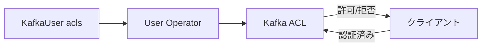

# 第11章 認可と ACL

> 本章で参照する公式リソース
>
> - [install/cluster-operator/040-Crd-kafka.yaml L418-L440](https://github.com/strimzi/strimzi-kafka-operator/blob/1.1.0/install/cluster-operator/040-Crd-kafka.yaml#L418-L440)
> - [install/cluster-operator/044-Crd-kafkauser.yaml L108-L177](https://github.com/strimzi/strimzi-kafka-operator/blob/1.1.0/install/cluster-operator/044-Crd-kafkauser.yaml#L108-L177)
> - [examples/user/kafka-user.yaml L1-L38](https://github.com/strimzi/strimzi-kafka-operator/blob/1.1.0/examples/user/kafka-user.yaml#L1-L38)
> - [examples/security/keycloak-authorization/kafka-ephemeral-oauth-single-keycloak-authz.yaml L29-L73](https://github.com/strimzi/strimzi-kafka-operator/blob/1.1.0/examples/security/keycloak-authorization/kafka-ephemeral-oauth-single-keycloak-authz.yaml#L29-L73)

## この章でできるようになること

- `Kafka` の `authorization.type`（`simple`、`custom`）を設定できる。
- `superUsers` の役割を説明できる。
- `KafkaUser` の ACL（resource、operations、host、patternType）を定義できる。
- Keycloak 認可の概要を把握できる。

## 前提

[第5章 Kafka Custom Resource の基本構造](../part01-kafka-cluster/05-kafka-resource.md)で `Kafka` と `KafkaUser` の構造を理解していること。
本章は第3章のオープンクラスタ（`my-cluster`、認証なし、認可なし）を前提とする。
動作確認節では本章内で認証付きリスナー、simple 認可、`KafkaUser` を適用してから ACL テストを行う。

## Kafka 側の認可設定

ブローカーで認可を有効にするには `spec.kafka.authorization` を設定する。

[install/cluster-operator/040-Crd-kafka.yaml L418-L440](https://github.com/strimzi/strimzi-kafka-operator/blob/1.1.0/install/cluster-operator/040-Crd-kafka.yaml#L418-L440)は次のとおりである。

```yaml
                  authorization:
                    type: object
                    properties:
                      authorizerClass:
                        type: string
                        description: "Authorization implementation class, which must be available in classpath."
                      superUsers:
                        type: array
                        items:
                          type: string
                        description: "List of super users, which are user principals with unlimited access rights."
                      supportsAdminApi:
                        type: boolean
                        description: Indicates whether the custom authorizer supports the APIs for managing ACLs using the Kafka Admin API. Defaults to `false`.
                      type:
                        type: string
                        enum:
                        - simple
                        - custom
                        description: "Authorization type. Currently, the supported types are `simple` and `custom`. `simple` authorization type uses Kafka's built-in authorizer for authorization. `custom` authorization type uses user-provided implementation for authorization."
                    required:
                    - type
                    description: Authorization configuration for Kafka brokers.
```

| type | 説明 |
|---|---|
| `simple` | Kafka 標準の ACL ベース認可 |
| `custom` | カスタム authorizer クラス（Keycloak Authorization Services 連携など） |

`superUsers` に列挙したプリンシパルは ACL の制限を受けない。
管理用サービスアカウントをここに登録する。

## KafkaUser の ACL

`KafkaUser` の `spec.authorization` でユーザーごとの ACL を宣言する。

[install/cluster-operator/044-Crd-kafkauser.yaml L108-L177](https://github.com/strimzi/strimzi-kafka-operator/blob/1.1.0/install/cluster-operator/044-Crd-kafkauser.yaml#L108-L177)は次のとおりである。

```yaml
              authorization:
                type: object
                properties:
                  acls:
                    type: array
                    items:
                      type: object
                      properties:
                        type:
                          type: string
                          enum:
                          - allow
                          - deny
                          description: The type of the rule. ACL rules with type `allow` are used to allow user to execute the specified operations. ACL rules with type `deny` are used to deny user to execute the specified operations. Default value is `allow`.
                        resource:
                          type: object
                          properties:
                            name:
                              type: string
                              description: Name of resource for which given ACL rule applies. Can be combined with `patternType` field to use prefix pattern.
                            patternType:
                              type: string
                              enum:
                              - literal
                              - prefix
                              description: "Describes the pattern used in the resource field. The supported types are `literal` and `prefix`. With `literal` pattern type, the resource field will be used as a definition of a full name. With `prefix` pattern type, the resource name will be used only as a prefix. Default value is `literal`."
                            type:
                              type: string
                              enum:
                              - topic
                              - group
                              - cluster
                              - transactionalId
                              description: "Resource type. The available resource types are `topic`, `group`, `cluster`, and `transactionalId`."
                          required:
                          - type
                          description: Indicates the resource for which given ACL rule applies.
                        host:
                          type: string
                          description: "The host from which the action described in the ACL rule is allowed or denied. If not set, it defaults to `*`, allowing or denying the action from any host."
                        operations:
                          type: array
                          items:
                            type: string
                            enum:
                            - Read
                            - Write
                            - Create
                            - Delete
                            - Alter
                            - Describe
                            - ClusterAction
                            - AlterConfigs
                            - DescribeConfigs
                            - IdempotentWrite
                            - All
                          description: "List of operations to allow or deny. Supported operations are: Read, Write, Create, Delete, Alter, Describe, ClusterAction, AlterConfigs, DescribeConfigs, IdempotentWrite and All. Only certain operations work with the specified resource."
                      required:
                      - resource
                      - operations
                    description: List of ACL rules which should be applied to this user.
                  type:
                    type: string
                    enum:
                    - simple
                    description: Authorization type. Currently the only supported type is `simple`. `simple` authorization type uses the Kafka Admin API for managing the ACL rules.
                required:
                - acls
                - type
                description: Authorization rules for this Kafka user.
```

[examples/user/kafka-user.yaml L1-L38](https://github.com/strimzi/strimzi-kafka-operator/blob/1.1.0/examples/user/kafka-user.yaml#L1-L38)は、トピック `my-topic` の読み書きと consumer group の Read を許可する。

```yaml
apiVersion: kafka.strimzi.io/v1
kind: KafkaUser
metadata:
  name: my-user
  labels:
    strimzi.io/cluster: my-cluster
spec:
  authentication:
    type: tls
  authorization:
    type: simple
    acls:
      # Example consumer Acls for topic my-topic using consumer group my-group
      - resource:
          type: topic
          name: my-topic
          patternType: literal
        operations:
          - Describe
          - Read
        host: "*"
      - resource:
          type: group
          name: my-group
          patternType: literal
        operations:
          - Read
        host: "*"
      # Example Producer Acls for topic my-topic
      - resource:
          type: topic
          name: my-topic
          patternType: literal
        operations:
          - Create
          - Describe
          - Write
        host: "*"
```

User Operator が ACL を Kafka に同期する。
mTLS ユーザーのプリンシパル名は証明書の CN に基づく。



## Keycloak 認可の概要

OAuth 2.0 認証は、リスナーの `authentication.type: custom`、`sasl: true`、`listenerConfig` で構成する。
Keycloak Authorization Services を使う場合に `authorization.type: custom` と `KeycloakAuthorizer` を設定する。

[examples/security/keycloak-authorization/kafka-ephemeral-oauth-single-keycloak-authz.yaml L29-L73](https://github.com/strimzi/strimzi-kafka-operator/blob/1.1.0/examples/security/keycloak-authorization/kafka-ephemeral-oauth-single-keycloak-authz.yaml#L29-L73)は Keycloak authorizer の例である。

```yaml
    listeners:
      - name: tls
        port: 9093
        type: internal
        tls: true
        authentication:
          type: custom
          sasl: true
          listenerConfig:
            sasl.enabled.mechanisms: OAUTHBEARER
            oauthbearer.sasl.server.callback.handler.class: io.strimzi.kafka.oauth.server.JaasServerOauthValidatorCallbackHandler
            oauthbearer.sasl.jaas.config: |
              org.apache.kafka.common.security.oauthbearer.OAuthBearerLoginModule required unsecuredLoginStringClaim_sub="thePrincipalName" oauth.valid.issuer.uri="https://${SSO_HOST}/realms/kafka-authz" oauth.jwks.endpoint.uri="https://${SSO_HOST}/realms/kafka-authz/protocol/openid-connect/certs" oauth.username.claim="preferred_username" oauth.ssl.truststore.location="/mnt/oauth-certs/tls.crt" oauth.ssl.truststore.type="PEM";
            connections.max.reauth.ms: 3600
    authorization:
      type: custom
      authorizerClass: io.strimzi.kafka.oauth.server.authorizer.KeycloakAuthorizer
      superUsers:
        - service-account-kafka
    config:
      # Needed for Oauth authentication and Keycloak authroization
      principal.builder.class: io.strimzi.kafka.oauth.server.OAuthKafkaPrincipalBuilder
      # Needed for Keycloak authorization
      strimzi.authorization.client.id: kafka
      strimzi.authorization.token.endpoint.uri: https://${SSO_HOST}/realms/kafka-authz/protocol/openid-connect/token
      strimzi.authorization.ssl.endpoint.identification.algorithm: ""
      strimzi.authorization.delegate.to.kafka.acl: "false"
      strimzi.authorization.ssl.truststore.location: /mnt/oauth-certs/tls.crt
      strimzi.authorization.ssl.truststore.type: PEM
      # Other Kafka configuration options
      offsets.topic.replication.factor: 1
      transaction.state.log.replication.factor: 1
      transaction.state.log.min.isr: 1
      default.replication.factor: 1
      min.insync.replicas: 1
    template:
      pod:
        volumes:
          - name: oauth-certs
            secret:
              secretName: oauth-server-cert
      kafkaContainer:
        volumeMounts:
          - name: oauth-certs
            mountPath: /mnt/oauth-certs
```

認証は OAuth Bearer 設定で行う。
認可は Keycloak のロールとポリシーで制御する。
`strimzi.authorization.delegate.to.kafka.acl` を `true` にすると、Keycloak 認可で拒否された操作を Kafka 標準 ACL に委譲できる。
本番導入時は Keycloak レルム設定とネットワーク経路を別途整備する。

## 動作確認

第3章のオープンクラスタから、本章の手順だけで ACL テストを再現する。
以下は動作確認用の手順例である。

認証付きリスナーと simple 認可を有効化する。

```bash
kubectl patch kafka my-cluster -n kafka --type=merge -p '
{
  "spec": {
    "kafka": {
      "authorization": {"type": "simple"},
      "listeners": [
        {"name": "plain", "port": 9092, "type": "internal", "tls": false},
        {"name": "tls", "port": 9093, "type": "internal", "tls": true, "authentication": {"type": "tls"}}
      ]
    }
  }
}'
```

期待される出力の例は次のとおりである。

```text
kafka.kafka.strimzi.io/my-cluster patched
```

patch 後はブローカーのローリング更新が走る。
`observedGeneration` が `generation` に追いつくのを待ってから次へ進む。

```bash
GEN=$(kubectl get kafka my-cluster -n kafka -o jsonpath='{.metadata.generation}')
kubectl wait kafka/my-cluster -n kafka \
  --for=jsonpath="{.status.observedGeneration}=${GEN}" --timeout=600s
kubectl wait kafka/my-cluster -n kafka --for=condition=Ready --timeout=600s
```

期待される出力の例は次のとおりである。

```text
kafka.kafka.strimzi.io/my-cluster condition met
kafka.kafka.strimzi.io/my-cluster condition met
```

[examples/user/kafka-user.yaml L1-L38](https://github.com/strimzi/strimzi-kafka-operator/blob/1.1.0/examples/user/kafka-user.yaml#L1-L38)は次のとおりである。

```yaml
apiVersion: kafka.strimzi.io/v1
kind: KafkaUser
metadata:
  name: my-user
  labels:
    strimzi.io/cluster: my-cluster
spec:
  authentication:
    type: tls
  authorization:
    type: simple
    acls:
      # Example consumer Acls for topic my-topic using consumer group my-group
      - resource:
          type: topic
          name: my-topic
          patternType: literal
        operations:
          - Describe
          - Read
        host: "*"
      - resource:
          type: group
          name: my-group
          patternType: literal
        operations:
          - Read
        host: "*"
      # Example Producer Acls for topic my-topic
      - resource:
          type: topic
          name: my-topic
          patternType: literal
        operations:
          - Create
          - Describe
          - Write
        host: "*"
```

```bash
kubectl apply -f kafka-user.yaml -n kafka
kubectl wait kafkauser/my-user -n kafka --for=condition=Ready --timeout=120s
```

期待される出力の例は次のとおりである。

```text
kafkauser.kafka.strimzi.io/my-user created
kafkauser.kafka.strimzi.io/my-user condition met
```

ACL が不足しているユーザーでトピックに書き込むと、クライアントに `TopicAuthorizationException` や `Not authorized` が返る。

読み取り専用 ACL の `KafkaUser` を作成したうえで、producer を実行する（失敗を期待する）。

```yaml
apiVersion: kafka.strimzi.io/v1
kind: KafkaUser
metadata:
  name: read-only-user
  labels:
    strimzi.io/cluster: my-cluster
spec:
  authentication:
    type: tls
  authorization:
    type: simple
    acls:
      - resource:
          type: topic
          name: my-topic
          patternType: literal
        operations:
          - Read
          - Describe
        host: "*"
```

```bash
kubectl apply -f read-only-user.yaml -n kafka
kubectl wait kafkauser/read-only-user -n kafka --for=condition=Ready --timeout=120s
```

期待される出力の例は次のとおりである。

```text
kafkauser.kafka.strimzi.io/read-only-user created
kafkauser.kafka.strimzi.io/read-only-user condition met
```

```bash
kubectl run kafka-producer-deny -ti --restart=Never -n kafka \
  --image=quay.io/strimzi/kafka:1.1.0-kafka-4.3.0 \
  --overrides='{"spec":{"volumes":[{"name":"user","secret":{"secretName":"read-only-user"}},{"name":"cluster-ca","secret":{"secretName":"my-cluster-cluster-ca-cert"}}],"containers":[{"name":"kafka","image":"quay.io/strimzi/kafka:1.1.0-kafka-4.3.0","command":["/bin/bash","-c"],"args":["format_pem() { awk \"NF {sub(/\\\\r/, \\\"\\\"); printf \\\"%s\\\\\\\\n\\\",\\$0;}\" \"$1\" | sed \"s/\\\\\\\\n$//\"; }; TRUST=$(format_pem /mnt/cluster-ca/ca.crt); CERT=$(format_pem /mnt/user/user.crt); KEY=$(format_pem /mnt/user/user.key); cat > /tmp/client.properties <<EOF\nsecurity.protocol=SSL\nssl.truststore.type=PEM\nssl.truststore.certificates=${TRUST}\nssl.keystore.type=PEM\nssl.keystore.certificate.chain=${CERT}\nssl.keystore.key=${KEY}\nEOF\necho test-deny | bin/kafka-console-producer.sh --bootstrap-server my-cluster-kafka-bootstrap:9093 --topic my-topic --producer.config /tmp/client.properties"],"volumeMounts":[{"name":"user","mountPath":"/mnt/user"},{"name":"cluster-ca","mountPath":"/mnt/cluster-ca"}]}]}}'
```

期待されるエラーの例は次のとおりである。

```text
org.apache.kafka.common.errors.TopicAuthorizationException: Not authorized to access topics: [my-topic]
```

`superUsers` に登録したプリンシパルは同じ操作が成功する。
登録後はブローカーのローリング更新が走る場合がある。

`my-user` に設定した ACL を Custom Resource から確認する。
`kafka-acls.sh --list` はクラスタ管理権限が必要なため、本章では `KafkaUser` の spec を参照する。

```bash
kubectl get kafkauser my-user -n kafka \
  -o jsonpath='{range .spec.authorization.acls[*]}{.resource.type}{"/"}{.resource.name}{" "}{.operations}{"\n"}{end}'
```

期待される出力の例は次のとおりである。

```text
topic/my-topic [Describe Read]
group/my-group [Read]
topic/my-topic [Create Describe Write]
```

mTLS ユーザーのプリンシパル名は `CN=my-user` である。
ブローカー側の ACL エントリもこの形式で評価される。

## まとめ

`authorization.type: simple` で Kafka 標準 ACL を使う。
`KafkaUser` の `acls` でユーザー単位の権限を宣言し、User Operator が同期する。
Keycloak Authorization Services 連携は `custom` authorizer で実現する。
本章で Kafka に加えた認証と認可の変更は例示であり、以降の章は第3章のオープンクラスタを前提に読む。

## 関連する章

- [第10章 リスナー認証](10-authentication.md)
