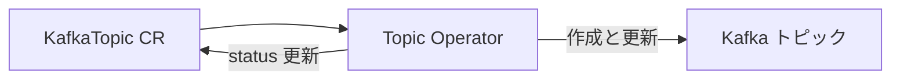

# 第12章 KafkaTopic の管理

> 本章で参照する公式リソース
>
> - [install/cluster-operator/043-Crd-kafkatopic.yaml L63-L76](https://github.com/strimzi/strimzi-kafka-operator/blob/1.1.0/install/cluster-operator/043-Crd-kafkatopic.yaml#L63-L76)
> - [install/cluster-operator/043-Crd-kafkatopic.yaml L110-L128](https://github.com/strimzi/strimzi-kafka-operator/blob/1.1.0/install/cluster-operator/043-Crd-kafkatopic.yaml#L110-L128)
> - [examples/topic/kafka-topic.yaml L1-L12](https://github.com/strimzi/strimzi-kafka-operator/blob/1.1.0/examples/topic/kafka-topic.yaml#L1-L12)
> - [CHANGELOG.md L607-L607](https://github.com/strimzi/strimzi-kafka-operator/blob/1.1.0/CHANGELOG.md#L607-L607)

## この章でできるようになること

- `KafkaTopic` Custom Resource でトピックのパーティション数、レプリカ数、設定を宣言できる。
- Topic Operator が Custom Resource と Kafka クラスタ内のトピックを同期する仕組みを説明できる。
- パーティション数やレプリカ数を変更するときの制約を理解できる。
- デプロイ後のトピック状態を `kubectl` と `kafka-topics` で確認できる。

## 前提

[第3章 クイックスタート](../part00-introduction/03-quickstart.md)で `Kafka` の `entityOperator.topicOperator` を有効化していること。
本章は第3章のオープンクラスタ（認証なし、認可なし）を前提とする。
認証情報は `KafkaTopic` ではなくクライアント側に設定する（`KafkaTopic` に authentication フィールドはない）。

## KafkaTopic の spec

[install/cluster-operator/043-Crd-kafkatopic.yaml L63-L76](https://github.com/strimzi/strimzi-kafka-operator/blob/1.1.0/install/cluster-operator/043-Crd-kafkatopic.yaml#L63-L76)は次のとおりである。

```yaml
              partitions:
                type: integer
                minimum: 1
                description: "The number of partitions the topic should have. This cannot be decreased after topic creation. It can be increased after topic creation, but it is important to understand the consequences that has, especially for topics with semantic partitioning. When absent this will default to the broker configuration for `num.partitions`."
              replicas:
                type: integer
                minimum: 1
                maximum: 32767
                description: The number of replicas the topic should have. When absent this will default to the broker configuration for `default.replication.factor`.
              config:
                x-kubernetes-preserve-unknown-fields: true
                type: object
                description: The topic configuration.
            description: The specification of the topic.
```

`partitions` はトピックのパーティション数である。
作成後に減らすことはできない。
`replicas` はレプリカ数である。
`config` には `retention.ms` や `segment.bytes` などのトピック設定を記述する。

## マニフェスト例

[examples/topic/kafka-topic.yaml L1-L12](https://github.com/strimzi/strimzi-kafka-operator/blob/1.1.0/examples/topic/kafka-topic.yaml#L1-L12)を適用する。

```yaml
apiVersion: kafka.strimzi.io/v1
kind: KafkaTopic
metadata:
  name: my-topic
  labels:
    strimzi.io/cluster: my-cluster
spec:
  partitions: 1
  replicas: 1
  config:
    retention.ms: 7200000
    segment.bytes: 1073741824
```

```bash
kubectl apply -f kafka-topic.yaml -n kafka
```

`metadata.name` が Kubernetes 上のリソース名になる。
`spec.topicName` で Kafka 上のトピック名を別名にできるが、通常は省略して `metadata.name` に合わせる。
`status.topicName` が確定したあとに `spec.topicName` を変更する操作はサポートされない。

## Topic Operator の役割

Topic Operator は Entity Operator Pod 内で動作し、`KafkaTopic` の spec を Kafka クラスタのトピック定義と同期する。
Custom Resource を正とする運用では、手動で `kafka-topics.sh --create` したトピックは Operator の管理外になる。

Strimzi 0.36.0 以降は **Unidirectional Topic Operator** が導入されている。

[CHANGELOG.md L607-L607](https://github.com/strimzi/strimzi-kafka-operator/blob/1.1.0/CHANGELOG.md#L607-L607)には次の記載がある。

```markdown
* Add support for _Unidirectional Topic Operator_ according to [Strimzi Proposal #51](https://github.com/strimzi/proposals/blob/main/051-unidirectional-topic-operator.md)
```

単方向管理では、Topic Operator が Kafka 側の変更を Custom Resource に反映しない。
Custom Resource が唯一の設定ソースであり、手動変更との競合を避けやすい。



## 変更時の注意点

| 操作 | 可否 | 補足 |
|---|---|---|
| `partitions` の増加 | 可能 | キー付きパーティションでは再配置の影響に注意 |
| `partitions` の減少 | 不可 | CRD の説明どおり減らせない |
| `replicas` の変更 | 条件付き | Cruise Control 有効化が前提。`status.replicasChange` で進行状態を追跡できる |

`replicas` を変更するには `Kafka` に `spec.cruiseControl` が必要である。
Topic Operator は Cruise Control REST API を直接呼び出し、レプリカ変更を実行する。
これは [第20章](../part06-cruise-control/20-kafkarebalance.md)の `KafkaRebalance` による proposal と approve のフローとは別経路である。

[install/cluster-operator/043-Crd-kafkatopic.yaml L110-L128](https://github.com/strimzi/strimzi-kafka-operator/blob/1.1.0/install/cluster-operator/043-Crd-kafkatopic.yaml#L110-L128)は次のとおりである。

```yaml
              replicasChange:
                type: object
                properties:
                  targetReplicas:
                    type: integer
                    description: The target replicas value requested by the user. This may be different from .spec.replicas when a change is ongoing.
                  state:
                    type: string
                    enum:
                    - pending
                    - ongoing
                    description: "Current state of the replicas change operation. This can be `pending`, when the change has been requested, or `ongoing`, when the change has been successfully submitted to Cruise Control."
                  message:
                    type: string
                    description: Message for the user related to the replicas change request. This may contain transient error messages that would disappear on periodic reconciliations.
                  sessionId:
                    type: string
                    description: The session identifier for replicas change requests pertaining to this KafkaTopic resource. This is used by the Topic Operator to track the status of `ongoing` replicas change operations.
                description: Replication factor change status.
```

## 動作確認

`KafkaTopic` の Ready 状態を確認する。

```bash
kubectl get kafkatopic my-topic -n kafka
```

期待される出力の例は次のとおりである。

```text
NAME       CLUSTER      PARTITIONS   REPLICATION FACTOR   READY
my-topic   my-cluster   1            1                    True
```

ブローカー上のトピック定義を確認する。
第3章の single-node 構成では Pod 名は `my-cluster-dual-role-0` である。

```bash
kubectl exec my-cluster-dual-role-0 -n kafka -- \
  bin/kafka-topics.sh --bootstrap-server localhost:9092 \
  --describe --topic my-topic
```

期待される出力の例は次のとおりである。

```text
Topic: my-topic	TopicId: xxxxx	PartitionCount: 1	ReplicationFactor: 1
	Topic: my-topic	Partition: 0	Leader: 0	Replicas: 0	Isr: 0
```

## まとめ

`KafkaTopic` でトピックを宣言的に管理する。
Topic Operator が Custom Resource と Kafka を同期する。
パーティション数は増やすだけ可能であり、レプリカ変更は Cruise Control 連携と `replicasChange` 状態を確認しながら進める。

## 関連する章

- [第3章 クイックスタート](../part00-introduction/03-quickstart.md)
- [第5章 Kafka Custom Resource の基本構造](../part01-kafka-cluster/05-kafka-resource.md)
- [第13章 KafkaUser の管理](13-kafkauser.md)
- [第19章 Cruise Control の有効化](../part06-cruise-control/19-cruise-control.md)
