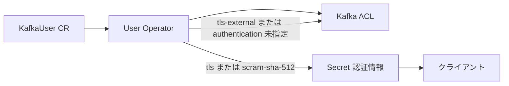

# 第13章 KafkaUser の管理

> 本章で参照する公式リソース
>
> - [install/cluster-operator/044-Crd-kafkauser.yaml L87-L100](https://github.com/strimzi/strimzi-kafka-operator/blob/1.1.0/install/cluster-operator/044-Crd-kafkauser.yaml#L87-L100)
> - [install/cluster-operator/044-Crd-kafkauser.yaml L108-L177](https://github.com/strimzi/strimzi-kafka-operator/blob/1.1.0/install/cluster-operator/044-Crd-kafkauser.yaml#L108-L177)
> - [install/cluster-operator/044-Crd-kafkauser.yaml L178-L197](https://github.com/strimzi/strimzi-kafka-operator/blob/1.1.0/install/cluster-operator/044-Crd-kafkauser.yaml#L178-L197)
> - [install/cluster-operator/044-Crd-kafkauser.yaml L248-L253](https://github.com/strimzi/strimzi-kafka-operator/blob/1.1.0/install/cluster-operator/044-Crd-kafkauser.yaml#L248-L253)
> - [examples/user/kafka-user.yaml L1-L38](https://github.com/strimzi/strimzi-kafka-operator/blob/1.1.0/examples/user/kafka-user.yaml#L1-L38)

## この章でできるようになること

- `KafkaUser` で認証方式（`tls`、`tls-external`、`scram-sha-512`）を指定できる。
- ACL と quotas を Custom Resource に記述できる。
- User Operator が生成する Secret の内容と使い方を把握できる。
- デプロイ後のユーザー状態と Secret を確認できる。

## 前提

[第11章 認可と ACL](../part02-security/11-authorization.md)で `Kafka` 側の認可と ACL の基本を理解していること。
本章は第3章のオープンクラスタ（`my-cluster`）を前提とする。
`Kafka` の `entityOperator.userOperator` が有効であること。
ACL 付き `KafkaUser` を `Ready=True` にするには、親 `Kafka` で `spec.kafka.authorization.type: simple` が有効である必要がある。

## authentication

[install/cluster-operator/044-Crd-kafkauser.yaml L87-L100](https://github.com/strimzi/strimzi-kafka-operator/blob/1.1.0/install/cluster-operator/044-Crd-kafkauser.yaml#L87-L100)は次のとおりである。

```yaml
                  type:
                    type: string
                    enum:
                    - tls
                    - tls-external
                    - scram-sha-512
                    description: Authentication type.
                  validityDays:
                    type: integer
                    minimum: 1
                    description: "Number of days for which the user certificate is valid. Both this property and `renewalDays` must be configured together.The value must be greater than 0 and greater than `renewalDays`.If not configured, the Clients CA configuration is used."
                required:
                - type
                description: "Authentication mechanism enabled for this Kafka user. The supported authentication mechanisms are `scram-sha-512`, `tls`, and `tls-external`. \n\n* `scram-sha-512` generates a secret with SASL SCRAM-SHA-512 credentials.\n* `tls` generates a secret with user certificate for mutual TLS authentication.\n* `tls-external` does not generate a user certificate.   But prepares the user for using mutual TLS authentication using a user certificate generated outside the User Operator.\n  ACLs and quotas set for this user are configured in the `CN=<username>` format.\n\nAuthentication is optional. If authentication is not configured, no credentials are generated. ACLs and quotas set for the user are configured in the `<username>` format suitable for SASL authentication."
```

| type | 説明 |
|---|---|
| `tls` | User Operator が clients CA で署名した証明書を Secret に生成する |
| `tls-external` | 証明書は生成せず、外部で用意した証明書向けに ACL を `CN=<username>` 形式で設定する |
| `scram-sha-512` | SCRAM 用のユーザー名とパスワードを Secret に生成する |

`tls` では `validityDays` と `renewalDays` をペアで指定できる（省略時は clients CA の設定に従う）。
`tls-external` では User Operator は証明書を生成しない。
authentication を省略した場合も credentials は生成されない。

## authorization と quotas

[install/cluster-operator/044-Crd-kafkauser.yaml L108-L177](https://github.com/strimzi/strimzi-kafka-operator/blob/1.1.0/install/cluster-operator/044-Crd-kafkauser.yaml#L108-L177)は次のとおりである。

```yaml
              authorization:
                type: object
                properties:
                  acls:
                    type: array
                    items:
                      type: object
                      properties:
                        type:
                          type: string
                          enum:
                          - allow
                          - deny
                          description: The type of the rule. ACL rules with type `allow` are used to allow user to execute the specified operations. ACL rules with type `deny` are used to deny user to execute the specified operations. Default value is `allow`.
                        resource:
                          type: object
                          properties:
                            name:
                              type: string
                              description: Name of resource for which given ACL rule applies. Can be combined with `patternType` field to use prefix pattern.
                            patternType:
                              type: string
                              enum:
                              - literal
                              - prefix
                              description: "Describes the pattern used in the resource field. The supported types are `literal` and `prefix`. With `literal` pattern type, the resource field will be used as a definition of a full name. With `prefix` pattern type, the resource name will be used only as a prefix. Default value is `literal`."
                            type:
                              type: string
                              enum:
                              - topic
                              - group
                              - cluster
                              - transactionalId
                              description: "Resource type. The available resource types are `topic`, `group`, `cluster`, and `transactionalId`."
                          required:
                          - type
                          description: Indicates the resource for which given ACL rule applies.
                        host:
                          type: string
                          description: "The host from which the action described in the ACL rule is allowed or denied. If not set, it defaults to `*`, allowing or denying the action from any host."
                        operations:
                          type: array
                          items:
                            type: string
                            enum:
                            - Read
                            - Write
                            - Create
                            - Delete
                            - Alter
                            - Describe
                            - ClusterAction
                            - AlterConfigs
                            - DescribeConfigs
                            - IdempotentWrite
                            - All
                          description: "List of operations to allow or deny. Supported operations are: Read, Write, Create, Delete, Alter, Describe, ClusterAction, AlterConfigs, DescribeConfigs, IdempotentWrite and All. Only certain operations work with the specified resource."
                      required:
                      - resource
                      - operations
                    description: List of ACL rules which should be applied to this user.
                  type:
                    type: string
                    enum:
                    - simple
                    description: Authorization type. Currently the only supported type is `simple`. `simple` authorization type uses the Kafka Admin API for managing the ACL rules.
                required:
                - acls
                - type
                description: Authorization rules for this Kafka user.
```

`authorization.type` の enum は `simple` のみである。

[install/cluster-operator/044-Crd-kafkauser.yaml L178-L197](https://github.com/strimzi/strimzi-kafka-operator/blob/1.1.0/install/cluster-operator/044-Crd-kafkauser.yaml#L178-L197)は次のとおりである。

```yaml
              quotas:
                type: object
                properties:
                  producerByteRate:
                    type: integer
                    minimum: 0
                    description: A quota on the maximum bytes per-second that each client group can publish to a broker before the clients in the group are throttled. Defined on a per-broker basis.
                  consumerByteRate:
                    type: integer
                    minimum: 0
                    description: A quota on the maximum bytes per-second that each client group can fetch from a broker before the clients in the group are throttled. Defined on a per-broker basis.
                  requestPercentage:
                    type: integer
                    minimum: 0
                    description: A quota on the maximum CPU utilization of each client group as a percentage of network and I/O threads.
                  controllerMutationRate:
                    type: number
                    minimum: 0
                    description: "A quota on the rate at which mutations are accepted for the create topics request, the create partitions request and the delete topics request. The rate is accumulated by the number of partitions created or deleted."
                description: "Quotas on requests to control the broker resources used by clients. Network bandwidth and request rate quotas can be enforced. For more information, see the Apache Kafka design documentation about quotas."
```

以下は quotas を付けた `KafkaUser` の例である。

```yaml
apiVersion: kafka.strimzi.io/v1
kind: KafkaUser
metadata:
  name: limited-user
  labels:
    strimzi.io/cluster: my-cluster
spec:
  authentication:
    type: scram-sha-512
  authorization:
    type: simple
    acls:
      - resource:
          type: topic
          name: my-topic
          patternType: literal
        operations:
          - Read
        host: "*"
  quotas:
    producerByteRate: 1048576
    consumerByteRate: 2097152
```

第3章のオープンクラスタから `READY=True` を再現するには、先に Kafka 側で認証と認可を有効化する。
以下は動作確認用の手順例である。

```bash
kubectl patch kafka my-cluster -n kafka --type=merge -p '
{
  "spec": {
    "kafka": {
      "authorization": {"type": "simple"},
      "listeners": [
        {"name": "plain", "port": 9092, "type": "internal", "tls": false},
        {"name": "tls", "port": 9093, "type": "internal", "tls": true, "authentication": {"type": "scram-sha-512"}}
      ]
    }
  }
}'
kubectl apply -f limited-user.yaml -n kafka
kubectl wait kafkauser/limited-user -n kafka --for=condition=Ready --timeout=120s
```

## User Operator が生成する Secret

`tls` と `scram-sha-512` では User Operator が認証情報を Secret に書き込む。
`status.secret` に Secret 名が記録される。

[install/cluster-operator/044-Crd-kafkauser.yaml L248-L253](https://github.com/strimzi/strimzi-kafka-operator/blob/1.1.0/install/cluster-operator/044-Crd-kafkauser.yaml#L248-L253)は次のとおりである。

```yaml
              username:
                type: string
                description: Username.
              secret:
                type: string
                description: The name of `Secret` where the credentials are stored.
```

| authentication.type | Secret の主なキー |
|---|---|
| `tls` | `ca.crt`、`user.crt`、`user.key`（および `user.p12` など） |
| `scram-sha-512` | `password`、`sasl.jaas.config` |
| `tls-external` | 証明書は生成しない（ACL のみ同期） |

`tls` と `scram-sha-512` のユーザーは User Operator が生成する Secret をマウントして接続する（[第10章](../part02-security/10-authentication.md)参照）。
`tls-external` は Secret を生成しないため、外部で用意した証明書を使う。
SCRAM ユーザーは `security.protocol=SASL_SSL` と `sasl.mechanism=SCRAM-SHA-512` を `client.properties` に設定する。



`tls` と `scram-sha-512` のときだけ User Operator が Secret を生成する。
`tls-external` と authentication 未指定では credentials は生成されない。

## 動作確認

`limited-user` の状態を確認する。

```bash
kubectl get kafkauser limited-user -n kafka
```

期待される出力の例は次のとおりである。

```text
NAME           CLUSTER      AUTHENTICATION   AUTHORIZATION   READY
limited-user   my-cluster   scram-sha-512    simple          True
```

生成された Secret のキーを確認する。

```bash
kubectl get secret limited-user -n kafka -o jsonpath='{.data}' | tr ',' '\n'
```

期待される出力には `password` と `sasl.jaas.config` の2キーが含まれる。

```text
{"password":"...
"sasl.jaas.config":"...
```

`status.secret` を確認する。

```bash
kubectl get kafkauser limited-user -n kafka -o jsonpath='{.status.secret}{"\n"}'
```

期待される出力の例は次のとおりである。

```text
limited-user
```

SCRAM ユーザーのパスワード長を確認する。

```bash
kubectl get secret limited-user -n kafka -o jsonpath='{.data.password}' | base64 -d | wc -c
```

期待される出力は `32` である（User Operator が生成する 32 文字のパスワード）。

## まとめ

`KafkaUser` で認証、ACL、quotas を宣言する。
User Operator が Secret と Kafka 側の ACL を同期する。
`tls` と `scram-sha-512` はリスナー側の `authentication.type` と一致させる。
`tls-external` はリスナー側は `type: tls` を使い、証明書は外部で管理する。
本章で Kafka に加えた認証と認可の変更は例示であり、以降の章は第3章のオープンクラスタを前提に読む。

## 関連する章

- [第10章 リスナー認証](../part02-security/10-authentication.md)
- [第11章 認可と ACL](../part02-security/11-authorization.md)
- [第12章 KafkaTopic の管理](12-kafkatopic.md)
