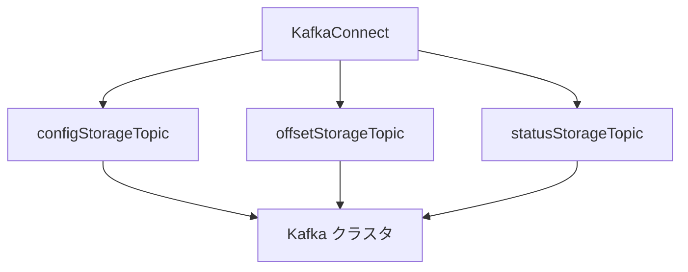

# 第14章 KafkaConnect の構築

> 本章で参照する公式リソース
>
> - [install/cluster-operator/041-Crd-kafkaconnect.yaml L56-L109](https://github.com/strimzi/strimzi-kafka-operator/blob/1.1.0/install/cluster-operator/041-Crd-kafkaconnect.yaml#L56-L109)
> - [examples/connect/kafka-connect.yaml L1-L26](https://github.com/strimzi/strimzi-kafka-operator/blob/1.1.0/examples/connect/kafka-connect.yaml#L1-L26)

## この章でできるようになること

- `KafkaConnect` Custom Resource で Connect クラスタをデプロイできる。
- 内部トピック（config、offset、status）の役割を説明できる。
- TLS 接続と `trustedCertificates` の設定方法を理解できる。
- Connect REST API への疎通を確認できる。

## 前提

[第3章 クイックスタート](../part00-introduction/03-quickstart.md)で Kafka クラスタ `my-cluster` が稼働していること。
本章は第3章のオープンクラスタ（`tls` リスナーは暗号化のみで認証なし）を前提とする。
Connect は対象 Kafka のブートストラップアドレスへ到達できる必要がある。
認可を有効化している環境では `KafkaConnect.spec.authentication` と対応する KafkaUser と ACL が必要（[第10章](../part02-security/10-authentication.md)と[第13章](../part03-topics-users/13-kafkauser.md)参照）。

## spec の主要フィールド

[install/cluster-operator/041-Crd-kafkaconnect.yaml L56-L109](https://github.com/strimzi/strimzi-kafka-operator/blob/1.1.0/install/cluster-operator/041-Crd-kafkaconnect.yaml#L56-L109)は次のとおりである。

```yaml
              version:
                type: string
                description: The Kafka Connect version. Defaults to the latest version. Consult the user documentation to understand the process required to upgrade or downgrade the version.
              replicas:
                type: integer
                description: The number of pods in the Kafka Connect group. Required in the `v1` version of the Strimzi API.
              image:
                type: string
                description: "The container image used for Kafka Connect pods. If no image name is explicitly specified, it is determined based on the `spec.version` configuration. The image names are specifically mapped to corresponding versions in the Cluster Operator configuration."
              bootstrapServers:
                type: string
                description: Bootstrap servers to connect to. This should be given as a comma separated list of _<hostname>_:_<port>_ pairs.
              groupId:
                type: string
                description: A unique ID that identifies the Connect cluster group.
              configStorageTopic:
                type: string
                description: The name of the Kafka topic where connector configurations are stored.
              statusStorageTopic:
                type: string
                description: The name of the Kafka topic where connector and task status are stored.
              offsetStorageTopic:
                type: string
                description: The name of the Kafka topic where source connector offsets are stored.
              tls:
                type: object
                properties:
                  trustedCertificates:
                    type: array
                    items:
                      type: object
                      properties:
                        secretName:
                          type: string
                          description: The name of the Secret containing the certificate.
                        certificate:
                          type: string
                          description: The name of the file certificate in the secret.
                        pattern:
                          type: string
                          description: "Pattern for the certificate files in the secret. Use the link:https://en.wikipedia.org/wiki/Glob_(programming)[_glob syntax_] for the pattern. All files in the secret that match the pattern are used."
                      oneOf:
                      - properties:
                          certificate: {}
                        required:
                        - certificate
                      - properties:
                          pattern: {}
                        required:
                        - pattern
                      required:
                      - secretName
                    description: Trusted certificates for TLS connection.
                description: TLS configuration.
```

`replicas` は Connect worker Pod 数である（`v1` API では必須）。
`groupId` は Connect クラスタを識別する一意の ID である。

## マニフェスト例

[examples/connect/kafka-connect.yaml L1-L26](https://github.com/strimzi/strimzi-kafka-operator/blob/1.1.0/examples/connect/kafka-connect.yaml#L1-L26)を適用する。

```yaml
apiVersion: kafka.strimzi.io/v1
kind: KafkaConnect
metadata:
  name: my-connect-cluster
#  annotations:
#  # use-connector-resources configures this KafkaConnect
#  # to use KafkaConnector resources to avoid
#  # needing to call the Connect REST API directly
#    strimzi.io/use-connector-resources: "true"
spec:
  version: 4.3.0
  replicas: 1
  bootstrapServers: my-cluster-kafka-bootstrap:9093
  groupId: my-connect-group
  configStorageTopic: my-connect-configs
  statusStorageTopic: my-connect-status
  offsetStorageTopic: my-connect-offsets
  tls:
    trustedCertificates:
      - secretName: my-cluster-cluster-ca-cert
        pattern: "*.crt"
  config:
    # -1 means it will use the default replication factor configured in the broker
    config.storage.replication.factor: -1
    offset.storage.replication.factor: -1
    status.storage.replication.factor: -1
```

```bash
kubectl apply -f kafka-connect.yaml -n kafka
```

TLS リスナー（9093）へ接続する場合は `tls.trustedCertificates` で cluster CA 証明書を参照する。
`pattern: "*.crt"` は Secret 内の該当ファイルをまとめて信頼する。

## 内部トピックの役割

Connect は分散協調のために Kafka 上に 3 種類の内部トピックを使う。

| フィールド | 格納内容 |
|---|---|
| `configStorageTopic` | コネクター設定 |
| `offsetStorageTopic` | ソースコネクターのオフセット |
| `statusStorageTopic` | コネクターとタスクの状態 |

`config` の `*.storage.replication.factor: -1` はブローカーのデフォルトレプリケーション係数を使う指定である。
本番では明示的なレプリカ数を設定することが多い。



## 動作確認

Connect クラスタの Ready 状態を確認する。

```bash
kubectl get kafkaconnect my-connect-cluster -n kafka
```

期待される出力の例は次のとおりである。

```text
NAME                 DESIRED REPLICAS   READY
my-connect-cluster   1                  True
```

Strimzi 1.1.0 の KafkaConnect は `StrimziPodSet` 経由で Pod を生成する。
Connect REST API に疎通する。

```bash
kubectl exec my-connect-cluster-connect-0 -n kafka -- \
  curl -s http://localhost:8083/connector-plugins | head -c 200
```

期待される出力には、利用可能なコネクタープラグインの JSON 配列が含まれる。

```text
[{"class":"org.apache.kafka.connect.mirror.MirrorCheckpointConnector",...
```

## まとめ

`KafkaConnect` で worker 群と内部トピック名を宣言する。
TLS 接続では cluster CA の Secret を `trustedCertificates` で指定する。
REST API（デフォルト 8083）でコネクターの状態を確認できる。

## 関連する章

- [第15章 コネクタープラグインのビルド](15-connect-build.md)
- [第16章 KafkaConnector によるコネクター管理](16-kafkaconnector.md)
