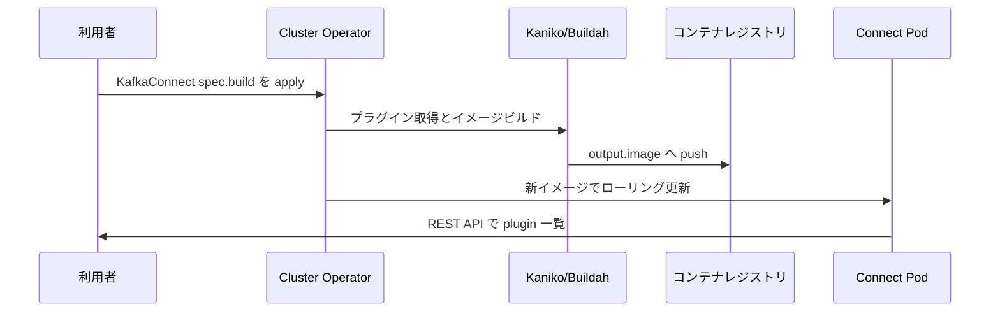

# 第15章 コネクタープラグインのビルド

> 本章で参照する公式リソース
>
> - [install/cluster-operator/041-Crd-kafkaconnect.yaml L2326-L2421](https://github.com/strimzi/strimzi-kafka-operator/blob/1.1.0/install/cluster-operator/041-Crd-kafkaconnect.yaml#L2326-L2421)
> - [examples/connect/kafka-connect-build.yaml L1-L43](https://github.com/strimzi/strimzi-kafka-operator/blob/1.1.0/examples/connect/kafka-connect-build.yaml#L1-L43)

## この章でできるようになること

- `spec.build` でコネクタープラグインを含む Connect イメージをビルドできる。
- `output.type`（`docker`、`imagestream`）と push 先を設定できる。
- `plugins` の artifact type（`jar`、`tgz`、`zip`、`maven`、`other`）を選べる。
- ビルド完了後の Pod イメージとプラグイン一覧を確認できる。

## 前提

[第14章 KafkaConnect の構築](14-kafkaconnect.md)の基本を理解していること。
本章は第3章のオープンクラスタ（`tls` リスナーは暗号化のみで認証なし）を前提とする。
プライベートレジストリへ push する場合は `pushSecret` を用意する（匿名 push 可能なデモ用レジストリでは不要）。
認可を有効化している環境では `KafkaConnect.spec.authentication` と対応する KafkaUser と ACL が必要（[第10章](../part02-security/10-authentication.md)と[第13章](../part03-topics-users/13-kafkauser.md)参照）。

## spec.build の構造

[install/cluster-operator/041-Crd-kafkaconnect.yaml L2326-L2421](https://github.com/strimzi/strimzi-kafka-operator/blob/1.1.0/install/cluster-operator/041-Crd-kafkaconnect.yaml#L2326-L2421)は次のとおりである。

```yaml
              build:
                type: object
                properties:
                  output:
                    type: object
                    properties:
                      additionalBuildOptions:
                        type: array
                        items:
                          type: string
                        description: "Configures additional options to pass to the `build` command of either Kaniko or Buildah (depending on the feature gate setting) when building a new Kafka Connect image. Allowed Kaniko options: --customPlatform, --custom-platform, --insecure, --insecure-pull, --insecure-registry, --log-format, --log-timestamp, --registry-mirror, --reproducible, --single-snapshot, --skip-tls-verify, --skip-tls-verify-pull, --skip-tls-verify-registry, --verbosity, --snapshotMode, --use-new-run, --registry-certificate, --registry-client-cert, --ignore-path. Allowed Buildah `build` options: --authfile, --cert-dir, --creds, --decryption-key, --retry, --retry-delay, --tls-verify. Those options are used only on Kubernetes, where Kaniko and Buildah are available. They are ignored on OpenShift. For more information, see the link:https://github.com/GoogleContainerTools/kaniko[Kaniko GitHub repository^] or the link:https://github.com/containers/buildah/blob/main/docs/buildah-build.1.md[Buildah build document^]. Changing this field does not trigger a rebuild of the Kafka Connect image."
                      additionalPushOptions:
                        type: array
                        items:
                          type: string
                        description: "Configures additional options to pass to the Buildah `push` command when pushing a new Connect image. Allowed options: --authfile, --cert-dir, --creds, --quiet, --retry, --retry-delay, --tls-verify. Those options are used only on Kubernetes, where Buildah is available. They are ignored on OpenShift. For more information, see the link:https://github.com/containers/buildah/blob/main/docs/buildah-push.1.md[Buildah push document^]. Changing this field does not trigger a rebuild of the Kafka Connect image."
                      image:
                        type: string
                        description: The name of the image which will be built. Required.
                      pushSecret:
                        type: string
                        description: Container Registry Secret with the credentials for pushing the newly built image.
                      type:
                        type: string
                        enum:
                        - docker
                        - imagestream
                        description: Output type. Must be either `docker` for pushing the newly build image to Docker compatible registry or `imagestream` for pushing the image to OpenShift ImageStream. Required.
                    required:
                    - image
                    - type
                    description: Configures where should the newly built image be stored. Required.
                  plugins:
                    type: array
                    items:
                      type: object
                      properties:
                        name:
                          type: string
                          pattern: "^[a-z0-9][-_a-z0-9]*[a-z0-9]$"
                          description: "The unique name of the connector plugin. Will be used to generate the path where the connector artifacts will be stored. The name has to be unique within the KafkaConnect resource. The name has to follow the following pattern: `^[a-z][-_a-z0-9]*[a-z]$`. Required."
                        artifacts:
                          type: array
                          items:
                            type: object
                            properties:
                              artifact:
                                type: string
                                description: Maven artifact id. Applicable to the `maven` artifact type only.
                              fileName:
                                type: string
                                description: Name under which the artifact will be stored.
                              group:
                                type: string
                                description: Maven group id. Applicable to the `maven` artifact type only.
                              includeScope:
                                type: string
                                enum:
                                - compile
                                - provided
                                - runtime
                                - test
                                - system
                                description: "Maven scope for including dependencies for the artifact. Valid values are `compile`, `provided`, `runtime`, `test`, and `system`. When not configured, no scope is set, and all dependencies are included. Applicable to the `maven` artifact type only."
                              insecure:
                                type: boolean
                                description: "By default, connections using TLS are verified to check they are secure. The server certificate used must be valid, trusted, and contain the server name. By setting this option to `true`, all TLS verification is disabled and the artifact will be downloaded, even when the server is considered insecure."
                              repository:
                                type: string
                                description: Maven repository to download the artifact from. Applicable to the `maven` artifact type only.
                              sha512sum:
                                type: string
                                description: "SHA512 checksum of the artifact. Optional. If specified, the checksum will be verified while building the new container. If not specified, the downloaded artifact will not be verified. Not applicable to the `maven` artifact type. "
                              type:
                                type: string
                                enum:
                                - jar
                                - tgz
                                - zip
                                - maven
                                - other
                                description: "Artifact type. Currently, the supported artifact types are `tgz`, `jar`, `zip`, `other` and `maven`."
                              url:
                                type: string
                                pattern: "^(https?|ftp)://[-a-zA-Z0-9+&@#/%?=~_|!:,.;]*[-a-zA-Z0-9+&@#/%=~_|]$"
                                description: "URL of the artifact which will be downloaded. Strimzi does not do any security scanning of the downloaded artifacts. For security reasons, you should first verify the artifacts manually and configure the checksum verification to make sure the same artifact is used in the automated build. Required for `jar`, `zip`, `tgz` and `other` artifacts. Not applicable to the `maven` artifact type."
                              version:
                                type: string
                                description: Maven version number. Applicable to the `maven` artifact type only.
                            required:
                            - type
                          description: List of artifacts which belong to this connector plugin. Required.
                      required:
                      - name
                      - artifacts
                    description: List of connector plugins which should be added to the Kafka Connect. Required.
```

`output.type: docker` は Docker 互換レジストリへ push する。
OpenShift では `imagestream` を選べる。
`plugins` 配列の各要素にプラグイン名と artifact リストを指定する。

## マニフェスト例

[examples/connect/kafka-connect-build.yaml L1-L43](https://github.com/strimzi/strimzi-kafka-operator/blob/1.1.0/examples/connect/kafka-connect-build.yaml#L1-L43)は Maven から `connect-file` を取得する例である。

```yaml
apiVersion: kafka.strimzi.io/v1
kind: KafkaConnect
metadata:
  name: my-connect-cluster
#  annotations:
#  # use-connector-resources configures this KafkaConnect
#  # to use KafkaConnector resources to avoid
#  # needing to call the Connect REST API directly
#    strimzi.io/use-connector-resources: "true"
spec:
  version: 4.3.0
  replicas: 1
  bootstrapServers: my-cluster-kafka-bootstrap:9093
  groupId: my-connect-group
  configStorageTopic: my-connect-configs
  statusStorageTopic: my-connect-status
  offsetStorageTopic: my-connect-offsets
  tls:
    trustedCertificates:
      - secretName: my-cluster-cluster-ca-cert
        pattern: "*.crt"
  config:
    # -1 means it will use the default replication factor configured in the broker
    config.storage.replication.factor: -1
    offset.storage.replication.factor: -1
    status.storage.replication.factor: -1
  build:
    output:
      type: docker
      # This image will last only for 24 hours and might be overwritten by other users
      # Strimzi will use this tag to push the image. But it will use the digest to pull
      # the container image to make sure it pulls exactly the image we just built. So
      # it should not happen that you pull someone else's container image. However, we
      # recommend changing this to your own container registry or using a different
      # image name for any other than demo purposes.
      image: ttl.sh/strimzi-connect-example-4.3.0:24h
    plugins:
      - name: kafka-connect-file
        artifacts:
          - type: maven
            group: org.apache.kafka
            artifact: connect-file
            version: 4.3.0
```

```bash
kubectl apply -f kafka-connect-build.yaml -n kafka
```

期待される出力の例は次のとおりである。

```text
kafkaconnect.kafka.strimzi.io/my-connect-cluster created
```

デモ用の `ttl.sh` イメージ名は一時利用向けである。
本番では自組織のレジストリと、必要に応じて `pushSecret` を設定する。

## ビルドの流れ

Cluster Operator は `spec.build` を検知すると、Kubernetes 上では Kaniko または Buildah で新しいイメージをビルドする。
OpenShift では Build API と BuildConfig を使う。
ビルド完了後、Connect Pod はそのイメージで再起動し、プラグインが `/opt/kafka/plugins` 配下に配置される。



## 動作確認

ビルドと Connect の Ready を待つ。

```bash
kubectl wait kafkaconnect/my-connect-cluster -n kafka --for=condition=Ready --timeout=1800s
kubectl get kafkaconnect my-connect-cluster -n kafka
```

期待される出力の例は次のとおりである。

```text
kafkaconnect.kafka.strimzi.io/my-connect-cluster condition met
```

```text
NAME                 DESIRED REPLICAS   READY
my-connect-cluster   1                  True
```

ビルドされたイメージ名は Pod の `image` フィールドで確認する（`KafkaConnect` の status に image フィールドはない）。

```bash
kubectl get pod -l strimzi.io/name=my-connect-cluster-connect -n kafka \
  -o jsonpath='{.items[0].spec.containers[0].image}{"\n"}'
```

期待される出力の例は次のとおりである。

```text
ttl.sh/strimzi-connect-example-4.3.0@sha256:abc123...
```

利用可能なコネクタープラグインを REST API で確認する。
応答の配列順は保証されないため、包含（Source と Sink のクラスが含まれる）を確認する。

```bash
PLUGINS=$(kubectl exec my-connect-cluster-connect-0 -n kafka -- \
  curl -s http://localhost:8083/connector-plugins)
if echo "${PLUGINS}" | grep -q FileStreamSourceConnector \
  && echo "${PLUGINS}" | grep -q FileStreamSinkConnector; then
  echo "plugin check: ok"
else
  echo "plugin check: missing"
  exit 1
fi
```

期待される出力の例は次のとおりである。

```text
plugin check: ok
```

## まとめ

`spec.build` でプラグイン入りの Connect イメージを自動ビルドする。
`output.type: docker` と、必要なら `pushSecret` でレジストリへ push する。
Maven や jar など artifact type に応じた取得方法を `plugins` に記述する。

## 関連する章

- [第14章 KafkaConnect の構築](14-kafkaconnect.md)
- [第16章 KafkaConnector によるコネクター管理](16-kafkaconnector.md)
