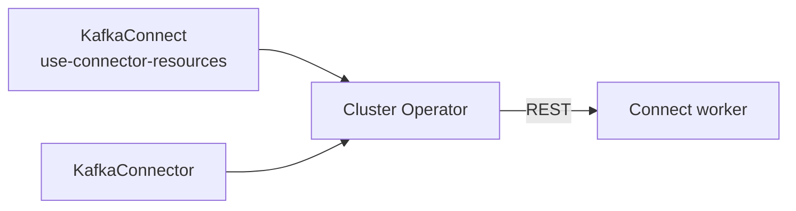

# 第16章 KafkaConnector によるコネクター管理

> 本章で参照する公式リソース
>
> - [install/cluster-operator/047-Crd-kafkaconnector.yaml L63-L93](https://github.com/strimzi/strimzi-kafka-operator/blob/1.1.0/install/cluster-operator/047-Crd-kafkaconnector.yaml#L63-L93)
> - [examples/connect/source-connector.yaml L1-L20](https://github.com/strimzi/strimzi-kafka-operator/blob/1.1.0/examples/connect/source-connector.yaml#L1-L20)
> - [examples/connect/kafka-connect.yaml L5-L9](https://github.com/strimzi/strimzi-kafka-operator/blob/1.1.0/examples/connect/kafka-connect.yaml#L5-L9)
> - [CHANGELOG.md L3-L5](https://github.com/strimzi/strimzi-kafka-operator/blob/1.1.0/CHANGELOG.md#L3-L5)

## この章でできるようになること

- `KafkaConnector` Custom Resource でコネクターを宣言的に管理できる。
- `strimzi.io/use-connector-resources` アノテーションの意味を説明できる。
- `state`（`running`、`paused`、`stopped`）と `autoRestart` を設定できる。
- failed コネクターの stop 対応（1.1.0）を理解できる。

## 前提

[第14章 KafkaConnect の構築](14-kafkaconnect.md)で Connect クラスタが稼働していること。
本章は第3章のオープンクラスタを前提とする。
[第15章](15-connect-build.md)で必要なプラグインをイメージに含めていること（FileStreamSourceConnector など）。
認可を有効化している環境では、親 `KafkaConnect` の `spec.authentication` と対応する KafkaUser と ACL が必要（[第10章](../part02-security/10-authentication.md)と[第13章](../part03-topics-users/13-kafkauser.md)参照）。

## KafkaConnector を有効にする

Connect クラスタで Custom Resource 管理を使うには、`KafkaConnect` に次のアノテーションを付ける。

[examples/connect/kafka-connect.yaml L5-L9](https://github.com/strimzi/strimzi-kafka-operator/blob/1.1.0/examples/connect/kafka-connect.yaml#L5-L9)は次のとおりである。

```yaml
#  annotations:
#  # use-connector-resources configures this KafkaConnect
#  # to use KafkaConnector resources to avoid
#  # needing to call the Connect REST API directly
#    strimzi.io/use-connector-resources: "true"
```

アノテーションを有効にすると、Cluster Operator が Connect REST API 経由で `KafkaConnector` をリコンサイルする（管理入口が Custom Resource になる）。

```bash
kubectl annotate kafkaconnect my-connect-cluster -n kafka \
  strimzi.io/use-connector-resources=true --overwrite
```

期待される出力の例は次のとおりである。

```text
kafkaconnect.kafka.strimzi.io/my-connect-cluster annotated
```

## spec の主要フィールド

[install/cluster-operator/047-Crd-kafkaconnector.yaml L63-L93](https://github.com/strimzi/strimzi-kafka-operator/blob/1.1.0/install/cluster-operator/047-Crd-kafkaconnector.yaml#L63-L93)は次のとおりである。

```yaml
              class:
                type: string
                description: The Class for the Kafka Connector.
              tasksMax:
                type: integer
                minimum: 1
                description: The maximum number of tasks for the Kafka Connector.
              autoRestart:
                type: object
                properties:
                  enabled:
                    type: boolean
                    description: Whether automatic restart for failed connectors and tasks should be enabled or disabled.
                  maxRestarts:
                    type: integer
                    description: "The maximum number of connector restarts that the operator will try. If the connector remains in a failed state after reaching this limit, it must be restarted manually by the user. Defaults to an unlimited number of restarts."
                description: Automatic restart of connector and tasks configuration.
              version:
                type: string
                description: Desired version or version range to respect when starting the Kafka Connector. This is only supported when using Kafka Connect version 4.1.0 and higher.
              config:
                x-kubernetes-preserve-unknown-fields: true
                type: object
                description: "The Kafka Connector configuration. The following properties cannot be set: name, connector.class, tasks.max, connector.plugin.version."
              state:
                type: string
                enum:
                - paused
                - stopped
                - running
                description: The state the connector should be in. Defaults to running.
```

`state` の enum は `running`、`paused`、`stopped` の 3 値である。
`failed` は enum に含まれない。
失敗は status の conditions で表される。

## マニフェスト例

[examples/connect/source-connector.yaml L1-L20](https://github.com/strimzi/strimzi-kafka-operator/blob/1.1.0/examples/connect/source-connector.yaml#L1-L20)を適用する。

```yaml
# To use the KafkaConnector resource, you have to first enable the connector operator using
# the strimzi.io/use-connector-resources annotation on the KafkaConnect custom resource.
# From Apache Kafka 3.1.1 and 3.2.0, you also have to add the FileStreamSourceConnector
# connector to the container image. You can do that using the kafka-connect-build.yaml example.
apiVersion: kafka.strimzi.io/v1
kind: KafkaConnector
metadata:
  name: my-source-connector
  labels:
    # The strimzi.io/cluster label identifies the KafkaConnect instance
    # in which to create this connector. That KafkaConnect instance
    # must have the strimzi.io/use-connector-resources annotation
    # set to true.
    strimzi.io/cluster: my-connect-cluster
spec:
  class: org.apache.kafka.connect.file.FileStreamSourceConnector
  tasksMax: 2
  config:
    file: "/opt/kafka/LICENSE"
    topic: my-topic
```

`state` と `autoRestart` を設定する例を示す（以下は例である）。

```yaml
apiVersion: kafka.strimzi.io/v1
kind: KafkaConnector
metadata:
  name: my-source-connector
  labels:
    strimzi.io/cluster: my-connect-cluster
spec:
  class: org.apache.kafka.connect.file.FileStreamSourceConnector
  tasksMax: 2
  state: running
  autoRestart:
    enabled: true
    maxRestarts: 3
  config:
    file: "/opt/kafka/LICENSE"
    topic: my-topic
```

```bash
kubectl apply -f source-connector.yaml -n kafka
```

`strimzi.io/cluster` ラベルは親の `KafkaConnect` 名と一致させる。

## failed コネクターの扱い（1.1.0）

[CHANGELOG.md L3-L5](https://github.com/strimzi/strimzi-kafka-operator/blob/1.1.0/CHANGELOG.md#L3-L5)には次の記載がある。

```markdown
## 1.1.0

* Allow failed `KafkaConnectors` to be stopped and reject pausing of failed connectors since this operation is not supported by Kafka Connect
```

failed 状態のコネクターは `state: stopped` で停止できる。
`paused` への変更は Kafka Connect が failed コネクターでサポートしないため、Operator が拒否する。



## 動作確認

コネクターの Ready とタスク状態を確認する。

```bash
kubectl get kafkaconnector my-source-connector -n kafka
```

期待される出力の例は次のとおりである。

```text
NAME                  CLUSTER              CONNECTOR CLASS                                      MAX TASKS   READY
my-source-connector   my-connect-cluster   org.apache.kafka.connect.file.FileStreamSourceConnector   2           True
```

`tasksMax` はタスク数の上限であり、実際に起動するタスク数を保証しない。
status の tasks 詳細を確認する。

```bash
kubectl get kafkaconnector my-source-connector -n kafka \
  -o jsonpath='{.status.connectorStatus.tasks}{"\n"}'
```

期待される出力には、`RUNNING` 状態のタスクが 1 件以上含まれる（件数は Connect の割り当てに依存する）。

```text
[{"id":0,"state":"RUNNING","worker_id":"my-connect-cluster-connect-0.my-connect-cluster-connect.kafka.svc:8083"}]
```

## まとめ

`strimzi.io/use-connector-resources: "true"` で `KafkaConnector` 管理を有効にする。
`class`、`tasksMax`、`config`、`state`、`autoRestart` でコネクターを宣言する。
1.1.0 では failed コネクターを `stopped` にできる。

## 関連する章

- [第14章 KafkaConnect の構築](14-kafkaconnect.md)
- [第15章 コネクタープラグインのビルド](15-connect-build.md)
