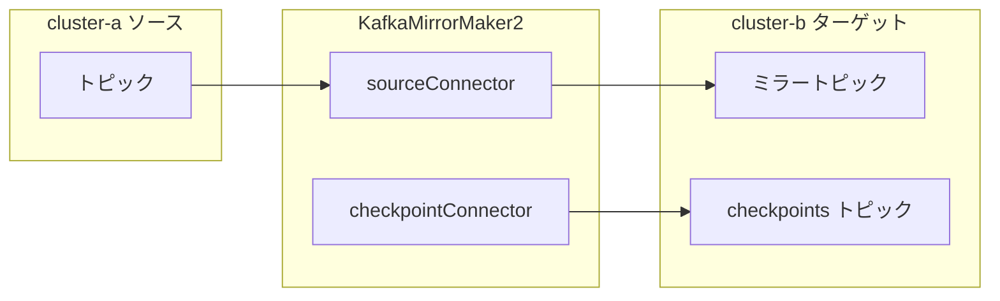

# 第17章 KafkaMirrorMaker2 によるクラスタ間レプリケーション

> 本章で参照する公式リソース
>
> - [install/cluster-operator/048-Crd-kafkamirrormaker2.yaml L56-L86](https://github.com/strimzi/strimzi-kafka-operator/blob/1.1.0/install/cluster-operator/048-Crd-kafkamirrormaker2.yaml#L56-L86)
> - [install/cluster-operator/048-Crd-kafkamirrormaker2.yaml L404-L415](https://github.com/strimzi/strimzi-kafka-operator/blob/1.1.0/install/cluster-operator/048-Crd-kafkamirrormaker2.yaml#L404-L415)
> - [examples/mirror-maker/kafka-mirror-maker-2.yaml L1-L46](https://github.com/strimzi/strimzi-kafka-operator/blob/1.1.0/examples/mirror-maker/kafka-mirror-maker-2.yaml#L1-L46)
> - [examples/mirror-maker/kafka-mirror-maker-2-custom-replication-policy.yaml L24-L42](https://github.com/strimzi/strimzi-kafka-operator/blob/1.1.0/examples/mirror-maker/kafka-mirror-maker-2-custom-replication-policy.yaml#L24-L42)
> - [examples/mirror-maker/kafka-source.yaml L1-L46](https://github.com/strimzi/strimzi-kafka-operator/blob/1.1.0/examples/mirror-maker/kafka-source.yaml#L1-L46)
> - [examples/mirror-maker/kafka-target.yaml L1-L46](https://github.com/strimzi/strimzi-kafka-operator/blob/1.1.0/examples/mirror-maker/kafka-target.yaml#L1-L46)

## この章でできるようになること

- `KafkaMirrorMaker2` でソースとターゲットの Kafka クラスタ間レプリケーションを構成できる。
- `mirrors` 配下の `sourceConnector` と `checkpointConnector` の役割を説明できる。
- `topicsPattern` と `groupsPattern` でミラー対象を絞り込める。
- replication policy によるトピック名の扱いの違いを理解できる。

## 前提

動作確認節で `cluster-a`（ソース）と `cluster-b`（ターゲット）を `kafka` Namespace に新規デプロイする。
`kafka` Namespace と、それを監視する Cluster Operator（[第2章](../part00-introduction/02-installation.md)で `strimzi` Namespace に導入済み）が存在すること。
デフォルト StorageClass が利用でき、動的プロビジョニングで PVC が Bound になるクラスタを前提とする。
ネットワーク上、MirrorMaker 2 Pod から両クラスタのブートストラップアドレスへ到達できること。
クラスタで認証と認可を有効化している場合は、ターゲット側は `spec.target.authentication`、ソース側は `spec.mirrors[].source.authentication` と対応する KafkaUser と ACL が必要（[第10章](../part02-security/10-authentication.md)と[第13章](../part03-topics-users/13-kafkauser.md)参照）。

## spec の構造

[install/cluster-operator/048-Crd-kafkamirrormaker2.yaml L56-L86](https://github.com/strimzi/strimzi-kafka-operator/blob/1.1.0/install/cluster-operator/048-Crd-kafkamirrormaker2.yaml#L56-L86)は次のとおりである。

```yaml
              version:
                type: string
                description: The Kafka Connect version. Defaults to the latest version. Consult the user documentation to understand the process required to upgrade or downgrade the version.
              replicas:
                type: integer
                description: The number of pods in the Kafka Connect group. Required in the `v1` version of the Strimzi API.
              image:
                type: string
                description: "The container image used for Kafka Connect pods. If no image name is explicitly specified, it is determined based on the `spec.version` configuration. The image names are specifically mapped to corresponding versions in the Cluster Operator configuration."
              target:
                type: object
                properties:
                  alias:
                    type: string
                    pattern: "^[a-zA-Z0-9\\._\\-]{1,100}$"
                    description: Alias used to reference the Kafka cluster.
                  bootstrapServers:
                    type: string
                    description: A comma-separated list of `host:port` pairs for establishing the connection to the Kafka cluster.
                  groupId:
                    type: string
                    description: A unique ID that identifies the Connect cluster group. Required.
                  configStorageTopic:
                    type: string
                    description: The name of the Kafka topic where connector configurations are stored. Required.
                  statusStorageTopic:
                    type: string
                    description: The name of the Kafka topic where connector and task statuses are stored. Required.
                  offsetStorageTopic:
                    type: string
                    description: The name of the Kafka topic where source connector offsets are stored. Required.
```

`target` は MirrorMaker 2 が Connect フレームワークの内部トピックに使うクラスタである。
`mirrors` 配列の各要素が、1 つのソースクラスタからターゲットへのミラー設定を表す。

## マニフェスト例

[examples/mirror-maker/kafka-mirror-maker-2.yaml L1-L46](https://github.com/strimzi/strimzi-kafka-operator/blob/1.1.0/examples/mirror-maker/kafka-mirror-maker-2.yaml#L1-L46)は active/passive 構成の例である。

```yaml
apiVersion: kafka.strimzi.io/v1
kind: KafkaMirrorMaker2
metadata:
  name: my-mirror-maker-2
spec:
  version: 4.3.0
  replicas: 1
  target:
    alias: cluster-b
    bootstrapServers: cluster-b-kafka-bootstrap:9092
    groupId: my-mirror-maker-2-group
    # internal topics should be prefixed with __ to be excluded from mirroring by default
    configStorageTopic: __my-mirror-maker-2-config
    offsetStorageTopic: __my-mirror-maker-2-offset
    statusStorageTopic: __my-mirror-maker-2-status
    config:
      # -1 means it will use the default replication factor configured in the broker
      config.storage.replication.factor: -1
      offset.storage.replication.factor: -1
      status.storage.replication.factor: -1
      # It is the fastest strategy and is compatible with MirrorMaker connectors, significantly improving worker start-up time
      plugin.discovery: service_load
  mirrors:
  - source:
      bootstrapServers: cluster-a-kafka-bootstrap:9092
      alias: cluster-a
    sourceConnector:
      tasksMax: 1
      config:
        # -1 means it will use the default replication factor configured in the broker
        replication.factor: -1
        offset-syncs.topic.replication.factor: -1
        sync.topic.acls.enabled: "false"
        # It is recommended to store offset-sync topic in the target so that MirrorMaker can be granted read-only access to the source cluster
        offset-syncs.topic.location: "target"
    checkpointConnector:
      tasksMax: 1
      config:
        # -1 means it will use the default replication factor configured in the broker
        checkpoints.topic.replication.factor: -1
        sync.group.offsets.enabled: "false"
        refresh.groups.interval.seconds: 600
        # This configuration has to match with the sourceConnector in order to work correctly
        offset-syncs.topic.location: "target"
    topicsPattern: ".*"
    groupsPattern: ".*"
```

MirrorMaker 2 はソースとターゲットのクラスタが Ready になってから apply する（動作確認節を参照）。

`sourceConnector` がトピックデータをミラーする。
`checkpointConnector` は consumer group のチェックポイント（`checkpoints` トピック）をターゲットに記録する。
`sync.group.offsets.enabled: "false"` のとき、ターゲット側の consumer group offset をソースと同期する処理は行わない（チェックポイント記録と offset 同期は別機能である）。



## topicsPattern と groupsPattern

[install/cluster-operator/048-Crd-kafkamirrormaker2.yaml L404-L415](https://github.com/strimzi/strimzi-kafka-operator/blob/1.1.0/install/cluster-operator/048-Crd-kafkamirrormaker2.yaml#L404-L415)は次のとおりである。

```yaml
                    topicsPattern:
                      type: string
                      description: "A regular expression matching the topics to be mirrored, for example, \"topic1\\|topic2\\|topic3\". Comma-separated lists are also supported."
                    topicsExcludePattern:
                      type: string
                      description: A regular expression matching the topics to exclude from mirroring. Comma-separated lists are also supported.
                    groupsPattern:
                      type: string
                      description: A regular expression matching the consumer groups to be mirrored. Comma-separated lists are also supported.
                    groupsExcludePattern:
                      type: string
                      description: A regular expression matching the consumer groups to exclude from mirroring. Comma-separated lists are also supported.
```

`topicsPattern: ".*"` はパターンに一致するトピックをミラー対象にする。
MirrorMaker 2 は内部トピックをデフォルトで除外するため、公式例は `target` のストレージトピック名に `__` プレフィックスを付ける。

## replication policy

デフォルトの `DefaultReplicationPolicy` はターゲット側でトピック名にソースクラスタの alias を付与する。
`IdentityReplicationPolicy` を使うとトピック名をそのまま複製する。

[examples/mirror-maker/kafka-mirror-maker-2-custom-replication-policy.yaml L24-L42](https://github.com/strimzi/strimzi-kafka-operator/blob/1.1.0/examples/mirror-maker/kafka-mirror-maker-2-custom-replication-policy.yaml#L24-L42)は次のとおりである。

```yaml
    sourceConnector:
      tasksMax: 1
      config:
        # -1 means it will use the default replication factor configured in the broker
        replication.factor: -1
        offset-syncs.topic.replication.factor: -1
        sync.topic.acls.enabled: "false"
        replication.policy.class: "org.apache.kafka.connect.mirror.IdentityReplicationPolicy"
        refresh.topics.interval.seconds: 600
    checkpointConnector:
      tasksMax: 1
      config:
        # -1 means it will use the default replication factor configured in the broker
        checkpoints.topic.replication.factor: -1
        replication.policy.class: "org.apache.kafka.connect.mirror.IdentityReplicationPolicy"
        sync.group.offsets.enabled: "false"
        refresh.groups.interval.seconds: 600
    topicsPattern: ".*"
    groupsPattern: ".*"
```

active/passive でターゲット側のトピック名をソースと同一にしたい場合に `IdentityReplicationPolicy` を選ぶ。

## 動作確認

検証の前に、ソースとターゲットのクラスタをデプロイする。

[examples/mirror-maker/kafka-source.yaml L1-L46](https://github.com/strimzi/strimzi-kafka-operator/blob/1.1.0/examples/mirror-maker/kafka-source.yaml#L1-L46)は次のとおりである。

```yaml
apiVersion: kafka.strimzi.io/v1
kind: KafkaNodePool
metadata:
  name: source
  labels:
    strimzi.io/cluster: cluster-a
spec:
  replicas: 1
  roles:
    - controller
    - broker
  storage:
    type: jbod
    volumes:
      - id: 0
        type: persistent-claim
        size: 100Gi
        kraftMetadata: shared
---

apiVersion: kafka.strimzi.io/v1
kind: Kafka
metadata:
  name: cluster-a
spec:
  kafka:
    version: 4.3.0
    metadataVersion: 4.3-IV0
    listeners:
      - name: plain
        port: 9092
        type: internal
        tls: false
      - name: tls
        port: 9093
        type: internal
        tls: true
    config:
      offsets.topic.replication.factor: 1
      transaction.state.log.replication.factor: 1
      transaction.state.log.min.isr: 1
      default.replication.factor: 1
      min.insync.replicas: 1
  entityOperator:
    topicOperator: {}
    userOperator: {}
```

[examples/mirror-maker/kafka-target.yaml L1-L46](https://github.com/strimzi/strimzi-kafka-operator/blob/1.1.0/examples/mirror-maker/kafka-target.yaml#L1-L46)は次のとおりである。

```yaml
apiVersion: kafka.strimzi.io/v1
kind: KafkaNodePool
metadata:
  name: target
  labels:
    strimzi.io/cluster: cluster-b
spec:
  replicas: 1
  roles:
    - controller
    - broker
  storage:
    type: jbod
    volumes:
      - id: 0
        type: persistent-claim
        size: 100Gi
        kraftMetadata: shared
---

apiVersion: kafka.strimzi.io/v1
kind: Kafka
metadata:
  name: cluster-b
spec:
  kafka:
    version: 4.3.0
    metadataVersion: 4.3-IV0
    listeners:
      - name: plain
        port: 9092
        type: internal
        tls: false
      - name: tls
        port: 9093
        type: internal
        tls: true
    config:
      offsets.topic.replication.factor: 1
      transaction.state.log.replication.factor: 1
      transaction.state.log.min.isr: 1
      default.replication.factor: 1
      min.insync.replicas: 1
  entityOperator:
    topicOperator: {}
    userOperator: {}
```

```bash
kubectl apply -f kafka-source.yaml -n kafka
```

期待される出力の例は次のとおりである。

```text
kafkanodepool.kafka.strimzi.io/source created
kafka.kafka.strimzi.io/cluster-a created
```

```bash
kubectl wait kafka/cluster-a -n kafka --for=condition=Ready --timeout=600s
```

期待される出力の例は次のとおりである。

```text
kafka.kafka.strimzi.io/cluster-a condition met
```

```bash
kubectl apply -f kafka-target.yaml -n kafka
```

期待される出力の例は次のとおりである。

```text
kafkanodepool.kafka.strimzi.io/target created
kafka.kafka.strimzi.io/cluster-b created
```

```bash
kubectl wait kafka/cluster-b -n kafka --for=condition=Ready --timeout=600s
```

期待される出力の例は次のとおりである。

```text
kafka.kafka.strimzi.io/cluster-b condition met
```

ソース側にミラー対象のユーザートピックへメッセージを送る。
`kafka-console-producer.sh` は正常送信時にメッセージ本文を標準出力へ返さない。

```bash
kubectl run kafka-produce-source -it --rm --restart=Never -n kafka \
  --image=quay.io/strimzi/kafka:1.1.0-kafka-4.3.0 \
  --command -- /bin/bash -c \
  'echo mirror-test | bin/kafka-console-producer.sh --bootstrap-server cluster-a-kafka-bootstrap:9092 --topic user-events'
```

`kafka-console-producer.sh` は正常送信時にメッセージ本文を標準出力へ返さない。
Pod は実行後に削除される。
kubectl の削除メッセージの文言はバージョンにより異なるため、ここでは断定しない。
送信結果はターゲット側の consumer で確認する（後述）。

MirrorMaker 2 を apply し、Ready を待つ。

```bash
kubectl apply -f kafka-mirror-maker-2.yaml -n kafka
```

期待される出力の例は次のとおりである。

```text
kafkamirrormaker2.kafka.strimzi.io/my-mirror-maker-2 created
```

```bash
kubectl wait kafkamirrormaker2/my-mirror-maker-2 -n kafka --for=condition=Ready --timeout=600s
kubectl get kafkamirrormaker2 my-mirror-maker-2 -n kafka
```

期待される出力の例は次のとおりである。

```text
kafkamirrormaker2.kafka.strimzi.io/my-mirror-maker-2 condition met
```

```text
NAME                DESIRED REPLICAS   READY
my-mirror-maker-2   1                  True
```

ターゲットクラスタ（ノードプール `target`、Pod 名 `cluster-b-target-0`）でミラーされたトピックを確認する。
MirrorMaker 2 の内部トピックと offset-sync トピックを除外する。
複製完了までポーリングする。

```bash
ATTEMPTS=0
MAX_ATTEMPTS=30
until kubectl exec cluster-b-target-0 -n kafka -- \
  bin/kafka-topics.sh --bootstrap-server localhost:9092 --list \
  | grep -v '^__' | grep -v '\.checkpoints\.internal$' | grep -v '^mm2-offset-syncs\.' \
  | grep -q 'cluster-a\.user-events'; do
  ATTEMPTS=$((ATTEMPTS + 1))
  if [ "${ATTEMPTS}" -ge "${MAX_ATTEMPTS}" ]; then
    echo "mirror topic not found after ${MAX_ATTEMPTS} attempts"
    exit 1
  fi
  sleep 5
done
kubectl exec cluster-b-target-0 -n kafka -- \
  bin/kafka-topics.sh --bootstrap-server localhost:9092 --list \
  | grep -v '^__' | grep -v '\.checkpoints\.internal$' | grep -v '^mm2-offset-syncs\.'
```

期待される出力には、ソース側の `user-events` に対応するトピック名が含まれる（replication policy により `cluster-a.user-events` などのプレフィックス付きの場合もある）。
`mm2-offset-syncs.cluster-b.internal` は除外対象である。

```text
cluster-a.user-events
```

ミラーされたメッセージ本文をターゲット側で確認する。

```bash
kubectl exec cluster-b-target-0 -n kafka -- \
  bin/kafka-console-consumer.sh --bootstrap-server localhost:9092 \
  --topic cluster-a.user-events --from-beginning --max-messages 1 --timeout-ms 30000
```

期待される出力の例は次のとおりである。

```text
mirror-test
```

## まとめ

`KafkaMirrorMaker2` は Connect ベースでクラスタ間レプリケーションを行う。
`target` と `mirrors[].source` でソースとターゲットを結び、`sourceConnector` と `checkpointConnector` がデータとチェックポイントを扱う。
replication policy でターゲットのトピック名規則を制御する。

## 関連する章

- [第14章 KafkaConnect の構築](../part04-connect/14-kafkaconnect.md)
- [第18章 KafkaBridge による HTTP アクセス](18-kafkabridge.md)
