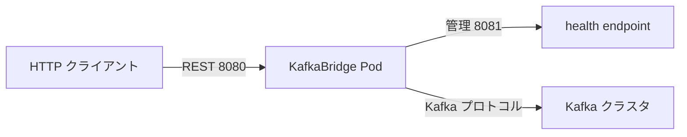

# 第18章 KafkaBridge による HTTP アクセス

> 本章で参照する公式リソース
>
> - [install/cluster-operator/046-Crd-kafkabridge.yaml L61-L70](https://github.com/strimzi/strimzi-kafka-operator/blob/1.1.0/install/cluster-operator/046-Crd-kafkabridge.yaml#L61-L70)
> - [install/cluster-operator/046-Crd-kafkabridge.yaml L156-L239](https://github.com/strimzi/strimzi-kafka-operator/blob/1.1.0/install/cluster-operator/046-Crd-kafkabridge.yaml#L156-L239)
> - [examples/bridge/kafka-bridge.yaml L1-L9](https://github.com/strimzi/strimzi-kafka-operator/blob/1.1.0/examples/bridge/kafka-bridge.yaml#L1-L9)
> - [examples/bridge/kafka-bridge-tls.yaml L1-L14](https://github.com/strimzi/strimzi-kafka-operator/blob/1.1.0/examples/bridge/kafka-bridge-tls.yaml#L1-L14)

## この章でできるようになること

- `KafkaBridge` で Kafka への HTTP（REST）アクセスを提供できる。
- `http` の port、TLS、CORS を設定できる。
- `consumer` と `producer` の有効化と設定を理解できる。
- HTTP エンドポイントへの疎通を curl で確認できる。

## 前提

[第3章 クイックスタート](../part00-introduction/03-quickstart.md)で Kafka クラスタが稼働していること。
本章は第3章のオープンクラスタ（認証なし、認可なし、`plain` 9092）を前提とする。
HTTP クライアントから Bridge Service に到達できること。
認可を有効化している環境では `KafkaBridge.spec.authentication` と対応する KafkaUser と ACL が必要（[第10章](../part02-security/10-authentication.md)と[第13章](../part03-topics-users/13-kafkauser.md)参照）。

## spec の主要フィールド

[install/cluster-operator/046-Crd-kafkabridge.yaml L61-L70](https://github.com/strimzi/strimzi-kafka-operator/blob/1.1.0/install/cluster-operator/046-Crd-kafkabridge.yaml#L61-L70)は次のとおりである。

```yaml
              replicas:
                type: integer
                minimum: 0
                description: The number of pods in the `Deployment`. Required in the `v1` version of the Strimzi API.
              image:
                type: string
                description: "The container image used for HTTP Bridge pods. If no image name is explicitly specified, the image name corresponds to the image specified in the Cluster Operator configuration. If an image name is not defined in the Cluster Operator configuration, a default value is used."
              bootstrapServers:
                type: string
                description: A list of host:port pairs for establishing the initial connection to the Kafka cluster.
```

[install/cluster-operator/046-Crd-kafkabridge.yaml L156-L239](https://github.com/strimzi/strimzi-kafka-operator/blob/1.1.0/install/cluster-operator/046-Crd-kafkabridge.yaml#L156-L239)は次のとおりである。

```yaml
              http:
                type: object
                properties:
                  port:
                    type: integer
                    minimum: 1023
                    description: Port the server listens on.
                  tls:
                    type: object
                    properties:
                      certificateAndKey:
                        type: object
                        properties:
                          secretName:
                            type: string
                            description: The name of the Secret containing the certificate.
                          certificate:
                            type: string
                            description: The name of the file certificate in the Secret.
                          key:
                            type: string
                            description: "The name of the private key in the secret. The private key must be in unencrypted PKCS #8 format. For more information, see RFC 5208: https://datatracker.ietf.org/doc/html/rfc5208."
                        required:
                        - secretName
                        - certificate
                        - key
                        description: Reference to the `Secret` which holds the certificate and private key pair.
                      config:
                        x-kubernetes-preserve-unknown-fields: true
                        type: object
                        description: "Additional configuration for the HTTP server TLS. Properties with the following prefixes cannot be set: ssl. (with the exception of: ssl.enabled.cipher.suites, ssl.enabled.protocols)."
                    required:
                    - certificateAndKey
                    description: TLS configuration for clients connections to the HTTP Bridge.
                  cors:
                    type: object
                    properties:
                      allowedOrigins:
                        type: array
                        items:
                          type: string
                        description: List of allowed origins. Java regular expressions can be used.
                      allowedMethods:
                        type: array
                        items:
                          type: string
                        description: List of allowed HTTP methods.
                    required:
                    - allowedOrigins
                    - allowedMethods
                    description: CORS configuration for the HTTP Bridge.
                description: The HTTP related configuration.
              adminClient:
                type: object
                properties:
                  config:
                    x-kubernetes-preserve-unknown-fields: true
                    type: object
                    description: The Kafka AdminClient configuration used for AdminClient instances created by the bridge.
                description: Kafka AdminClient related configuration.
              consumer:
                type: object
                properties:
                  enabled:
                    type: boolean
                    description: Whether the HTTP consumer should be enabled or disabled. The default is enabled (`true`).
                  timeoutSeconds:
                    type: integer
                    description: "The timeout in seconds for deleting inactive consumers, default is -1 (disabled)."
                  config:
                    x-kubernetes-preserve-unknown-fields: true
                    type: object
                    description: "The Kafka consumer configuration used for consumer instances created by the bridge. Properties with the following prefixes cannot be set: ssl., bootstrap.servers, group.id, sasl., security. (with the exception of: ssl.endpoint.identification.algorithm, ssl.cipher.suites, ssl.protocol, ssl.enabled.protocols)."
                description: Kafka consumer related configuration.
              producer:
                type: object
                properties:
                  enabled:
                    type: boolean
                    description: Whether the HTTP producer should be enabled or disabled. The default is enabled (`true`).
                  config:
                    x-kubernetes-preserve-unknown-fields: true
                    type: object
                    description: "The Kafka producer configuration used for producer instances created by the bridge. Properties with the following prefixes cannot be set: ssl., bootstrap.servers, sasl., security. (with the exception of: ssl.endpoint.identification.algorithm, ssl.cipher.suites, ssl.protocol, ssl.enabled.protocols)."
```

Bridge は Kafka プロトコルの代わりに HTTP で produce と consume を行う。
ブラウザや curl など、Kafka クライアントライブラリを持たないクライアント向けである。

## 平文 HTTP の例

[examples/bridge/kafka-bridge.yaml L1-L9](https://github.com/strimzi/strimzi-kafka-operator/blob/1.1.0/examples/bridge/kafka-bridge.yaml#L1-L9)は最小構成である。

```yaml
apiVersion: kafka.strimzi.io/v1
kind: KafkaBridge
metadata:
  name: my-bridge
spec:
  replicas: 1
  bootstrapServers: my-cluster-kafka-bootstrap:9092
  http:
    port: 8080
```

```bash
kubectl apply -f kafka-bridge.yaml -n kafka
```

期待される出力の例は次のとおりである。

```text
kafkabridge.kafka.strimzi.io/my-bridge created
```

`consumer.enabled` と `producer.enabled` はデフォルトで `true` である。
無効化する場合は次のように追記する（以下は追記例である）。

```yaml
spec:
  consumer:
    enabled: false
  producer:
    enabled: true
```

## TLS 付き HTTP の例

[examples/bridge/kafka-bridge-tls.yaml L1-L14](https://github.com/strimzi/strimzi-kafka-operator/blob/1.1.0/examples/bridge/kafka-bridge-tls.yaml#L1-L14)は HTTP 側にも TLS を設定する。

```yaml
apiVersion: kafka.strimzi.io/v1
kind: KafkaBridge
metadata:
  name: my-bridge
spec:
  replicas: 1
  bootstrapServers: my-cluster-kafka-bootstrap:9092
  http:
    port: 8443
    tls:
      certificateAndKey:
        secretName: my-bridge-cert-secret
        certificate: cert.crt
        key: key.key
```

Kafka 側のリスナーが認証を要求する場合のみ `spec.authentication` を設定する（TLS だけでは不要）。
詳細は [第10章](../part02-security/10-authentication.md)を参照する。



## 動作確認

Bridge の Ready を待ってから状態を確認する。

```bash
kubectl wait kafkabridge/my-bridge -n kafka --for=condition=Ready --timeout=300s
kubectl get kafkabridge my-bridge -n kafka
```

期待される出力の例は次のとおりである。

```text
kafkabridge.kafka.strimzi.io/my-bridge condition met
```

期待される出力の例は次のとおりである。

```text
NAME        DESIRED REPLICAS   READY
my-bridge   1                  True
```

health エンドポイントは管理ポート 8081 で公開される。
Service 経由で確認する。
`kubectl run --rm` で起動した Pod は実行後に削除される。

```bash
kubectl run curl-bridge -ti --restart=Never --rm -n kafka \
  --image=curlimages/curl -- \
  curl -s -o /dev/null -w "%{http_code}" \
  http://my-bridge-bridge-service:8081/healthy
```

期待される HTTP ステータスコードは `200` である。

トピックへメッセージを送る例を示す（Bridge の REST API 仕様に従う）。
確認用の値は他レコードと区別できる一意な文字列とする。

```bash
kubectl run curl-produce -ti --restart=Never --rm -n kafka \
  --image=curlimages/curl -- \
  curl -s -o /dev/null -w '%{http_code}\n' -X POST \
  -H "Content-Type: application/vnd.kafka.json.v2+json" \
  -d '{"records":[{"value":"bridge-verify-7f3a2c"}]}' \
  http://my-bridge-bridge-service:8080/topics/my-topic
```

期待される HTTP ステータスコードは `200` である。

consumer instance を作成し、subscription を登録してから records を取得する。

```bash
kubectl run curl-consume -ti --restart=Never --rm -n kafka \
  --image=curlimages/curl -- /bin/sh -c "
RESP=\$(curl -s -w \"\n%{http_code}\" -X POST \
  -H \"Content-Type: application/vnd.kafka.v2+json\" \
  -d \"{\\\"name\\\":\\\"my-consumer\\\",\\\"format\\\":\\\"json\\\",\\\"auto.offset.reset\\\":\\\"earliest\\\"}\" \
  http://my-bridge-bridge-service:8080/consumers/my-group)
BODY=\$(echo \"\$RESP\" | head -n -1)
CODE=\$(echo \"\$RESP\" | tail -n 1)
echo \"create=\${CODE}\"
INSTANCE=\$(echo \"\$BODY\" | sed -n 's/.*\"instance_id\":\"\\([^\"]*\\)\".*/\\1/p')
echo \"instance_id=\${INSTANCE}\"
curl -s -o /dev/null -w \"subscribe=%{http_code}\\n\" -X POST \
  -H \"Content-Type: application/vnd.kafka.v2+json\" \
  -d \"{\\\"topics\\\":[\\\"my-topic\\\"]}\" \
  \"http://my-bridge-bridge-service:8080/consumers/my-group/instances/\${INSTANCE}/subscription\"
FOUND=0
for i in 1 2 3 4 5; do
  OUT=\$(curl -s -w \"\\nrecords=%{http_code}\\n\" \
    -H \"Accept: application/vnd.kafka.json.v2+json\" \
    \"http://my-bridge-bridge-service:8080/consumers/my-group/instances/\${INSTANCE}/records\")
  echo \"\$OUT\"
  if echo \"\$OUT\" | grep -q 'bridge-verify-7f3a2c'; then FOUND=1; break; fi
  sleep 2
done
if [ \"\$FOUND\" -ne 1 ]; then echo \"records check: failed\"; exit 1; fi
curl -s -o /dev/null -w \"delete=%{http_code}\\n\" -X DELETE \
  \"http://my-bridge-bridge-service:8080/consumers/my-group/instances/\${INSTANCE}\"
"
```

期待される HTTP ステータスコードは、consumer 作成と records 取得が `200`、subscription が `204`、DELETE が `204` である。
初回の records 取得は空配列 `[]` になることがある。
再試行後に produce したレコードが含まれる。
レコードを確認できなかった場合は `records check: failed` で非0終了する。
以下はスクリプト内の `echo` 出力の代表例である。
kubectl 由来の削除行など版依存の出力は含めない。

```text
create=200
instance_id=my-consumer
subscribe=204
[]
records=200
[{"topic":"my-topic","key":null,"value":"bridge-verify-7f3a2c","partition":0,"offset":0,"timestamp":1710000000000}]
records=200
delete=204
```

`offset` と `timestamp` は環境により異なる。
初回の空配列 `[]` と `records=200` の行は再試行のたびに繰り返される。

同じ consumer 名で再実行すると `409` になるため、上記スクリプト内で instance を DELETE する。
Bridge REST API の HTTP コードは [Kafka Bridge 1.0.0 OpenAPI](https://github.com/strimzi/strimzi-kafka-bridge/blob/1.0.0/src/main/resources/openapi.json)を参照する。

## まとめ

`KafkaBridge` は Kafka への HTTP ラッパーとして REST produce/consume を提供する。
`http.port` で待ち受けポートを指定し、必要に応じて `http.tls` で HTTPS にする。
`consumer.enabled` と `producer.enabled` で機能を個別に切り替えられる。
health チェックは管理ポート 8081 の `/healthy` を使う。

## 関連する章

- [第7章 リスナーと外部アクセス](../part01-kafka-cluster/07-listeners.md)
- [第10章 リスナー認証](../part02-security/10-authentication.md)
- [第17章 KafkaMirrorMaker2 によるクラスタ間レプリケーション](17-mirrormaker2.md)
