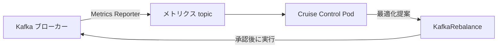

# 第19章 Cruise Control の有効化

> 本章で参照する公式リソース
>
> - [install/cluster-operator/040-Crd-kafka.yaml L3386-L3391](https://github.com/strimzi/strimzi-kafka-operator/blob/1.1.0/install/cluster-operator/040-Crd-kafka.yaml#L3386-L3391)
> - [install/cluster-operator/040-Crd-kafka.yaml L4424-L4464](https://github.com/strimzi/strimzi-kafka-operator/blob/1.1.0/install/cluster-operator/040-Crd-kafka.yaml#L4424-L4464)
> - [install/cluster-operator/040-Crd-kafka.yaml L4509-L4555](https://github.com/strimzi/strimzi-kafka-operator/blob/1.1.0/install/cluster-operator/040-Crd-kafka.yaml#L4509-L4555)
> - [examples/cruise-control/kafka-cruise-control.yaml L63-L63](https://github.com/strimzi/strimzi-kafka-operator/blob/1.1.0/examples/cruise-control/kafka-cruise-control.yaml#L63-L63)
> - [examples/cruise-control/kafka-cruise-control-with-goals.yaml L63-L91](https://github.com/strimzi/strimzi-kafka-operator/blob/1.1.0/examples/cruise-control/kafka-cruise-control-with-goals.yaml#L63-L91)
> - [examples/cruise-control/kafka-cruise-control-auto-rebalancing.yaml L63-L79](https://github.com/strimzi/strimzi-kafka-operator/blob/1.1.0/examples/cruise-control/kafka-cruise-control-auto-rebalancing.yaml#L63-L79)
> - [documentation/api/io.strimzi.api.kafka.model.kafka.cruisecontrol.CruiseControlSpec.adoc L161-L205](https://github.com/strimzi/strimzi-kafka-operator/blob/1.1.0/documentation/api/io.strimzi.api.kafka.model.kafka.cruisecontrol.CruiseControlSpec.adoc#L161-L205)

## この章でできるようになること

- `Kafka` の `spec.cruiseControl` で Cruise Control を有効化できる。
- `brokerCapacity`、`config`（goals）、`apiUsers` の設定方法を理解できる。
- `autoRebalance` によるスケール時の自動リバランスの概要を把握できる。
- Cruise Control Pod の稼働を確認できる。

## 前提

[第5章 Kafka Custom Resource の基本構造](../part01-kafka-cluster/05-kafka-resource.md)で `Kafka` Custom Resource の構造を理解していること。
Cruise Control はブローカーが2台未満のクラスタにはデプロイできない。
第3章の single-node dual-role クラスタだけでは有効化に失敗する。
[第4章](../part01-kafka-cluster/04-kafkanodepool.md)でブローカープールを追加したクラスタ、またはブローカー2台以上の分離構成を前提とする。

## Cruise Control の役割

Cruise Control は Kafka クラスタの負荷を分析し、パーティション配置の最適化案を生成する。
Strimzi は `Kafka` Custom Resource の `spec.cruiseControl` を設定すると、Cruise Control Pod をクラスタにデプロイする。
生成された提案は [第20章 KafkaRebalance](20-kafkarebalance.md)の `KafkaRebalance` Custom Resource で承認と実行を行う。

各ブローカーの Metrics Reporter が raw metrics を専用 Kafka topic に publish し、Cruise Control の Load Monitor がそれを処理する。



[install/cluster-operator/040-Crd-kafka.yaml L3386-L3391](https://github.com/strimzi/strimzi-kafka-operator/blob/1.1.0/install/cluster-operator/040-Crd-kafka.yaml#L3386-L3391)は次のとおりである。

```yaml
              cruiseControl:
                type: object
                properties:
                  image:
                    type: string
                    description: "The container image used for Cruise Control pods. If no image name is explicitly specified, the image name corresponds to the name specified in the Cluster Operator configuration. If an image name is not defined in the Cluster Operator configuration, a default value is used."
```

## 最小構成での有効化

[examples/cruise-control/kafka-cruise-control.yaml L63-L63](https://github.com/strimzi/strimzi-kafka-operator/blob/1.1.0/examples/cruise-control/kafka-cruise-control.yaml#L63-L63)は空のオブジェクトで有効化する。

```yaml
  cruiseControl: {}
```

`Kafka` リソースを patch または apply して反映する。

```bash
kubectl patch kafka my-cluster -n kafka --type merge \
  -p '{"spec":{"cruiseControl":{}}}'
```

期待される出力の例は次のとおりである。

```text
kafka.kafka.strimzi.io/my-cluster patched
```

patch 後は `observedGeneration` が `generation` に追いつくのを待ってから Ready を確認する。

```bash
GEN=$(kubectl get kafka my-cluster -n kafka -o jsonpath='{.metadata.generation}')
kubectl wait kafka/my-cluster -n kafka \
  --for=jsonpath="{.status.observedGeneration}=${GEN}" --timeout=600s
kubectl wait kafka/my-cluster -n kafka --for=condition=Ready --timeout=600s
```

期待される出力の例は次のとおりである。

```text
kafka.kafka.strimzi.io/my-cluster condition met
kafka.kafka.strimzi.io/my-cluster condition met
```

## brokerCapacity と config

[install/cluster-operator/040-Crd-kafka.yaml L4424-L4464](https://github.com/strimzi/strimzi-kafka-operator/blob/1.1.0/install/cluster-operator/040-Crd-kafka.yaml#L4424-L4464)は次のとおりである。

```yaml
                  brokerCapacity:
                    type: object
                    properties:
                      cpu:
                        type: string
                        pattern: "^[0-9]+([.][0-9]{0,3}|[m]?)$"
                        description: "Broker capacity for CPU resource in cores or millicores. For example, 1, 1.500, 1500m. For more information on valid CPU resource units see https://kubernetes.io/docs/concepts/configuration/manage-resources-containers/#meaning-of-cpu."
                      inboundNetwork:
                        type: string
                        pattern: "^[0-9]+([KMG]i?)?B/s$"
                        description: "Broker capacity for inbound network throughput in bytes per second. Use an integer value with standard Kubernetes byte units (K, M, G) or their bibyte (power of two) equivalents (Ki, Mi, Gi) per second. For example, 10000KiB/s."
                      outboundNetwork:
                        type: string
                        pattern: "^[0-9]+([KMG]i?)?B/s$"
                        description: "Broker capacity for outbound network throughput in bytes per second. Use an integer value with standard Kubernetes byte units (K, M, G) or their bibyte (power of two) equivalents (Ki, Mi, Gi) per second. For example, 10000KiB/s."
                      overrides:
                        type: array
                        items:
                          type: object
                          properties:
                            brokers:
                              type: array
                              items:
                                type: integer
                              description: List of Kafka brokers (broker identifiers).
                            cpu:
                              type: string
                              pattern: "^[0-9]+([.][0-9]{0,3}|[m]?)$"
                              description: "Broker capacity for CPU resource in cores or millicores. For example, 1, 1.500, 1500m. For more information on valid CPU resource units see https://kubernetes.io/docs/concepts/configuration/manage-resources-containers/#meaning-of-cpu."
                            inboundNetwork:
                              type: string
                              pattern: "^[0-9]+([KMG]i?)?B/s$"
                              description: "Broker capacity for inbound network throughput in bytes per second. Use an integer value with standard Kubernetes byte units (K, M, G) or their bibyte (power of two) equivalents (Ki, Mi, Gi) per second. For example, 10000KiB/s."
                            outboundNetwork:
                              type: string
                              pattern: "^[0-9]+([KMG]i?)?B/s$"
                              description: "Broker capacity for outbound network throughput in bytes per second. Use an integer value with standard Kubernetes byte units (K, M, G) or their bibyte (power of two) equivalents (Ki, Mi, Gi) per second. For example, 10000KiB/s."
                          required:
                          - brokers
                        description: Overrides for individual brokers. The `overrides` property lets you specify a different capacity configuration for different brokers.
                    description: The Cruise Control `brokerCapacity` configuration.
```

`config` 配下の `goals`、`default.goals`、`hard.goals` で最適化の目標を指定する。
[examples/cruise-control/kafka-cruise-control-with-goals.yaml L63-L91](https://github.com/strimzi/strimzi-kafka-operator/blob/1.1.0/examples/cruise-control/kafka-cruise-control-with-goals.yaml#L63-L91)は次のとおりである。

```yaml
  cruiseControl:
    config:
      # Note that `goals` must be a superset of `default.goals` and `hard.goals`
      goals: >
        com.linkedin.kafka.cruisecontrol.analyzer.goals.RackAwareGoal,
        com.linkedin.kafka.cruisecontrol.analyzer.goals.MinTopicLeadersPerBrokerGoal,
        # ... (中略) ...
      default.goals: >
        com.linkedin.kafka.cruisecontrol.analyzer.goals.RackAwareGoal,
        com.linkedin.kafka.cruisecontrol.analyzer.goals.ReplicaCapacityGoal,
        com.linkedin.kafka.cruisecontrol.analyzer.goals.DiskCapacityGoal
      hard.goals: >
        com.linkedin.kafka.cruisecontrol.analyzer.goals.RackAwareGoal,
        com.linkedin.kafka.cruisecontrol.analyzer.goals.ReplicaCapacityGoal,
        com.linkedin.kafka.cruisecontrol.analyzer.goals.DiskCapacityGoal
```

## apiUsers と autoRebalance

Cruise Control REST API は Basic 認証と SSL が標準で有効である。
`apiUsers` は保護された API に直接アクセスする追加ユーザーの credentials を設定するフィールドである。
credentials は Jetty の `HashLoginService` 形式で Secret に格納する。

[documentation/api/io.strimzi.api.kafka.model.kafka.cruisecontrol.CruiseControlSpec.adoc L161-L205](https://github.com/strimzi/strimzi-kafka-operator/blob/1.1.0/documentation/api/io.strimzi.api.kafka.model.kafka.cruisecontrol.CruiseControlSpec.adoc#L161-L205)は次のとおりである。

```asciidoc
Cruise Control reads authentication credentials for API users in Jetty's `HashLoginService` file format.

Standard Cruise Control `USER` and `VIEWER` roles are supported.

* `USER` has access to all the `GET` endpoints except `bootstrap` and `train`.
* `VIEWER` has access to `kafka_cluster_state`, `user_tasks`, and `review_board` endpoints.

In this example, we define two custom API users in the supported format in a text file called `cruise-control-auth.txt`:

[source]
----
userOne: passwordOne, USER
userTwo: passwordTwo, VIEWER
----

Then, use this file to create a secret with the following command:

[source]
----
kubectl create secret generic cruise-control-api-users-secret  --from-file=cruise-control-auth.txt=cruise-control-auth.txt
----

Next, we reference the secret in the `spec.cruiseControl.apiUsers` section of the Kafka resource:

.Example Cruise Control apiUsers configuration
[source,yaml,subs="attributes+"]
----
apiVersion: {KafkaApiVersion}
kind: Kafka
metadata:
  name: my-cluster
spec:
  # ...
  cruiseControl:
    # ...
    apiUsers:
      type: hashLoginService
      valueFrom:
        secretKeyRef:
          name: cruise-control-api-users-secret
          key: cruise-control-auth.txt
     ...
----

Strimzi then decodes and uses the contents of this secret to populate Cruise Control's API authentication credentials file.
```

以下は API ユーザーを設定する手順例である。

```text
userOne: passwordOne, USER
userTwo: passwordTwo, VIEWER
```

上記を `cruise-control-auth.txt` として Secret を作成する。

```bash
kubectl create secret generic cruise-control-api-users-secret -n kafka \
  --from-file=cruise-control-auth.txt=cruise-control-auth.txt
```

期待される出力の例は次のとおりである。

```text
secret/cruise-control-api-users-secret created
```

`Kafka` の `spec.cruiseControl.apiUsers` で Secret を参照する（以下は例である）。

```yaml
  cruiseControl:
    apiUsers:
      type: hashLoginService
      valueFrom:
        secretKeyRef:
          name: cruise-control-api-users-secret
          key: cruise-control-auth.txt
```

```bash
kubectl patch kafka my-cluster -n kafka --type=merge -p '
{
  "spec": {
    "cruiseControl": {
      "apiUsers": {
        "type": "hashLoginService",
        "valueFrom": {
          "secretKeyRef": {
            "name": "cruise-control-api-users-secret",
            "key": "cruise-control-auth.txt"
          }
        }
      }
    }
  }
}'
```

期待される出力の例は次のとおりである。

```text
kafka.kafka.strimzi.io/my-cluster patched
```

patch 後は Kafka のリコンサイル完了と Cruise Control Deployment のローリング更新完了を待つ。

```bash
GEN=$(kubectl get kafka my-cluster -n kafka -o jsonpath='{.metadata.generation}')
kubectl wait kafka/my-cluster -n kafka \
  --for=jsonpath="{.status.observedGeneration}=${GEN}" --timeout=600s
kubectl wait kafka/my-cluster -n kafka --for=condition=Ready --timeout=600s
kubectl rollout status deployment/my-cluster-cruise-control -n kafka --timeout=600s
```

期待される出力の例は次のとおりである。

```text
kafka.kafka.strimzi.io/my-cluster condition met
kafka.kafka.strimzi.io/my-cluster condition met
deployment "my-cluster-cruise-control" successfully rolled out
```

Cruise Control Pod が再作成されたあと、追加ユーザーで REST API にアクセスできる。

```bash
CC_POD=$(kubectl get pod -n kafka -l strimzi.io/name=my-cluster-cruise-control \
  -o jsonpath='{.items[0].metadata.name}')
kubectl exec -n kafka "${CC_POD}" -- \
  curl -sk -u userOne:passwordOne 'https://localhost:9090/kafkacruisecontrol/state?json=true'
```

期待される出力にはクラスタ状態の JSON が含まれる。

[install/cluster-operator/040-Crd-kafka.yaml L4509-L4555](https://github.com/strimzi/strimzi-kafka-operator/blob/1.1.0/install/cluster-operator/040-Crd-kafka.yaml#L4509-L4555)は次のとおりである。

```yaml
                  apiUsers:
                    type: object
                    properties:
                      type:
                        type: string
                        enum:
                        - hashLoginService
                        description: "Type of the Cruise Control API users configuration. Supported format is: `hashLoginService`."
                      valueFrom:
                        type: object
                        properties:
                          secretKeyRef:
                            type: object
                            properties:
                              key:
                                type: string
                              name:
                                type: string
                              optional:
                                type: boolean
                            description: Selects a key of a Secret in the resource's namespace.
                        description: Secret from which the custom Cruise Control API authentication credentials are read.
                    required:
                    - type
                    - valueFrom
                    description: Configuration of the Cruise Control REST API users.
                  autoRebalance:
                    type: array
                    minItems: 1
                    items:
                      type: object
                      properties:
                        mode:
                          type: string
                          enum:
                          - add-brokers
                          - remove-brokers
                          description: "Specifies the mode for automatically rebalancing when brokers are added or removed. Supported modes are `add-brokers` and `remove-brokers`. \n"
                        template:
                          type: object
                          properties:
                            name:
                              type: string
                          description: Reference to the KafkaRebalance custom resource to be used as the configuration template for the auto-rebalancing on scaling when running for the corresponding mode.
                      required:
                      - mode
                    description: "Auto-rebalancing on scaling related configuration listing the modes, when brokers are added or removed, with the corresponding rebalance template configurations.If this field is set, at least one mode has to be defined."
```

`autoRebalance` の `mode` enum は `add-brokers` と `remove-brokers` のみである。
発火条件は既存ノードプールの `spec.replicas` 変更に限定される（ノードプールの新規作成や削除では発火しない）。

[examples/cruise-control/kafka-cruise-control-auto-rebalancing.yaml L63-L79](https://github.com/strimzi/strimzi-kafka-operator/blob/1.1.0/examples/cruise-control/kafka-cruise-control-auto-rebalancing.yaml#L63-L79)は次のとおりである。

```yaml
  cruiseControl:
    autoRebalance:
      - mode: add-brokers
        template:
          name: my-add-brokers-rebalancing-template
      - mode: remove-brokers
        template:
          name: my-remove-brokers-rebalancing-template
---
apiVersion: kafka.strimzi.io/v1
kind: KafkaRebalance
metadata:
  name: my-add-brokers-rebalancing-template
  annotations:
    strimzi.io/rebalance-template: "true"
# no goals specified, using the default goals from the Cruise Control configuration
spec: {}
```

テンプレート用の `KafkaRebalance` には `strimzi.io/rebalance-template: "true"` アノテーションを付ける。

## 動作確認

Cruise Control Pod の存在を確認する。

```bash
kubectl get pod -l strimzi.io/name=my-cluster-cruise-control -n kafka
```

期待される出力の例は次のとおりである。

```text
NAME                                          READY   STATUS    RESTARTS   AGE
my-cluster-cruise-control-7d8f9c6b4d-abcde   1/1     Running   0          5m
```

`Kafka` の Ready 状態も確認する。

```bash
kubectl get kafka my-cluster -n kafka -o jsonpath='{.status.conditions[?(@.type=="Ready")].status}{"\n"}'
```

期待される出力は `True` である。

## まとめ

`spec.cruiseControl` を設定すると Cruise Control がデプロイされる。
`brokerCapacity` と `config` でクラスタ容量と最適化目標を定義する。
`autoRebalance` は既存ノードプールの `replicas` 変更時にリバランスを自動化する。

## 関連する章

- [第4章 KafkaNodePool とノードロール](../part01-kafka-cluster/04-kafkanodepool.md)
- [第20章 KafkaRebalance によるリバランス](20-kafkarebalance.md)
- [第23章 スケーリングとローリング更新](../part07-operations/23-scaling-rolling-update.md)
