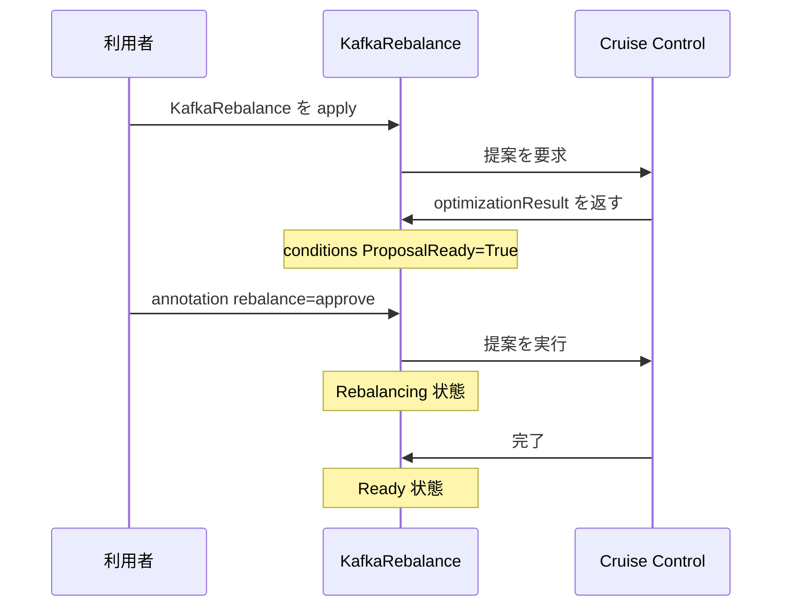

# 第20章 KafkaRebalance によるリバランス

> 本章で参照する公式リソース
>
> - [install/cluster-operator/049-Crd-kafkarebalance.yaml L56-L76](https://github.com/strimzi/strimzi-kafka-operator/blob/1.1.0/install/cluster-operator/049-Crd-kafkarebalance.yaml#L56-L76)
> - [install/cluster-operator/049-Crd-kafkarebalance.yaml L104-L161](https://github.com/strimzi/strimzi-kafka-operator/blob/1.1.0/install/cluster-operator/049-Crd-kafkarebalance.yaml#L104-L161)
> - [examples/cruise-control/kafka-rebalance-full.yaml L1-L8](https://github.com/strimzi/strimzi-kafka-operator/blob/1.1.0/examples/cruise-control/kafka-rebalance-full.yaml#L1-L8)
> - [examples/cruise-control/kafka-rebalance-add-brokers.yaml L1-L10](https://github.com/strimzi/strimzi-kafka-operator/blob/1.1.0/examples/cruise-control/kafka-rebalance-add-brokers.yaml#L1-L10)
> - [examples/cruise-control/kafka-rebalance-remove-brokers.yaml L1-L10](https://github.com/strimzi/strimzi-kafka-operator/blob/1.1.0/examples/cruise-control/kafka-rebalance-remove-brokers.yaml#L1-L10)
> - [examples/cruise-control/kafka-rebalance-remove-disks.yaml L1-L12](https://github.com/strimzi/strimzi-kafka-operator/blob/1.1.0/examples/cruise-control/kafka-rebalance-remove-disks.yaml#L1-L12)

## この章でできるようになること

- `KafkaRebalance` Custom Resource でリバランス提案の取得と実行を制御できる。
- `mode`（`full`、`add-brokers`、`remove-brokers`、`remove-disks`）の使い分けを説明できる。
- `ProposalReady` 状態と `strimzi.io/rebalance: approve` アノテーションの流れを追える。
- `status.optimizationResult` で提案内容を確認できる。

## 前提

[第19章 Cruise Control の有効化](19-cruise-control.md)で `spec.cruiseControl` を有効化していること。

## spec の主要フィールド

[install/cluster-operator/049-Crd-kafkarebalance.yaml L56-L76](https://github.com/strimzi/strimzi-kafka-operator/blob/1.1.0/install/cluster-operator/049-Crd-kafkarebalance.yaml#L56-L76)は次のとおりである。

```yaml
              mode:
                type: string
                enum:
                - full
                - add-brokers
                - remove-brokers
                - remove-disks
                description: "Mode to run the rebalancing. The supported modes are `full`, `add-brokers`, `remove-brokers`.\nIf not specified, the `full` mode is used by default. \n\n* `full` mode runs the rebalancing across all the brokers in the cluster.\n* `add-brokers` mode can be used after scaling up the cluster to move some replicas to the newly added brokers.\n* `remove-brokers` mode can be used before scaling down the cluster to move replicas out of the brokers to be removed.\n* `remove-disks` mode can be used to move data across the volumes within the same broker\n."
              brokers:
                type: array
                items:
                  type: integer
                description: The list of newly added brokers in case of scaling up or the ones to be removed in case of scaling down to use for rebalancing. This list can be used only with rebalancing mode `add-brokers` and `removed-brokers`. It is ignored with `full` mode.
              goals:
                type: array
                items:
                  type: string
                description: "A list of goals, ordered by decreasing priority, to use for generating and executing the rebalance proposal. The supported goals are available at https://github.com/linkedin/cruise-control#goals. If an empty goals list is provided, the goals declared in the default.goals Cruise Control configuration parameter are used."
              skipHardGoalCheck:
                type: boolean
                description: Whether to allow the hard goals specified in the Kafka CR to be skipped in optimization proposal generation. This can be useful when some of those hard goals are preventing a balance solution being found. Default is false.
```

| mode | 用途 |
|---|---|
| `full` | クラスタ全体のリバランス（デフォルト） |
| `add-brokers` | スケールアウト後に新ブローカーへレプリカを移動 |
| `remove-brokers` | スケールイン前に削除対象ブローカーからレプリカを退避 |
| `remove-disks` | 同一ブローカー内の JBOD ディスク間でレプリカを移動 |

`add-brokers` と `remove-brokers` では `brokers` リストが必須である。

## マニフェスト例

クラスタ全体のリバランスは [examples/cruise-control/kafka-rebalance-full.yaml L1-L8](https://github.com/strimzi/strimzi-kafka-operator/blob/1.1.0/examples/cruise-control/kafka-rebalance-full.yaml#L1-L8)のとおり空 spec で開始できる。

```yaml
apiVersion: kafka.strimzi.io/v1
kind: KafkaRebalance
metadata:
  name: my-rebalance
  labels:
    strimzi.io/cluster: my-cluster
# no goals specified, using the default goals from the Cruise Control configuration
spec: {}
```

```bash
kubectl apply -f kafka-rebalance-full.yaml -n kafka
```

期待される出力の例は次のとおりである。

```text
kafkarebalance.kafka.strimzi.io/my-rebalance created
```

ブローカー追加後のリバランスは [examples/cruise-control/kafka-rebalance-add-brokers.yaml L1-L10](https://github.com/strimzi/strimzi-kafka-operator/blob/1.1.0/examples/cruise-control/kafka-rebalance-add-brokers.yaml#L1-L10)を参照する。

```yaml
apiVersion: kafka.strimzi.io/v1
kind: KafkaRebalance
metadata:
  name: my-rebalance
  labels:
    strimzi.io/cluster: my-cluster
# no goals specified, using the default goals from the Cruise Control configuration
spec:
  mode: add-brokers
  brokers: [3, 4]
```

ブローカー削除前は [examples/cruise-control/kafka-rebalance-remove-brokers.yaml L1-L10](https://github.com/strimzi/strimzi-kafka-operator/blob/1.1.0/examples/cruise-control/kafka-rebalance-remove-brokers.yaml#L1-L10)のとおり `mode: remove-brokers` を使う。

```yaml
apiVersion: kafka.strimzi.io/v1
kind: KafkaRebalance
metadata:
  name: my-rebalance
  labels:
    strimzi.io/cluster: my-cluster
# no goals specified, using the default goals from the Cruise Control configuration
spec:
  mode: remove-brokers
  brokers: [3, 4]
```

ディスク間の移動は [examples/cruise-control/kafka-rebalance-remove-disks.yaml L1-L12](https://github.com/strimzi/strimzi-kafka-operator/blob/1.1.0/examples/cruise-control/kafka-rebalance-remove-disks.yaml#L1-L12)を参照する。
前提は KRaft モードで JBOD ストレージを使い、同一ブローカー上に複数 disk がある構成である。

```yaml
apiVersion: kafka.strimzi.io/v1
kind: KafkaRebalance
metadata:
  name: my-rebalance
  labels:
    strimzi.io/cluster: my-cluster
# no goals specified, using the default goals from the Cruise Control configuration
spec:
  mode: remove-disks
  moveReplicasOffVolumes:
    - brokerId: 0
      volumeIds: [1]
```

## 提案から実行までの流れ

`KafkaRebalance` を作成すると、Cruise Control が最適化提案を生成する。
`status.conditions` に `ProposalReady` が `True` になると、提案の確認ができる。
実行するには `metadata.annotations` に `strimzi.io/rebalance: approve` を付与する。



[install/cluster-operator/049-Crd-kafkarebalance.yaml L104-L161](https://github.com/strimzi/strimzi-kafka-operator/blob/1.1.0/install/cluster-operator/049-Crd-kafkarebalance.yaml#L104-L161)は次のとおりである。

```yaml
              moveReplicasOffVolumes:
                type: array
                minItems: 1
                items:
                  type: object
                  properties:
                    brokerId:
                      type: integer
                      description: ID of the broker that contains the disk from which you want to move the partition replicas.
                    volumeIds:
                      type: array
                      minItems: 1
                      items:
                        type: integer
                      description: IDs of the disks from which the partition replicas need to be moved.
                description: List of brokers and their corresponding volumes from which replicas need to be moved.
            description: The specification of the Kafka rebalance.
          status:
            type: object
            properties:
              conditions:
                type: array
                items:
                  type: object
                  properties:
                    type:
                      type: string
                      description: "The unique identifier of a condition, used to distinguish between other conditions in the resource."
                    status:
                      type: string
                      description: "The status of the condition, either True, False or Unknown."
                    lastTransitionTime:
                      type: string
                      description: "Last time the condition of a type changed from one status to another. The required format is 'yyyy-MM-ddTHH:mm:ssZ', in the UTC time zone."
                    reason:
                      type: string
                      description: The reason for the condition's last transition (a single word in CamelCase).
                    message:
                      type: string
                      description: Human-readable message indicating details about the condition's last transition.
                description: List of status conditions.
              observedGeneration:
                type: integer
                description: The generation of the CRD that was last reconciled by the operator.
              sessionId:
                type: string
                description: The session identifier for requests to Cruise Control pertaining to this KafkaRebalance resource. This is used by the Kafka Rebalance operator to track the status of ongoing rebalancing operations.
              progress:
                type: object
                properties:
                  rebalanceProgressConfigMap:
                    type: string
                    description: The name of the `ConfigMap` containing information related to the progress of a partition rebalance.
                description: A reference to Config Map with the progress information.
              optimizationResult:
                x-kubernetes-preserve-unknown-fields: true
                type: object
                description: A JSON object describing the optimization result.
```

## 動作確認

`KafkaRebalance` の状態を確認する。
提案生成中は `PendingProposal` になることがある。

```bash
kubectl get kafkarebalance my-rebalance -n kafka
```

`ProposalReady` になるまで待つ。

```bash
kubectl wait kafkarebalance/my-rebalance -n kafka \
  --for=jsonpath='{.status.conditions[?(@.type=="ProposalReady")].status}'=True \
  --timeout=600s
kubectl get kafkarebalance my-rebalance -n kafka
```

`kubectl wait` は条件を満たすと `condition met` と表示する。

期待される出力の例は次のとおりである。

```text
kafkarebalance.kafka.strimzi.io/my-rebalance condition met
```

```text
NAME          CLUSTER      TEMPLATE   STATUS
my-rebalance  my-cluster              ProposalReady
```

`ProposalReady` になったら提案内容を確認する。

```bash
kubectl get kafkarebalance my-rebalance -n kafka \
  -o jsonpath='{.status.optimizationResult}{"\n"}' | head -c 300
```

JSON 形式の最適化結果が表示される。

提案を承認して実行する。

```bash
kubectl annotate kafkarebalance my-rebalance -n kafka \
  strimzi.io/rebalance=approve --overwrite
```

期待される出力の例は次のとおりである。

```text
kafkarebalance.kafka.strimzi.io/my-rebalance annotated
```

実行中は STATUS が `Rebalancing` に変わる。
完了後は `Ready` になるまで待つ。

```bash
kubectl wait kafkarebalance/my-rebalance -n kafka \
  --for=jsonpath='{.status.conditions[?(@.type=="Ready")].status}'=True \
  --timeout=1800s
kubectl get kafkarebalance my-rebalance -n kafka
```

期待される出力の例は次のとおりである。

```text
kafkarebalance.kafka.strimzi.io/my-rebalance condition met
```

```text
NAME          CLUSTER      TEMPLATE   STATUS
my-rebalance  my-cluster              Ready
```

新しい proposal を取得するには `strimzi.io/rebalance: refresh` アノテーションが必要である。

## まとめ

`KafkaRebalance` で Cruise Control の提案取得と実行を制御する。
`mode` と `brokers` でスケール前後のリバランスを切り替える。
`ProposalReady` を確認してから `strimzi.io/rebalance: approve` で実行する。

## 関連する章

- [第19章 Cruise Control の有効化](19-cruise-control.md)
- [第12章 KafkaTopic の管理](../part03-topics-users/12-kafkatopic.md)
- [第23章 スケーリングとローリング更新](../part07-operations/23-scaling-rolling-update.md)
