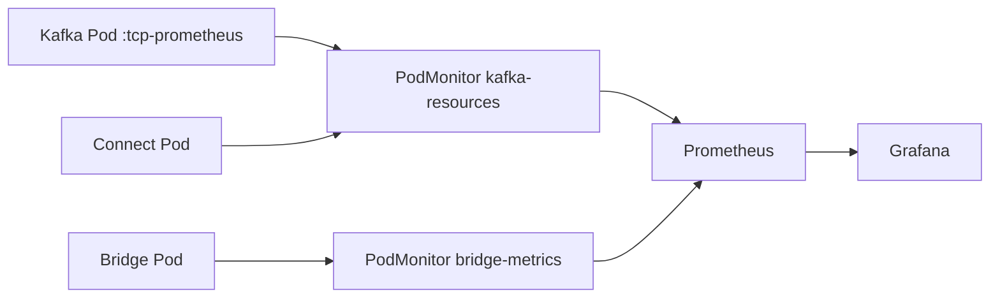

# 第22章 監視とメトリクス

> 本章で参照する公式リソース
>
> - [install/cluster-operator/040-Crd-kafka.yaml L561-L595](https://github.com/strimzi/strimzi-kafka-operator/blob/1.1.0/install/cluster-operator/040-Crd-kafka.yaml#L561-L595)
> - [install/cluster-operator/040-Crd-kafka.yaml L4469-L4508](https://github.com/strimzi/strimzi-kafka-operator/blob/1.1.0/install/cluster-operator/040-Crd-kafka.yaml#L4469-L4508)
> - [install/cluster-operator/040-Crd-kafka.yaml L593-L598](https://github.com/strimzi/strimzi-kafka-operator/blob/1.1.0/install/cluster-operator/040-Crd-kafka.yaml#L593-L598)
> - [examples/metrics/kafka-metrics.yaml L1-L18](https://github.com/strimzi/strimzi-kafka-operator/blob/1.1.0/examples/metrics/kafka-metrics.yaml#L1-L18)
> - [examples/metrics/kafka-metrics.yaml L62-L73](https://github.com/strimzi/strimzi-kafka-operator/blob/1.1.0/examples/metrics/kafka-metrics.yaml#L62-L73)
> - [examples/metrics/kafka-metrics.yaml L71-L85](https://github.com/strimzi/strimzi-kafka-operator/blob/1.1.0/examples/metrics/kafka-metrics.yaml#L71-L85)
> - [examples/metrics/kafka-connect-metrics.yaml L11-L16](https://github.com/strimzi/strimzi-kafka-operator/blob/1.1.0/examples/metrics/kafka-connect-metrics.yaml#L11-L16)
> - [examples/metrics/kafka-bridge-metrics.yaml L10-L15](https://github.com/strimzi/strimzi-kafka-operator/blob/1.1.0/examples/metrics/kafka-bridge-metrics.yaml#L10-L15)
> - [examples/metrics/prometheus-install/pod-monitors/kafka-resources-metrics.yaml L1-L19](https://github.com/strimzi/strimzi-kafka-operator/blob/1.1.0/examples/metrics/prometheus-install/pod-monitors/kafka-resources-metrics.yaml#L1-L19)
> - [examples/metrics/prometheus-install/pod-monitors/bridge-metrics.yaml L1-L17](https://github.com/strimzi/strimzi-kafka-operator/blob/1.1.0/examples/metrics/prometheus-install/pod-monitors/bridge-metrics.yaml#L1-L17)

## この章でできるようになること

- `metricsConfig` で Kafka ブローカーのメトリクスを有効化できる。
- `jmxPrometheusExporter` と `strimziMetricsReporter` の違いを説明できる。
- Connect、Bridge、Cruise Control のメトリクス設定方法を理解できる。
- Prometheus によるスクレイプの全体像を把握できる。

## 前提

Prometheus Operator により `PodMonitor` CRD（`monitoring.coreos.com/v1`）が提供されるクラスタであること。
PodMonitor を適用する `monitoring` Namespace は未作成でもよい（手順内で冪等に作成する）。
[第4章 KafkaNodePool とノードロール](../part01-kafka-cluster/04-kafkanodepool.md)でロール分離を完了したクラスタ（`broker` プールあり）を前提とする。
第3章の dual-role のままコントローラー専用ノードプールを追加する操作は、Strimzi 1.1.0 ではコントローラーのスケーリングに該当し未サポートである。

## metricsConfig のスキーマ

Kafka ブローカーの `spec.kafka.metricsConfig` は次の 2 種類をサポートする。

[install/cluster-operator/040-Crd-kafka.yaml L561-L595](https://github.com/strimzi/strimzi-kafka-operator/blob/1.1.0/install/cluster-operator/040-Crd-kafka.yaml#L561-L595)は次のとおりである。

```yaml
                  metricsConfig:
                    type: object
                    properties:
                      type:
                        type: string
                        enum:
                        - jmxPrometheusExporter
                        - strimziMetricsReporter
                        description: Metrics type. The supported types are `jmxPrometheusExporter` and `strimziMetricsReporter`. Type `jmxPrometheusExporter` uses the Prometheus JMX Exporter to expose Kafka JMX metrics in Prometheus format through an HTTP endpoint. Type `strimziMetricsReporter` uses the Strimzi Metrics Reporter to directly expose Kafka metrics in Prometheus format through an HTTP endpoint.
                      valueFrom:
                        type: object
                        properties:
                          configMapKeyRef:
                            type: object
                            properties:
                              key:
                                type: string
                              name:
                                type: string
                              optional:
                                type: boolean
                            description: Reference to the key in the ConfigMap containing the configuration.
                        description: ConfigMap entry where the Prometheus JMX Exporter configuration is stored.
                      values:
                        type: object
                        properties:
                          allowList:
                            type: array
                            items:
                              type: string
                            description: A list of regex patterns to filter the metrics to collect. Should contain at least one element.
                        description: Configuration values for the Strimzi Metrics Reporter.
                    required:
                    - type
                    description: Metrics configuration.
```

| type | 説明 |
|---|---|
| `jmxPrometheusExporter` | JMX Exporter で JMX メトリクスを Prometheus 形式で公開する |
| `jmxPrometheusExporter` の `valueFrom` | ConfigMap 参照が必須である |
| `strimziMetricsReporter` | Strimzi Metrics Reporter で直接 Prometheus 形式を公開する（`values.allowList` でフィルタ） |

[install/cluster-operator/040-Crd-kafka.yaml L593-L598](https://github.com/strimzi/strimzi-kafka-operator/blob/1.1.0/install/cluster-operator/040-Crd-kafka.yaml#L593-L598)は次のとおりである。

```yaml
                    required:
                    - type
                    description: Metrics configuration.
                    x-kubernetes-validations:
                    - rule: self.type != 'jmxPrometheusExporter' || has(self.valueFrom)
                      message: valueFrom property is required
```

## Kafka のメトリクス有効化

[examples/metrics/kafka-metrics.yaml L62-L73](https://github.com/strimzi/strimzi-kafka-operator/blob/1.1.0/examples/metrics/kafka-metrics.yaml#L62-L73)は JMX Exporter を使う例である。

```yaml
    metricsConfig:
      type: jmxPrometheusExporter
      valueFrom:
        configMapKeyRef:
          name: kafka-metrics
          key: kafka-metrics-config.yml
  entityOperator:
    topicOperator: {}
    userOperator: {}
  kafkaExporter:
    topicRegex: ".*"
    groupRegex: ".*"
```

同ファイルには JMX Exporter のルールを含む `ConfigMap` も定義されている。

[examples/metrics/kafka-metrics.yaml L71-L85](https://github.com/strimzi/strimzi-kafka-operator/blob/1.1.0/examples/metrics/kafka-metrics.yaml#L71-L85)は次のとおりである。

```yaml
  kafkaExporter:
    topicRegex: ".*"
    groupRegex: ".*"
---
kind: ConfigMap
apiVersion: v1
metadata:
  name: kafka-metrics
  labels:
    app: strimzi
data:
  kafka-metrics-config.yml: |
    # See https://github.com/prometheus/jmx_exporter for more info about JMX Prometheus Exporter metrics
    lowercaseOutputName: true
    rules:
```

`kafkaExporter` セクションで consumer group とトピックの lag メトリクスも取得できる。

既存の分離構成クラスタへメトリクスを追加する。
公式サンプル `kafka-metrics.yaml` 全体を apply するとコントローラー専用ノードプールが追加され、既存 dual-role コントローラーと競合する。
ここでは ConfigMap の作成と `Kafka` への `metricsConfig` 追加のみ行う。

```bash
curl -sL https://raw.githubusercontent.com/strimzi/strimzi-kafka-operator/1.1.0/examples/metrics/kafka-metrics.yaml \
  -o kafka-metrics.yaml
awk '/^kind: ConfigMap/,0' kafka-metrics.yaml > kafka-metrics-configmap.yaml
kubectl apply -f kafka-metrics-configmap.yaml -n kafka
```

期待される出力の例は次のとおりである。

```text
configmap/kafka-metrics created
```

```bash
kubectl patch kafka/my-cluster -n kafka --type=merge -p '{
  "spec": {
    "kafka": {
      "metricsConfig": {
        "type": "jmxPrometheusExporter",
        "valueFrom": {
          "configMapKeyRef": {
            "name": "kafka-metrics",
            "key": "kafka-metrics-config.yml"
          }
        }
      }
    },
    "kafkaExporter": {
      "topicRegex": ".*",
      "groupRegex": ".*"
    }
  }
}'
```

期待される出力の例は次のとおりである。

```text
kafka.kafka.strimzi.io/my-cluster patched
```

patch 後は `observedGeneration` が `generation` に追いつくのを待ってから Ready を確認する。

```bash
GEN=$(kubectl get kafka my-cluster -n kafka -o jsonpath='{.metadata.generation}')
kubectl wait kafka/my-cluster -n kafka \
  --for=jsonpath="{.status.observedGeneration}=${GEN}" --timeout=600s
kubectl wait kafka/my-cluster -n kafka --for=condition=Ready --timeout=600s
```

期待される出力の例は次のとおりである。

```text
kafka.kafka.strimzi.io/my-cluster condition met
kafka.kafka.strimzi.io/my-cluster condition met
```

## 他コンポーネントのメトリクス

`KafkaConnect` は `spec.metricsConfig` で同様に設定する。

[examples/metrics/kafka-connect-metrics.yaml L11-L16](https://github.com/strimzi/strimzi-kafka-operator/blob/1.1.0/examples/metrics/kafka-connect-metrics.yaml#L11-L16)は次のとおりである。

```yaml
  metricsConfig:
    type: jmxPrometheusExporter
    valueFrom:
      configMapKeyRef:
        name: connect-metrics
        key: metrics-config.yml
```

`KafkaBridge` も同じ形式である。

[examples/metrics/kafka-bridge-metrics.yaml L10-L15](https://github.com/strimzi/strimzi-kafka-operator/blob/1.1.0/examples/metrics/kafka-bridge-metrics.yaml#L10-L15)は次のとおりである。

```yaml
  metricsConfig:
    type: jmxPrometheusExporter
    valueFrom:
      configMapKeyRef:
        name: bridge-metrics
        key: metrics-config.yml
```

Cruise Control のメトリクスは `spec.cruiseControl.metricsConfig` で設定する。
`jmxPrometheusExporter` のみサポートである。

[install/cluster-operator/040-Crd-kafka.yaml L4469-L4508](https://github.com/strimzi/strimzi-kafka-operator/blob/1.1.0/install/cluster-operator/040-Crd-kafka.yaml#L4469-L4508)は次のとおりである。

```yaml
                  metricsConfig:
                    type: object
                    properties:
                      type:
                        type: string
                        enum:
                        - jmxPrometheusExporter
                        - strimziMetricsReporter
                        description: Metrics type. The supported types are `jmxPrometheusExporter` and `strimziMetricsReporter`. Type `jmxPrometheusExporter` uses the Prometheus JMX Exporter to expose Kafka JMX metrics in Prometheus format through an HTTP endpoint. Type `strimziMetricsReporter` uses the Strimzi Metrics Reporter to directly expose Kafka metrics in Prometheus format through an HTTP endpoint.
                      valueFrom:
                        type: object
                        properties:
                          configMapKeyRef:
                            type: object
                            properties:
                              key:
                                type: string
                              name:
                                type: string
                              optional:
                                type: boolean
                            description: Reference to the key in the ConfigMap containing the configuration.
                        description: ConfigMap entry where the Prometheus JMX Exporter configuration is stored.
                      values:
                        type: object
                        properties:
                          allowList:
                            type: array
                            items:
                              type: string
                            description: A list of regex patterns to filter the metrics to collect. Should contain at least one element.
                        description: Configuration values for the Strimzi Metrics Reporter.
                    required:
                    - type
                    description: "Metrics configuration. Only `jmxPrometheusExporter` can be configured, as this component does not support `strimziMetricsReporter`."
                    x-kubernetes-validations:
                    - rule: self.type != 'jmxPrometheusExporter' || has(self.valueFrom)
                      message: valueFrom property is required
                    - rule: self.type != 'strimziMetricsReporter'
                      message: value type not supported
```

## Prometheus 連携の全体像

`examples/metrics/prometheus-install/` 配下には Prometheus、PodMonitor、Grafana ダッシュボードのサンプルがある。
`examples/metrics/grafana-dashboards/` には Strimzi 用のダッシュボード JSON が含まれる。



[examples/metrics/prometheus-install/pod-monitors/kafka-resources-metrics.yaml L1-L19](https://github.com/strimzi/strimzi-kafka-operator/blob/1.1.0/examples/metrics/prometheus-install/pod-monitors/kafka-resources-metrics.yaml#L1-L19)は次のとおりである。

```yaml
---
apiVersion: monitoring.coreos.com/v1
kind: PodMonitor
metadata:
  name: kafka-resources-metrics
  labels:
    app: strimzi
spec:
  selector:
    matchExpressions:
      - key: "strimzi.io/kind"
        operator: In
        values: ["Kafka", "KafkaConnect", "KafkaMirrorMaker2"]
  namespaceSelector:
    matchNames:
      - myproject
  podMetricsEndpoints:
  - path: /metrics
    port: tcp-prometheus
```

Bridge 用には別の PodMonitor が必要である。

[examples/metrics/prometheus-install/pod-monitors/bridge-metrics.yaml L1-L17](https://github.com/strimzi/strimzi-kafka-operator/blob/1.1.0/examples/metrics/prometheus-install/pod-monitors/bridge-metrics.yaml#L1-L17)は次のとおりである。

```yaml
---
apiVersion: monitoring.coreos.com/v1
kind: PodMonitor
metadata:
  name: bridge-metrics
  labels:
    app: strimzi
spec:
  selector:
    matchLabels:
      strimzi.io/kind: KafkaBridge
  namespaceSelector:
    matchNames:
      - myproject
  podMetricsEndpoints:
  - path: /metrics
    port: rest-api-mgmt
```

`namespaceSelector.matchNames` を運用 Namespace（例 `kafka`）に合わせて変更してから apply する。

```bash
kubectl create namespace monitoring --dry-run=client -o yaml | kubectl apply -f -
```

期待される出力の例は次のとおりである。
未作成の場合は `created`、既存の場合は `unchanged` となる。

```text
namespace/monitoring created
```

```bash
mkdir -p pod-monitors
for f in kafka-resources-metrics.yaml bridge-metrics.yaml; do
  curl -sL "https://raw.githubusercontent.com/strimzi/strimzi-kafka-operator/1.1.0/examples/metrics/prometheus-install/pod-monitors/${f}" \
    -o "pod-monitors/${f}"
done
sed -i 's/myproject/kafka/g' pod-monitors/*.yaml
kubectl apply -f pod-monitors/ -n monitoring
```

期待される出力の例は次のとおりである。
`kubectl apply -f` はディレクトリ内のファイルを字句順に処理する。

```text
podmonitor.monitoring.coreos.com/bridge-metrics created
podmonitor.monitoring.coreos.com/kafka-resources-metrics created
```

## 動作確認

ブローカー Pod のメトリクスポートを確認する。
ローリング更新後の Pod 名は `kubectl get pod -l strimzi.io/cluster=my-cluster,strimzi.io/pool-name=broker -n kafka` で確認する。

```bash
BROKER_POD=$(kubectl get pod -n kafka -l strimzi.io/cluster=my-cluster,strimzi.io/pool-name=broker \
  -o jsonpath='{.items[0].metadata.name}')
kubectl get pod "${BROKER_POD}" -n kafka \
  -o jsonpath='{.spec.containers[0].ports[?(@.name=="tcp-prometheus")].containerPort}{"\n"}'
```

期待される出力は `9404` である（JMX Exporter のデフォルト）。

Pod 内からメトリクスエンドポイントにアクセスする。

```bash
kubectl exec "${BROKER_POD}" -n kafka -- \
  curl -s http://localhost:9404/metrics | grep kafka_server_raftmetrics_current_leader
```

期待される出力の例は次のとおりである。

```text
# HELP kafka_server_raftmetrics_current_leader ...
# TYPE kafka_server_raftmetrics_current_leader gauge
kafka_server_raftmetrics_current_leader 0.0
```

JMX Exporter の rule は `current-state` など一部メトリクスにラベルを付与するが、`current_leader` はラベルなしの GAUGE 行として出力される。

## まとめ

`metricsConfig` で各コンポーネントの Prometheus メトリクスを有効化する。
Kafka では `jmxPrometheusExporter` または `strimziMetricsReporter` を選ぶ。
PodMonitor で Prometheus にスクレイプさせ、Grafana ダッシュボードで可視化する。

## 関連する章

- [第5章 Kafka Custom Resource の基本構造](../part01-kafka-cluster/05-kafka-resource.md)
- [第14章 KafkaConnect の構築](../part04-connect/14-kafkaconnect.md)
- [第19章 Cruise Control の有効化](../part06-cruise-control/19-cruise-control.md)
- [第24章 トラブルシューティングと運用](24-troubleshooting.md)
