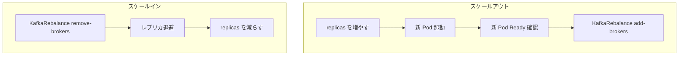

# 第23章 スケーリングとローリング更新

> 本章で参照する公式リソース
>
> - [install/cluster-operator/045-Crd-kafkanodepool.yaml L60-L63](https://github.com/strimzi/strimzi-kafka-operator/blob/1.1.0/install/cluster-operator/045-Crd-kafkanodepool.yaml#L60-L63)
> - [examples/kafka/kafka-persistent.yaml L20-L36](https://github.com/strimzi/strimzi-kafka-operator/blob/1.1.0/examples/kafka/kafka-persistent.yaml#L20-L36)
> - [CHANGELOG.md L3-L15](https://github.com/strimzi/strimzi-kafka-operator/blob/1.1.0/CHANGELOG.md#L3-L15)
> - [CHANGELOG.md L419-L419](https://github.com/strimzi/strimzi-kafka-operator/blob/1.1.0/CHANGELOG.md#L419-L419)
> - [install/drain-cleaner/README.md L1-L5](https://github.com/strimzi/strimzi-kafka-operator/blob/1.1.0/install/drain-cleaner/README.md#L1-L5)

## この章でできるようになること

- ブローカー専用 `KafkaNodePool` の `replicas` 変更によるスケールアウトとスケールインの手順を実行できる。
- ブローカー追加削除時の Cruise Control 連携を理解できる。
- `strimzi.io/manual-rolling-update` アノテーションで手動ローリング更新を起動できる。
- Drain Cleaner と `UseBackgroundPodDeletion` 機能ゲートの役割を説明できる。

## 前提

[第3章 クイックスタート](../part00-introduction/03-quickstart.md)のオープンクラスタ（`my-cluster`、`dual-role` 1台、node ID 0）のみを前提とする。
デフォルト StorageClass が利用でき、動的プロビジョニングで PVC が Bound になるクラスタを前提とする。
本章内でブローカー専用ノードプール `broker` を新規作成し、Cruise Control を有効化してからスケール手順を行う。
fresh なプールではクラスタ全体の node ID は 1 から順に割り当てられる（dual-role の 0 の次から）。

## ブローカープールの作成と Cruise Control 有効化

以下はブローカー専用プールを新規作成する例である。

```yaml
apiVersion: kafka.strimzi.io/v1
kind: KafkaNodePool
metadata:
  name: broker
  labels:
    strimzi.io/cluster: my-cluster
spec:
  replicas: 3
  roles:
    - broker
  storage:
    type: jbod
    volumes:
      - id: 0
        type: persistent-claim
        size: 100Gi
        kraftMetadata: shared
```

```bash
kubectl apply -f broker-pool.yaml -n kafka
```

期待される出力の例は次のとおりである。

```text
kafkanodepool.kafka.strimzi.io/broker created
```

Pod が生成されるまで待ってから Ready を確認する。

```bash
until [ "$(kubectl get pod -l strimzi.io/pool-name=broker,strimzi.io/cluster=my-cluster -n kafka \
  --no-headers 2>/dev/null | wc -l)" -ge 3 ]; do
  sleep 2
done
kubectl wait pod -l strimzi.io/pool-name=broker,strimzi.io/cluster=my-cluster -n kafka \
  --for=condition=Ready --timeout=600s
```

期待される出力の例は次のとおりである。

```text
pod/my-cluster-broker-1 condition met
pod/my-cluster-broker-2 condition met
pod/my-cluster-broker-3 condition met
```

```bash
kubectl get kafkanodepool broker -n kafka
```

期待される出力の例は次のとおりである。

```text
NAME     DESIRED REPLICAS   ROLES          NODEIDS
broker   3                  ["broker"]     [1,2,3]
```

Cruise Control を有効化する（`KafkaRebalance` の前提）。

```bash
kubectl patch kafka/my-cluster -n kafka --type=merge -p '{"spec":{"cruiseControl":{}}}'
```

期待される出力の例は次のとおりである。

```text
kafka.kafka.strimzi.io/my-cluster patched
```

patch 後は `observedGeneration` が `generation` に追いつくのを待ってから Ready を確認する。

```bash
GEN=$(kubectl get kafka my-cluster -n kafka -o jsonpath='{.metadata.generation}')
kubectl wait kafka/my-cluster -n kafka \
  --for=jsonpath="{.status.observedGeneration}=${GEN}" --timeout=600s
kubectl wait kafka/my-cluster -n kafka --for=condition=Ready --timeout=600s
```

期待される出力の例は次のとおりである。

```text
kafka.kafka.strimzi.io/my-cluster condition met
kafka.kafka.strimzi.io/my-cluster condition met
```

## replicas によるスケール

ブローカー専用 `KafkaNodePool` の `replicas` を変更すると、Cluster Operator が Pod 数を調整する。

[install/cluster-operator/045-Crd-kafkanodepool.yaml L60-L63](https://github.com/strimzi/strimzi-kafka-operator/blob/1.1.0/install/cluster-operator/045-Crd-kafkanodepool.yaml#L60-L63)は次のとおりである。

```yaml
              replicas:
                type: integer
                minimum: 0
                description: The number of pods in the pool.
```

スケールアウトの手順は次のとおりである。

1. ブローカー専用ノードプールの `replicas` を増やして apply する。
2. 新 Pod が Ready になることを確認する。
3. `KafkaRebalance`（`mode: add-brokers`、`brokers: [新 node ID]`）でレプリカを新ブローカーへ移動する（[第20章](../part06-cruise-control/20-kafkarebalance.md)）。

スケールインは逆順である。
`mode: remove-brokers` と `brokers: [削除対象 node ID]` でレプリカを退避し、リバランスが `Ready` になってから `replicas` を減らす。

操作対象のブローカー専用ノードプールは [examples/kafka/kafka-persistent.yaml L20-L36](https://github.com/strimzi/strimzi-kafka-operator/blob/1.1.0/examples/kafka/kafka-persistent.yaml#L20-L36)を参照する（プール名は `broker`）。

```yaml
apiVersion: kafka.strimzi.io/v1
kind: KafkaNodePool
metadata:
  name: broker
  labels:
    strimzi.io/cluster: my-cluster
spec:
  replicas: 3
  roles:
    - broker
  storage:
    type: jbod
    volumes:
      - id: 0
        type: persistent-claim
        size: 100Gi
        kraftMetadata: shared
```

Pod 名の末尾は node ID である（例: `my-cluster-broker-<ID>`）。

### スケールアウト

以下はブローカープールを 3 から 5 に増やす例である。

```bash
OLD_IDS=$(kubectl get kafkanodepool broker -n kafka -o jsonpath='{.status.nodeIds}' \
  | tr -d '[]' | tr ',' ' ')
kubectl patch kafkanodepool broker -n kafka --type merge -p '{"spec":{"replicas":5}}'
```

期待される出力の例は次のとおりである。

```text
kafkanodepool.kafka.strimzi.io/broker patched
```

新 Pod が所定数になるまで待ってから Ready を確認する。

```bash
DESIRED=5
until [ "$(kubectl get pod -l strimzi.io/pool-name=broker,strimzi.io/cluster=my-cluster -n kafka \
  --no-headers 2>/dev/null | wc -l)" -eq "${DESIRED}" ]; do
  sleep 2
done
kubectl wait pod -l strimzi.io/pool-name=broker,strimzi.io/cluster=my-cluster -n kafka \
  --for=condition=Ready --timeout=600s
```

期待される出力の例は次のとおりである。

```text
pod/my-cluster-broker-1 condition met
pod/my-cluster-broker-2 condition met
pod/my-cluster-broker-3 condition met
pod/my-cluster-broker-4 condition met
pod/my-cluster-broker-5 condition met
```

スケール前後の `status.nodeIds` の差分から、追加された node ID を取得する。

```bash
ALL_IDS=$(kubectl get kafkanodepool broker -n kafka -o jsonpath='{.status.nodeIds}' \
  | tr -d '[]' | tr ',' ' ')
NEW_IDS=$(printf '%s\n' ${ALL_IDS} | grep -vxF -f <(printf '%s\n' ${OLD_IDS}) | paste -sd, -)
echo "add brokers: ${NEW_IDS}"
kubectl apply -f - <<EOF
apiVersion: kafka.strimzi.io/v1
kind: KafkaRebalance
metadata:
  name: grow-brokers
  labels:
    strimzi.io/cluster: my-cluster
spec:
  mode: add-brokers
  brokers: [${NEW_IDS}]
EOF
```

期待される出力の例は次のとおりである。

```text
add brokers: 4,5
kafkarebalance.kafka.strimzi.io/grow-brokers created
```

```bash
kubectl wait kafkarebalance/grow-brokers -n kafka \
  --for=jsonpath='{.status.conditions[?(@.type=="ProposalReady")].status}'=True --timeout=600s
kubectl annotate kafkarebalance grow-brokers -n kafka strimzi.io/rebalance=approve --overwrite
kubectl wait kafkarebalance/grow-brokers -n kafka \
  --for=jsonpath='{.status.conditions[?(@.type=="Ready")].status}'=True --timeout=1800s
```

期待される出力の例は次のとおりである。

```text
kafkarebalance.kafka.strimzi.io/grow-brokers condition met
kafkarebalance.kafka.strimzi.io/grow-brokers annotated
kafkarebalance.kafka.strimzi.io/grow-brokers condition met
```

スケールアウト完了後の Pod 数を確認する。

```bash
kubectl get kafkanodepool broker -n kafka
kubectl get pod -l strimzi.io/cluster=my-cluster,strimzi.io/pool-name=broker -n kafka
```

期待される出力の例は次のとおりである。

```text
NAME     DESIRED REPLICAS   ROLES          NODEIDS
broker   5                  ["broker"]     [1,2,3,4,5]
```

```text
NAME                  READY   STATUS    RESTARTS   AGE
my-cluster-broker-1   1/1     Running   0          30m
my-cluster-broker-2   1/1     Running   0          30m
my-cluster-broker-3   1/1     Running   0          30m
my-cluster-broker-4   1/1     Running   0          10m
my-cluster-broker-5   1/1     Running   0          10m
```

### スケールイン

スケールアウト完了後、削除対象の node ID（本章の例では 4 と 5）を取得する。

```bash
REMOVE_IDS=$(kubectl get kafkanodepool broker -n kafka -o jsonpath='{.status.nodeIds}' \
  | tr -d '[]' | tr ',' ' ' | awk '{print $(NF-1)","$NF}')
echo "remove brokers: ${REMOVE_IDS}"
```

期待される出力の例は次のとおりである。

```text
remove brokers: 4,5
```

`KafkaRebalance` で削除対象ブローカーからレプリカを退避する。

```bash
kubectl apply -f - <<EOF
apiVersion: kafka.strimzi.io/v1
kind: KafkaRebalance
metadata:
  name: shrink-brokers
  labels:
    strimzi.io/cluster: my-cluster
spec:
  mode: remove-brokers
  brokers: [${REMOVE_IDS}]
EOF
```

期待される出力の例は次のとおりである。

```text
kafkarebalance.kafka.strimzi.io/shrink-brokers created
```

```bash
kubectl wait kafkarebalance/shrink-brokers -n kafka \
  --for=jsonpath='{.status.conditions[?(@.type=="ProposalReady")].status}'=True \
  --timeout=600s
kubectl annotate kafkarebalance shrink-brokers -n kafka strimzi.io/rebalance=approve --overwrite
kubectl wait kafkarebalance/shrink-brokers -n kafka \
  --for=jsonpath='{.status.conditions[?(@.type=="Ready")].status}'=True \
  --timeout=1800s
kubectl patch kafkanodepool broker -n kafka --type merge -p '{"spec":{"replicas":3}}'
```

期待される出力の例は次のとおりである。

```text
kafkarebalance.kafka.strimzi.io/shrink-brokers condition met
kafkarebalance.kafka.strimzi.io/shrink-brokers annotated
kafkarebalance.kafka.strimzi.io/shrink-brokers condition met
kafkanodepool.kafka.strimzi.io/broker patched
```

3 Pod へ収束するまで待つ。

```bash
DESIRED=3
until [ "$(kubectl get pod -l strimzi.io/pool-name=broker,strimzi.io/cluster=my-cluster -n kafka \
  --no-headers 2>/dev/null | wc -l)" -eq "${DESIRED}" ]; do
  sleep 2
done
kubectl wait pod -l strimzi.io/pool-name=broker,strimzi.io/cluster=my-cluster -n kafka \
  --for=condition=Ready --timeout=600s
kubectl get kafkanodepool broker -n kafka
kubectl get pod -l strimzi.io/cluster=my-cluster,strimzi.io/pool-name=broker -n kafka
```

期待される出力の例は次のとおりである。

```text
pod/my-cluster-broker-1 condition met
pod/my-cluster-broker-2 condition met
pod/my-cluster-broker-3 condition met
```

```text
NAME     DESIRED REPLICAS   ROLES          NODEIDS
broker   3                  ["broker"]     [1,2,3]
```

```text
NAME                  READY   STATUS    RESTARTS   AGE
my-cluster-broker-1   1/1     Running   0          45m
my-cluster-broker-2   1/1     Running   0          45m
my-cluster-broker-3   1/1     Running   0          45m
```



## 手動ローリング更新

Pod に `strimzi.io/manual-rolling-update` アノテーションを付けると、Cluster Operator がその Pod のローリング更新を実行する。
設定変更後に特定 Pod だけ再起動したい場合に使う。

[CHANGELOG.md L419-L419](https://github.com/strimzi/strimzi-kafka-operator/blob/1.1.0/CHANGELOG.md#L419-L419)には、手動ローリング更新失敗時のリコンサイル継続に関する記載がある。

```markdown
* Continue reconciliation after failed manual rolling update using the `strimzi.io/manual-rolling-update` annotation (when the `ContinueReconciliationOnManualRollingUpdateFailure` feature gate is enabled).
```

以下は `my-cluster-broker-1` に対して手動ローリング更新を起動し、完了まで待つ例である。

```bash
TARGET_POD=my-cluster-broker-1
kubectl get pod "${TARGET_POD}" -n kafka \
  -o jsonpath='{.status.startTime}{"\n"}' > /tmp/start-before.txt
kubectl annotate pod "${TARGET_POD}" -n kafka \
  strimzi.io/manual-rolling-update=true
```

期待される出力の例は次のとおりである。

```text
pod/my-cluster-broker-1 annotated
```

Operator はアノテーションを検知して Pod を再作成する。
`startTime` が変わるまで待ってから Ready を確認する。

```bash
until kubectl get pod "${TARGET_POD}" -n kafka -o jsonpath='{.status.startTime}' 2>/dev/null \
  | grep -qv "$(cat /tmp/start-before.txt)"; do
  sleep 2
done
kubectl wait pod/"${TARGET_POD}" -n kafka --for=condition=Ready --timeout=300s
kubectl get pod "${TARGET_POD}" -n kafka -o jsonpath='{.status.startTime}{"\n"}'
```

期待される出力の例は次のとおりである。

```text
pod/my-cluster-broker-1 condition met
2026-07-13T01:00:00Z
```

更新完了後、アノテーションは Operator が除去する。
`startTime` は手順開始前と異なる新しいタイムスタンプである。

## Drain Cleaner

ノードの drain 時に Kafka Pod が under-replicated にならないよう、Strimzi Drain Cleaner が eviction を制御する。

[install/drain-cleaner/README.md L1-L5](https://github.com/strimzi/strimzi-kafka-operator/blob/1.1.0/install/drain-cleaner/README.md#L1-L5)は次のとおりである。

```markdown
# Strimzi Drain Cleaner

Strimzi Drain Cleaner is a utility which helps with moving the Kafka pods deployed by [Strimzi](https://strimzi.io/) from Kubernetes nodes which are being drained.
It is useful if you want the Strimzi operator to move the pods instead of Kubernetes itself.
The advantage of this approach is that the Strimzi operator makes sure that no Kafka topics become under-replicated during the node draining.
```

[CHANGELOG.md L3-L15](https://github.com/strimzi/strimzi-kafka-operator/blob/1.1.0/CHANGELOG.md#L3-L15)には次の記載がある。

```markdown
## 1.1.0

* Allow failed `KafkaConnectors` to be stopped and reject pausing of failed connectors since this operation is not supported by Kafka Connect
* Add support for Apache Kafka 4.3.0 and 4.2.1
* Remove support for Kafka 4.1.x
* Reconcile Cruise Control before Entity Operator when both are enabled.
* New Cluster operator configuration option `STRIMZI_PKCS12_KEYSTORE_GENERATION` to disable generating PKCS12 stores in CA and Kafka user `Secret` resources.
* Support for Gateway API-based `type: tlsroute` listener
* Support for dependency scope configuration of Maven artifacts in Kafka Connect Build
* Support for configuring per-broker listener annotation and label templates.
* Improved support for custom Apache Kafka versions
* Add `UseBackgroundPodDeletion` feature gate (alpha, disabled by default) to use background deletion propagation when deleting pods during rolling updates. 
* Strimzi Drain Cleaner updated to 1.6.0 (included in the Strimzi installation files)
```

`UseBackgroundPodDeletion` は alpha でデフォルト無効の機能ゲートである。
Helm values の `featureGates: "+UseBackgroundPodDeletion"` で有効化できる（[第21章](21-helm-values.md)）。

## まとめ

ブローカー専用 `KafkaNodePool.replicas` でスケールし、Cruise Control と組み合わせてレプリカを安全に移動する。
`strimzi.io/manual-rolling-update` で Pod 単位の再起動を制御する。
Drain Cleaner と `UseBackgroundPodDeletion` でノード drain とローリング更新を安定させる。

## 関連する章

- [第4章 KafkaNodePool とノードロール](../part01-kafka-cluster/04-kafkanodepool.md)
- [第19章 Cruise Control の有効化](../part06-cruise-control/19-cruise-control.md)
- [第20章 KafkaRebalance によるリバランス](../part06-cruise-control/20-kafkarebalance.md)
- [第21章 Helm values リファレンス](21-helm-values.md)
