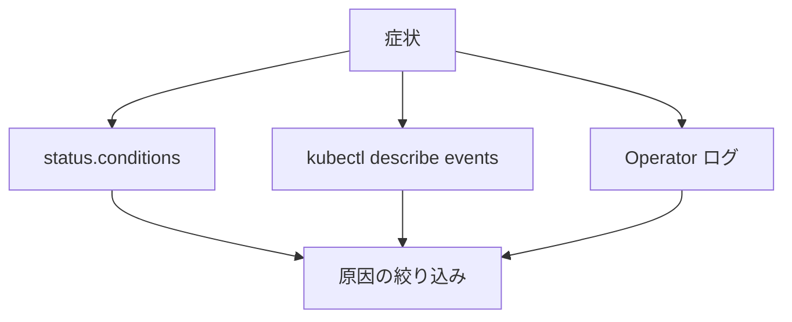

# 第24章 トラブルシューティングと運用

> 本章で参照する公式リソース
>
> - [install/cluster-operator/040-Crd-kafka.yaml L5532-L5555](https://github.com/strimzi/strimzi-kafka-operator/blob/1.1.0/install/cluster-operator/040-Crd-kafka.yaml#L5532-L5555)
> - [install/cluster-operator/043-Crd-kafkatopic.yaml L80-L103](https://github.com/strimzi/strimzi-kafka-operator/blob/1.1.0/install/cluster-operator/043-Crd-kafkatopic.yaml#L80-L103)
> - [install/cluster-operator/060-Deployment-strimzi-cluster-operator.yaml L29-L35](https://github.com/strimzi/strimzi-kafka-operator/blob/1.1.0/install/cluster-operator/060-Deployment-strimzi-cluster-operator.yaml#L29-L35)

## この章でできるようになること

- Custom Resource の `status.conditions` と `observedGeneration` を読み解ける。
- Pod Pending、証明書期限、リスナー設定ミス、認可拒否などの典型問題に対処できる。
- Cluster Operator のログからリコンサイル失敗の原因を絞り込める。
- events と status を組み合わせた調査手順を実行できる。

## 前提

`kubectl` で Namespace 内の Pod、Event、Custom Resource にアクセスできること。
本章は第3章のオープンクラスタ（`my-cluster`）を前提とする。

## status.conditions の読み方

Strimzi の Custom Resource は `status.conditions` に Ready などの状態を記録する。

[install/cluster-operator/040-Crd-kafka.yaml L5532-L5555](https://github.com/strimzi/strimzi-kafka-operator/blob/1.1.0/install/cluster-operator/040-Crd-kafka.yaml#L5532-L5555)は次のとおりである。

```yaml
              conditions:
                type: array
                items:
                  type: object
                  properties:
                    type:
                      type: string
                      description: "The unique identifier of a condition, used to distinguish between other conditions in the resource."
                    status:
                      type: string
                      description: "The status of the condition, either True, False or Unknown."
                    lastTransitionTime:
                      type: string
                      description: "Last time the condition of a type changed from one status to another. The required format is 'yyyy-MM-ddTHH:mm:ssZ', in the UTC time zone."
                    reason:
                      type: string
                      description: The reason for the condition's last transition (a single word in CamelCase).
                    message:
                      type: string
                      description: Human-readable message indicating details about the condition's last transition.
                description: List of status conditions.
              observedGeneration:
                type: integer
                description: The generation of the CRD that was last reconciled by the operator.
```

`metadata.generation` と `status.observedGeneration` が一致しない場合、Operator がまだ最新 spec を処理していない可能性がある。
`Kafka` の失敗状態は `NotReady=True` として記録される（`Ready=False` ではない）。
`reason` と `message` を確認する。

`KafkaTopic` や `KafkaUser` も同様の構造を持つ。
[install/cluster-operator/043-Crd-kafkatopic.yaml L80-L103](https://github.com/strimzi/strimzi-kafka-operator/blob/1.1.0/install/cluster-operator/043-Crd-kafkatopic.yaml#L80-L103)は次のとおりである。

```yaml
              conditions:
                type: array
                items:
                  type: object
                  properties:
                    type:
                      type: string
                      description: "The unique identifier of a condition, used to distinguish between other conditions in the resource."
                    status:
                      type: string
                      description: "The status of the condition, either True, False or Unknown."
                    lastTransitionTime:
                      type: string
                      description: "Last time the condition of a type changed from one status to another. The required format is 'yyyy-MM-ddTHH:mm:ssZ', in the UTC time zone."
                    reason:
                      type: string
                      description: The reason for the condition's last transition (a single word in CamelCase).
                    message:
                      type: string
                      description: Human-readable message indicating details about the condition's last transition.
                description: List of status conditions.
              observedGeneration:
                type: integer
                description: The generation of the CRD that was last reconciled by the operator.
```

## よくある問題と対処

### Pod が Pending のまま

PVC が Bound にならない、またはノードのリソースが不足している場合に Pod が Pending になる。
single-node 例では Pod 名は `my-cluster-dual-role-0`、PVC 名は `data-0-my-cluster-dual-role-0` である。

```bash
kubectl get pvc -n kafka
```

期待される正常時の出力の例（single-node）は次のとおりである。

```text
NAME                              STATUS   VOLUME                                     CAPACITY   ACCESS MODES   STORAGECLASS   AGE
data-0-my-cluster-dual-role-0     Bound    pvc-abc123                                 100Gi      RWO            standard       1d
```

```bash
kubectl describe pod my-cluster-dual-role-0 -n kafka
kubectl describe pvc data-0-my-cluster-dual-role-0 -n kafka
```

期待される正常時の出力の例（PVC 節）は次のとおりである。

```text
Status:        Bound
```

`Events` 節に `Insufficient cpu` や `volume binding` 関連のメッセージが出ていないか確認する。
StorageClass の存在、`resources.requests` の過大設定、ノードの空き容量を見直す。

Pod の `Events` 節の期待される正常時の例は次のとおりである。

```text
  Type    Reason     Age   Message
  ----    ------     ----  -------
  Normal  Scheduled  5m    Successfully assigned kafka/my-cluster-dual-role-0 to node-1
  Normal  Pulled     5m    Container image already present on machine
```

### 証明書期限

TLS 関連の接続失敗は CA またはブローカー証明書の期限切れが原因のことがある。
Strimzi が管理する CA は `renewalDays` 以内に自動更新を試みる。
`generateCertificateAuthority: false` の独自 CA は Operator が更新しない。

```bash
kubectl get secret my-cluster-cluster-ca-cert -n kafka \
  -o jsonpath='{.data.ca\.crt}' | base64 -d | openssl x509 -noout -dates
```

期待される出力の例は次のとおりである。

```text
notBefore=Jan  1 00:00:00 2026 GMT
notAfter=Dec 31 23:59:59 2026 GMT
```

cluster CA に加え、ブローカー証明書 Secret も確認する。
証明書キーは Pod 名に `.crt` を付けた名前である（例: `my-cluster-dual-role-0.crt`）。

```bash
kubectl get secret my-cluster-dual-role-0 -n kafka \
  -o jsonpath='{.data.my-cluster-dual-role-0\.crt}' | base64 -d | openssl x509 -noout -dates
```

期待される出力の例は次のとおりである。

```text
notBefore=Jan  1 00:00:00 2026 GMT
notAfter=Dec 31 23:59:59 2026 GMT
```

`notAfter` が近い場合は [第9章](../part02-security/09-tls-certificates.md)の `renewalDays` 設定を確認する。

### リスナー設定ミス

クライアントが接続できない場合、リスナーの `type` と `tls`、advertised アドレスの不一致を疑う。

```bash
kubectl get kafka my-cluster -n kafka -o jsonpath='{.status.listeners}{"\n"}'
kubectl get svc -l strimzi.io/cluster=my-cluster -n kafka
```

期待される出力の例（listeners 節）は次のとおりである。
フィールド名は `name` である（`type` ではない）。

```text
[{"name":"plain","addresses":[{"host":"my-cluster-kafka-bootstrap.kafka.svc","port":9092}],...}]
```

Service 一覧の期待される出力の例は次のとおりである。

```text
NAME                         TYPE        CLUSTER-IP     EXTERNAL-IP   PORT(S)                                        AGE
my-cluster-kafka-bootstrap   ClusterIP   10.0.0.1       <none>        9091/TCP,9092/TCP,9093/TCP                     1d
my-cluster-kafka-brokers     ClusterIP   None           <none>        9090/TCP,9091/TCP,8443/TCP,9092/TCP,9093/TCP   1d
```

本章は第3章のオープンクラスタ（Cruise Control 未導入）を前提とする。
Cruise Control を有効化したクラスタでは `my-cluster-cruise-control` Service も同じラベルで一覧に出る。

[第7章](../part01-kafka-cluster/07-listeners.md)のブートストラップ Service 名とポートがクライアント設定と一致しているか確認する。

### 認可拒否

認証は成功するが操作が拒否される場合は ACL または `authorization` 設定を確認する。
第3章のオープンクラスタには `my-user` も simple 認可もない。
以下は本節内で認証と認可を有効化し、次の `KafkaUser` 例を apply してから ACL を確認する例である。

```yaml
apiVersion: kafka.strimzi.io/v1
kind: KafkaUser
metadata:
  name: my-user
  labels:
    strimzi.io/cluster: my-cluster
spec:
  authentication:
    type: tls
  authorization:
    type: simple
    acls:
      - resource:
          type: topic
          name: my-topic
          patternType: literal
        operations:
          - Describe
          - Read
        host: "*"
      - resource:
          type: group
          name: my-group
          patternType: literal
        operations:
          - Read
        host: "*"
      - resource:
          type: topic
          name: my-topic
          patternType: literal
        operations:
          - Create
          - Describe
          - Write
        host: "*"
```

```bash
kubectl patch kafka my-cluster -n kafka --type=merge -p '
{"spec":{"kafka":{"authorization":{"type":"simple"},"listeners":[
  {"name":"plain","port":9092,"type":"internal","tls":false},
  {"name":"tls","port":9093,"type":"internal","tls":true,"authentication":{"type":"tls"}}
]}}}'
GEN=$(kubectl get kafka my-cluster -n kafka -o jsonpath='{.metadata.generation}')
kubectl wait kafka/my-cluster -n kafka \
  --for=jsonpath="{.status.observedGeneration}=${GEN}" --timeout=600s
kubectl wait kafka/my-cluster -n kafka --for=condition=Ready --timeout=600s
kubectl apply -f - <<EOF
apiVersion: kafka.strimzi.io/v1
kind: KafkaUser
metadata:
  name: my-user
  labels:
    strimzi.io/cluster: my-cluster
spec:
  authentication:
    type: tls
  authorization:
    type: simple
    acls:
      - resource:
          type: topic
          name: my-topic
          patternType: literal
        operations:
          - Describe
          - Read
        host: "*"
      - resource:
          type: group
          name: my-group
          patternType: literal
        operations:
          - Read
        host: "*"
      - resource:
          type: topic
          name: my-topic
          patternType: literal
        operations:
          - Create
          - Describe
          - Write
        host: "*"
EOF
kubectl wait kafkauser/my-user -n kafka --for=condition=Ready --timeout=120s
```

期待される出力の例は次のとおりである。

```text
kafka.kafka.strimzi.io/my-cluster patched
kafka.kafka.strimzi.io/my-cluster condition met
kafka.kafka.strimzi.io/my-cluster condition met
kafkauser.kafka.strimzi.io/my-user created
kafkauser.kafka.strimzi.io/my-user condition met
```

```bash
kubectl get kafkauser my-user -n kafka -o yaml | grep -A 20 'authorization:'
```

期待される出力の例は次のとおりである。
`grep -A 20` は一致行と後続 20 行（計 21 行）を返す。
`kubectl -o yaml` のキー順は入力マニフェスト順を保証しない。

```text
  authorization:
    type: simple
    acls:
    - resource:
        type: topic
        name: my-topic
        patternType: literal
      operations:
      - Describe
      - Read
      host: "*"
    - resource:
        type: group
        name: my-group
        patternType: literal
      operations:
      - Read
      host: "*"
    - resource:
        type: topic
        name: my-topic
```

[第11章](../part02-security/11-authorization.md)の ACL 定義と、Kafka 側の `superUsers` を照合する。



## Cluster Operator のログ

Cluster Operator のログにリコンサイルエラーが記録される。

[install/cluster-operator/060-Deployment-strimzi-cluster-operator.yaml L29-L35](https://github.com/strimzi/strimzi-kafka-operator/blob/1.1.0/install/cluster-operator/060-Deployment-strimzi-cluster-operator.yaml#L29-L35)は次のとおりである。

```yaml
        - name: strimzi-cluster-operator
          image: quay.io/strimzi/operator:1.1.0
          ports:
            - containerPort: 8080
              name: http
          args:
            - /opt/strimzi/bin/cluster_operator_run.sh
```

コンテナ名 `strimzi-cluster-operator` に対してログを取得する。
`replicas` が 2 以上のときは leader 以外の Pod にエラーが出ていないか、全 Pod のログを確認する。

```bash
kubectl logs deploy/strimzi-cluster-operator -n strimzi --tail=100
for pod in $(kubectl get pod -n strimzi -l name=strimzi-cluster-operator -o name); do
  echo "=== ${pod} ==="
  kubectl logs -n strimzi "${pod}" --tail=50
done
```

期待される出力の例は次のとおりである。

```text
2026-07-12 12:00:00 INFO  AbstractOperator:123 - Reconciliation #1 ...
=== pod/strimzi-cluster-operator-abc12 ===
2026-07-12 12:00:01 INFO  AbstractOperator:123 - Reconciliation #2 ...
=== pod/strimzi-cluster-operator-def34 ===
2026-07-12 12:00:02 INFO  AbstractOperator:123 - Reconciliation #3 ...
```

直近のリコンサイル失敗を追う場合は、全 Operator Pod のログを順に確認する。

```bash
for pod in $(kubectl get pod -n strimzi -l name=strimzi-cluster-operator -o name); do
  echo "=== ${pod} ==="
  kubectl logs -n strimzi "${pod}" --tail=500 | grep -i 'reconcile\|error\|warn' || true
done
```

期待される出力の例は次のとおりである。

```text
=== pod/strimzi-cluster-operator-abc12 ===
2026-07-12 12:00:00 WARN  AbstractOperator:456 - Reconciliation #3 ...
=== pod/strimzi-cluster-operator-def34 ===
2026-07-12 12:00:01 INFO  AbstractOperator:123 - Reconciliation #4 ...
```

leader 以外の Pod にエラーが出ていないか、ループで全 Pod を確認する。

## 動作確認

`Kafka` の conditions 一覧を取得する。

```bash
kubectl get kafka my-cluster -n kafka \
  -o jsonpath='{range .status.conditions[*]}{.type}={.status} reason={.reason} msg={.message}{"\n"}{end}'
```

期待される正常時の出力の例は次のとおりである。

```text
Ready=True reason= msg=
```

`NotReady=False` 条件は正常時には作成されない。

関連 Event を確認する。

```bash
kubectl get events -n kafka --field-selector involvedObject.name=my-cluster-dual-role-0 \
  --sort-by='.lastTimestamp' | tail -5
```

期待される出力の例は次のとおりである。

```text
LAST SEEN   TYPE     REASON    OBJECT                        MESSAGE
2m          Normal   Pulled    pod/my-cluster-dual-role-0    Container image already present
```

Warning イベントに PVC やスケジューリングの問題が記録されていないか確認する。

## まとめ

`status.conditions` と `observedGeneration` で Custom Resource の収束状態を判断する。
Pending、証明書、リスナー、認可はそれぞれ describe、Secret、Service、ACL で切り分ける。
Cluster Operator のログでリコンサイル失敗の詳細を追う。

## 関連する章

- [第2章 インストール](../part00-introduction/02-installation.md)
- [第7章 リスナーと外部アクセス](../part01-kafka-cluster/07-listeners.md)
- [第9章 TLS と認証局](../part02-security/09-tls-certificates.md)
- [第11章 認可と ACL](../part02-security/11-authorization.md)
- [第22章 監視とメトリクス](22-monitoring-metrics.md)
